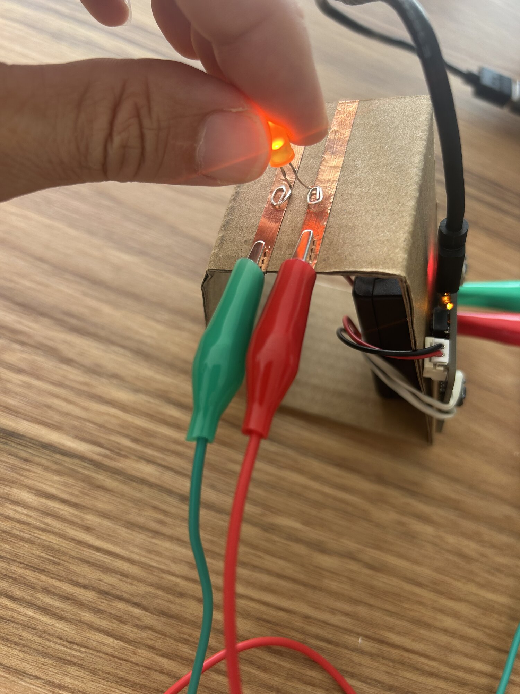
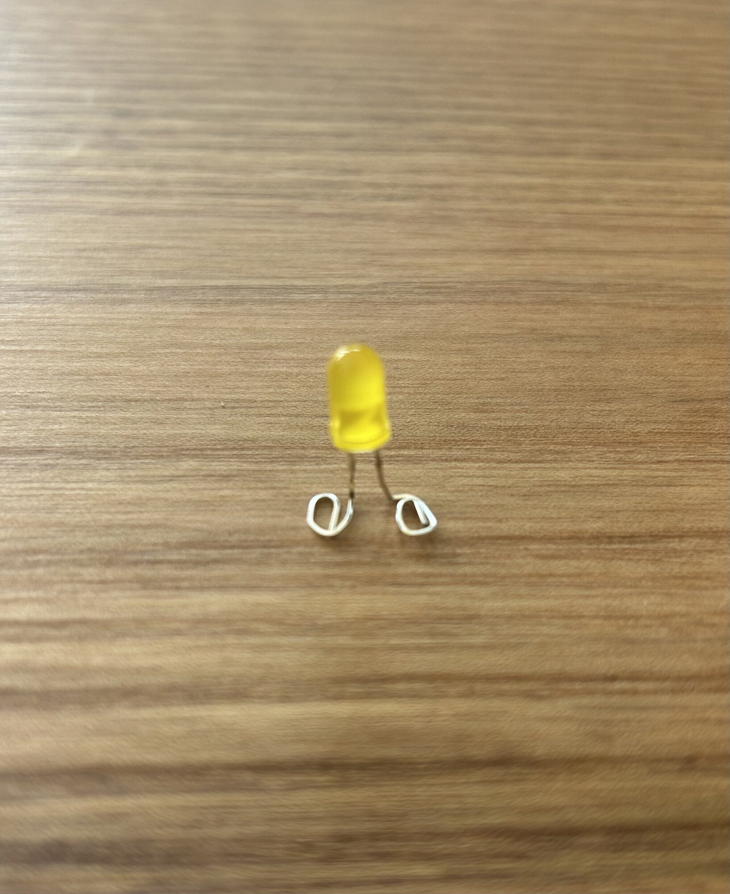
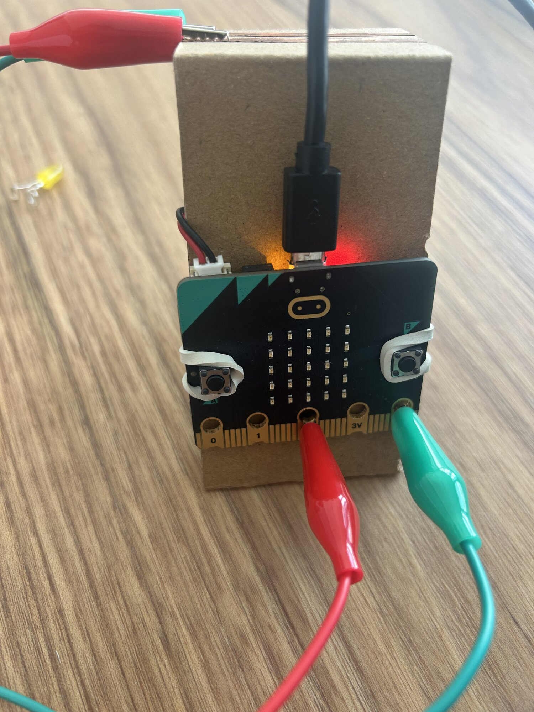

# Câbler un circuit

Un circuit, c'est une boucle : le courant part d'une borne de la source, traverse les composants, et revient à l'autre borne. Cette fiche dit comment la fermer, comment la commander, et comment ne rien abîmer.

## La boucle

<figure markdown>

</figure>

> [!NOTE] Conducteur et isolant
> Le cuivre, les pinces, la peau même conduisent le courant. Le carton, le plastique, l'air ne le conduisent pas. Une boucle ouverte à un seul endroit, et plus rien ne passe.

## La LED

**Elle a un sens.** La patte longue (`+`) va vers le `+` de la source. Montée à l'envers, elle ne s'allume pas, et elle ne s'abîme pas.

**Sur le micro:bit, elle se branche sans résistance.** `3V` et les broches ne fournissent pas assez pour la griller. Sur un pack d'accus, plus puissant, il lui faut une résistance (220 Ω), sinon elle grille.

<figure markdown>

</figure>

Pattes enroulées en boucle : elles touchent mieux une piste de cuivre. Repère la patte longue avant d'enrouler.

## Le ruban de cuivre

- Une piste se colle d'un seul tenant. Dans un angle, **plie** le ruban sur lui-même.
- Si l'adhésif n'est pas conducteur, deux morceaux superposés ne font pas contact : c'est pour ça qu'on plie au lieu de recouper.

## Les câbles à pinces

Une pince sur la piste, l'autre sur une broche. Ils se branchent et se débranchent sans rien abîmer.

> [!CAUTION] Les pinces ne se touchent pas
> Deux pinces qui se touchent sur `3V` et `GND` court-circuitent l'alimentation.

## Les broches du micro:bit

<figure markdown>

</figure>

| Broche | Rôle |
|---|---|
| `0`, `1`, `2` | Entrées ou sorties, selon le programme |
| `3V` | Le `+` du micro:bit, 3 volts |
| `GND` | Le `−`, la masse |

**En sortie**, la broche envoie du courant quand le programme écrit `1`, rien quand il écrit `0`. De quoi allumer une LED, pas un moteur.

**En entrée**, la broche lit ce qui lui arrive. `lire la broche analogique` donne un nombre de `0` à `1023`. Deux bandes de cuivre reliées à `P2` et `GND` font un bouton : un doigt posé à cheval fait chuter la valeur.

> [!CAUTION] 3,6 V au plus
> Un pack d'accus ne se branche jamais sur `3V` ni sur une broche du micro:bit.

Le micro:bit s'alimente par son boîtier 2 × AAA, ou par l'USB. Le boîtier est préférable : la lampe n'a pas besoin de l'ordinateur.

## La masse commune

Quand un composant a sa propre alimentation, comme la matrice, il faut relier son `GND` à celui du micro:bit.

> [!NOTE] Pourquoi
> Un signal, c'est une tension mesurée par rapport à la masse. Sans masse commune, le composant reçoit un signal sans référence, et ne fait rien ou n'importe quoi.

## Les bornes à levier

[photo : une borne à levier ouverte, un fil inséré, levier refermé]

Levier ouvert, fil dénudé enfoncé à fond, levier fermé. Tire doucement : le fil tient. Une borne par point de connexion : une pour tous les `+`, une pour tous les `−`.

> [!CAUTION] Le court-circuit
> Les fils nus d'un pack d'accus ne se touchent jamais. Débranche le pack avant de déplacer un fil.

## Le schéma de câblage

[photo : un schéma de câblage dessiné à la main]

Avant de câbler un produit, dessine-le : chaque composant, la broche où il va, d'où vient son énergie, et la masse commune. Puis câble en suivant le schéma, un fil à la fois, et coche-le.

Un moteur ou un servomoteur ne se branche pas sur une broche : il passe par la carte DFR0548.

→ [La carte DFR0548 et ses blocs](carte-dfr0548.md) · [Déboguer](deboguer.md)
