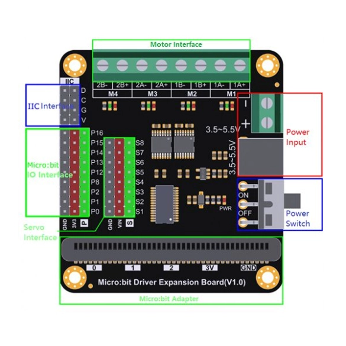

# La carte DFR0548

C'est la carte sur laquelle s'enfiche ton micro:bit. Son nom complet est *Micro:bit Driver Expansion Board*. Elle fait le lien entre un micro:bit qui décide et des moteurs qui consomment.

<figure markdown>

<figcaption>Les repères sont ceux du fabricant, en anglais.</figcaption>
</figure>

| Sur le schéma | Ce que c'est |
|---|---|
| **Motor Interface** | Les borniers `M1` à `M4` |
| **Power Input** | L'entrée des accus, `3.5~5.5V` |
| **Power Switch** | L'interrupteur `ON` / `OFF` des moteurs |
| **Micro:bit Adapter** | Le connecteur du micro:bit |
| **Servo Interface** | Les broches à servomoteurs `S1` à `S8` |
| **IIC Interface** | Le bus entre la carte et le micro:bit |
| **Micro:bit IO Interface** | Les broches `P0` à `P16` ressorties |

## Pourquoi elle existe

> [!NOTE] Trois choses qu'une broche ne peut pas faire
> **Fournir assez de courant.** Une broche de micro:bit délivre quelques milliampères — de quoi allumer une LED. Un moteur à courant continu en réclame plusieurs centaines. Branché en direct, le moteur ne tourne pas, et la broche risque de lâcher.
>
> **Inverser le sens.** Une broche envoie du courant ou n'en envoie pas. Pour faire tourner un moteur dans l'autre sens, il faut inverser la polarité à ses bornes — ce qu'aucune broche ne peut faire seule.
>
> **Doser la vitesse.** Il faut découper l'alimentation en impulsions très rapides et régler leur durée. La carte s'en charge, en continu, sans que le micro:bit ait à s'en occuper.

Le partage des rôles est donc :

| Qui | Fait quoi |
|---|---|
| **Le micro:bit** | décide : quel moteur, quel sens, quelle vitesse |
| **La carte** | exécute : elle commute la puissance et découpe le courant |
| **Les accus** | fournissent l'énergie |

## Deux sources d'énergie, séparées

C'est le point qui surprend le plus au début.

Le micro:bit est alimenté par l'USB ou par sa propre pile. Les moteurs sont alimentés par le pack d'accus branché sur la carte. **Ce ne sont pas les mêmes circuits.**

Conséquence pratique : ton programme peut tourner parfaitement — écran allumé, animations, sons — pendant que les moteurs restent immobiles, simplement parce que le pack est débranché ou l'interrupteur sur *off*. C'est même la panne numéro un.

→ [Quand ça ne marche pas](depannage.md)

## Les branchements

Avant de câbler quoi que ce soit : **interrupteur de la carte sur *off***. On ne visse jamais un fil sur un circuit sous tension.

**Le micro:bit** s'enfiche dans le connecteur de la carte, **écran vers l'extérieur**, boutons A et B accessibles. Le connecteur est détrompé : il ne rentre que dans un sens. S'il résiste, il est à l'envers — ne force pas, retourne-le.

<figure markdown>

<figcaption>Le connecteur est détrompé. S'il résiste, retourne le micro:bit.</figcaption>
</figure>

**Les moteurs** se vissent sur les borniers verts repérés `M1`, `M2`, `M3`, `M4`. Sur le rover, on utilise `M1` et `M2`.

Chaque moteur sort deux fils : desserre la vis, glisse la partie dénudée, resserre. Puis **tire doucement sur le fil** : s'il ressort, il n'était pas serré, et il ressortira tout seul à la première secousse.

<figure markdown>

<figcaption>Desserrer, glisser le fil dénudé, resserrer — puis tirer dessus pour vérifier.</figcaption>
</figure>

L'ordre des deux fils d'un moteur détermine son sens de rotation. Il n'y a pas de bon ou de mauvais branchement : si un moteur tourne à l'envers, tu peux soit inverser ses deux fils, soit changer `CW` en `CCW` dans le code.

**Le pack d'accus** se visse sur le bornier d'alimentation — le petit connecteur vert à deux vis, marqué `3.5~5.5V`, à l'écart du bornier des moteurs. Fil rouge sur `+`, fil noir sur `−`. La carte accepte de 3,5 à 5,5 V ; un pack de quatre accus NiMH fournit environ 4,8 V.

> [!CAUTION] La polarité ne se rattrape pas
> Inverser le `+` et le `−` peut détruire la carte. C'est le seul geste du montage qui abîme du matériel pour de bon. Vérifie deux fois avant de basculer l'interrupteur, et fais contrôler si tu as le moindre doute.

**L'interrupteur** de la carte coupe l'alimentation des moteurs. Prends l'habitude de le laisser sur *off* pendant que tu manipules le rover.

## Comment le micro:bit lui parle

Le micro:bit et la carte communiquent sur deux fils seulement, par un dialogue qu'on appelle **I2C**. Chaque appareil branché sur ces deux fils possède une adresse ; quand le micro:bit envoie un ordre, il commence par dire à qui il s'adresse, et seul l'appareil concerné répond.

C'est la même idée que d'appeler quelqu'un par son prénom dans une pièce où tout le monde entend — et c'est exactement ce que fait la radio quand plusieurs rovers partagent le même groupe.

Tu n'as rien à programmer de tout ça : les blocs de l'extension s'en occupent.

→ [L'extension DF-Driver](extension-df-driver.md) · [La radio](makecode-prise-en-main.md#la-radio)
