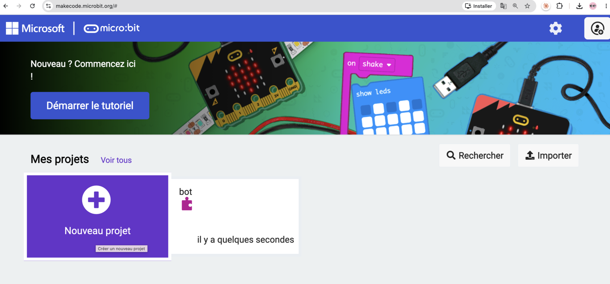
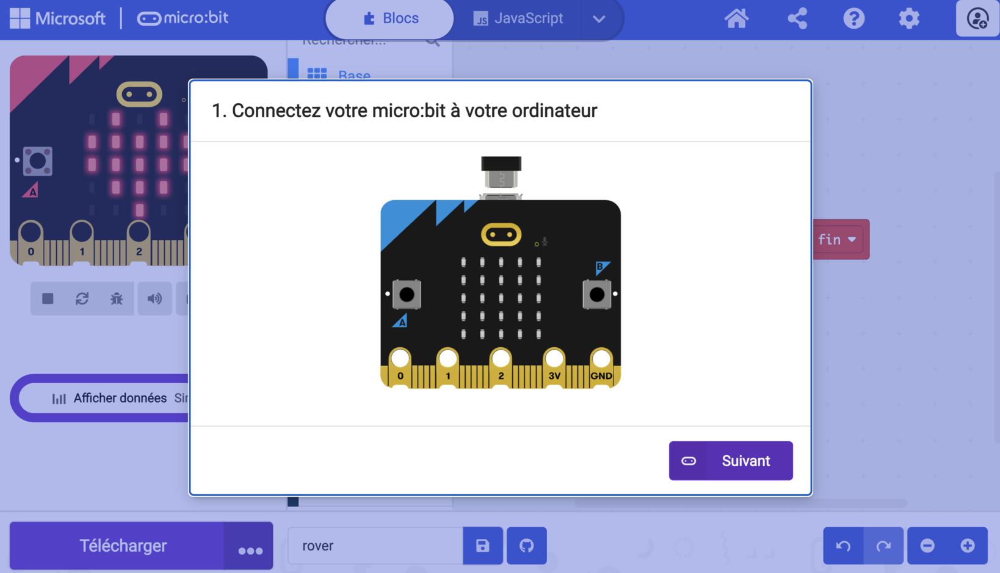
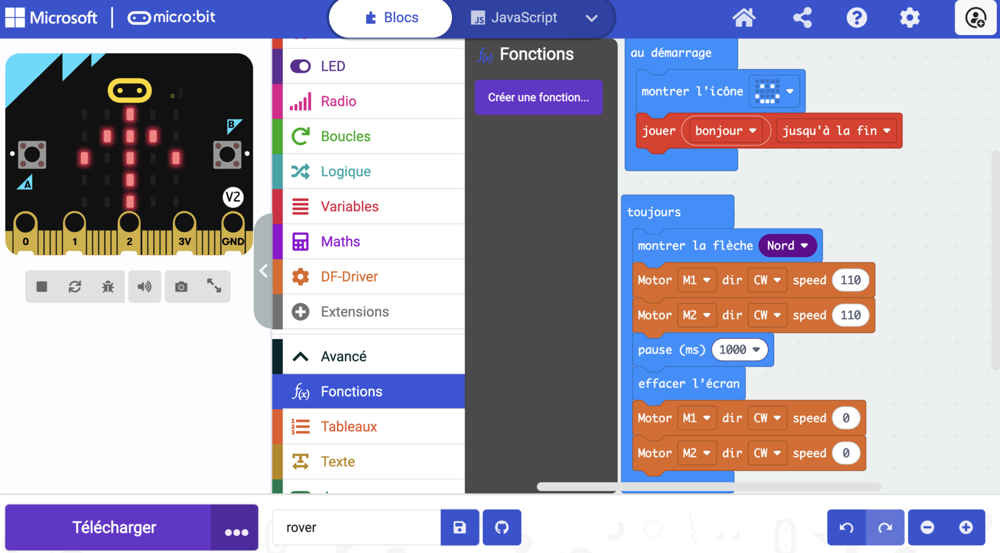
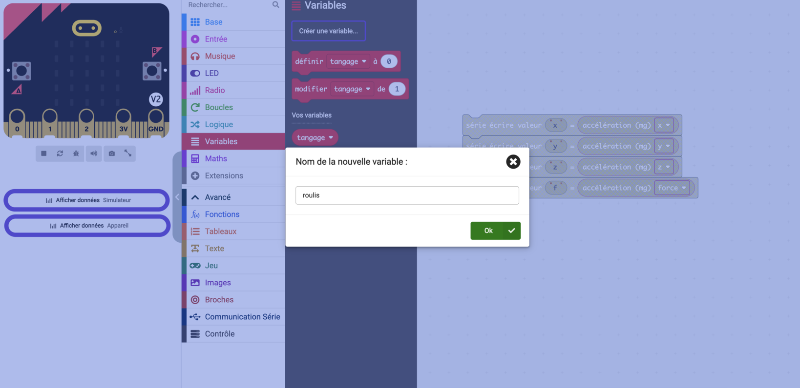
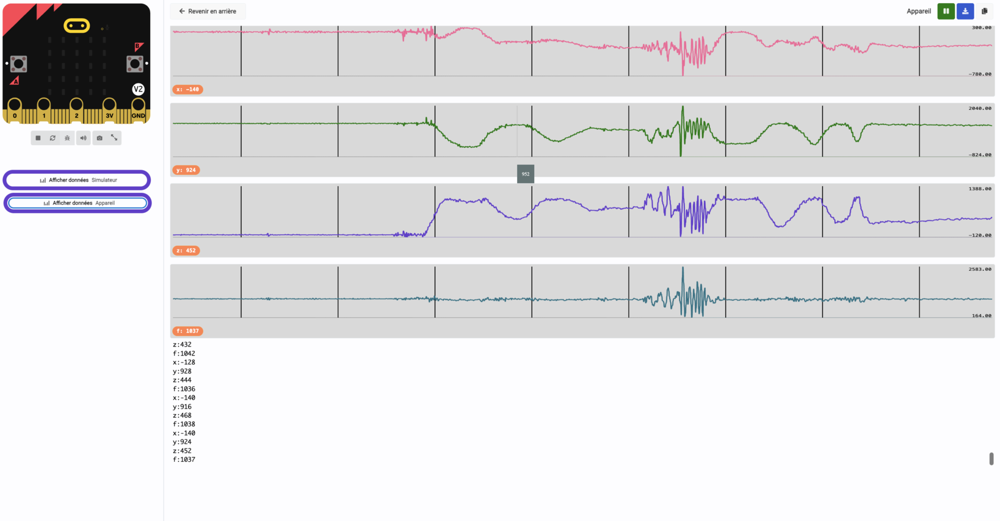
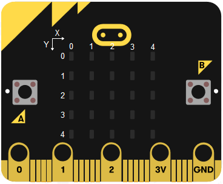
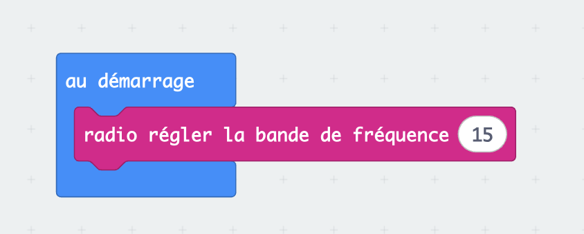
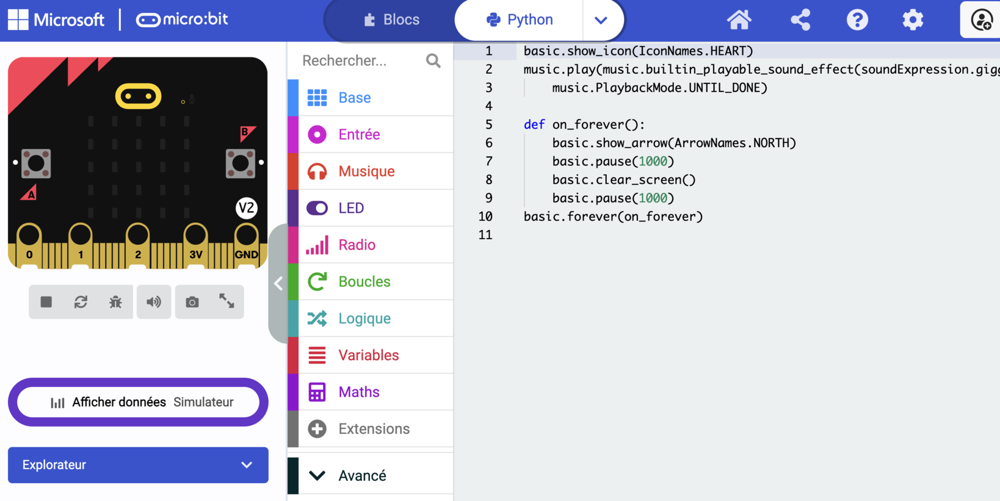

# Prendre en main MakeCode

MakeCode est l'éditeur dans lequel tu écris tes programmes. Il s'ouvre dans un navigateur, à [makecode.microbit.org](https://makecode.microbit.org). Rien à installer.

## Créer un projet

Sur la page d'accueil, **Nouveau projet**, puis un nom.

<figure class="screenshot" markdown>

<figcaption>Tes projets restent dans le navigateur de l'ordinateur où tu les as créés.</figcaption>
</figure>

> [!TIP] Un projet, plusieurs séances
> Donne un nom clair dès le début, par exemple `rover`, et reviens dans le même projet d'une séance à l'autre plutôt que d'en créer un nouveau à chaque fois.
>
> Les projets sont enregistrés dans le navigateur, pas dans un compte. Sur un autre ordinateur, tu ne les retrouveras pas. Si tu changes de poste, utilise le bouton de partage pour récupérer un lien vers ton projet.

## L'écran

Trois zones, de gauche à droite.

**Le simulateur** : un micro:bit dessiné qui exécute ton programme en direct, avant même de le téléverser. Il affiche l'écran, réagit aux boutons, joue les sons. Pratique pour tester une animation sans brancher la carte.

**La palette** : les catégories de blocs, chacune sa couleur. Base, Entrée, Musique, LED, Radio, Boucles, Logique, Variables, Maths, puis Extensions et Avancé.

**L'espace de travail** : où tu assembles tes blocs.

En bas à gauche, le bouton **Télécharger**. En haut au centre, la bascule **Blocs / JavaScript / Python**.

## Les deux blocs de départ

Un projet neuf contient déjà deux blocs.

`au démarrage` s'exécute **une seule fois**, au moment où la carte s'allume ou redémarre. C'est là qu'on met ce qui se règle au début.

`toujours` s'exécute **en boucle, sans fin**, tant que la carte est alimentée. Arrivé en bas, il repart en haut. C'est là qu'on met ce qui doit se répéter.

> [!NOTE] Pourquoi il faut des pauses
> La carte exécute les instructions bien plus vite que l'œil ne suit. Un `toujours` qui allume puis éteint l'écran sans pause produit une image grise et immobile, pas un clignotement.
>
> Le bloc `pause (ms)` se règle en millisecondes : `1000` ms font une seconde. C'est lui qui rend un programme visible.

## Téléverser

Branche le micro:bit en USB, clique sur **Télécharger**, et suis les instructions.

<figure class="screenshot" markdown>

<figcaption>La première fois, l'éditeur demande l'autorisation d'accéder à la carte.</figcaption>
</figure>

La LED jaune au dos de la carte clignote pendant le transfert. Quand elle s'arrête, le programme démarre.

> [!TIP] Sache que ton programme tourne
> Mets toujours une icône et un son dans `au démarrage`. Quand quelque chose ne marchera pas, tu sauras au premier coup d'œil si c'est bien ton programme qui s'exécute, et tu t'épargneras de chercher dans le code un problème qui est dans les fils.

Une fois téléversé, le programme est **dans la carte**. Débranche l'USB, alimente par les accus : il repart tout seul. L'ordinateur n'est plus nécessaire.

## Les fonctions

Une fonction est un bloc que **tu** fabriques : tu lui donnes un nom, tu mets des blocs dedans, et tu l'appelles ensuite par son nom.

**Fonctions** → **Créer une fonction…** → nomme-la → **Terminé**.

<figure class="screenshot" markdown>

</figure>

Le nouveau bloc `fonction <nom>` apparaît dans l'espace de travail : glisse tes blocs dedans. Un bloc `appel <nom>` apparaît en même temps dans la catégorie **Fonctions**. C'est lui que tu places dans `toujours` ou dans `au démarrage`.

> [!NOTE] À quoi ça sert
> À écrire une fois ce qu'on utilise dix fois, et à se relire. `appel avancer` se comprend sans lire le détail ; trois blocs moteur avec des chiffres, non.

Deux règles qui évitent des heures perdues :

- **Un nom qui dit ce que ça fait.** `avancer`, pas `fonction2`.
- **On modifie la fonction, jamais ses copies.** Change la vitesse dans `avancer`, et tous les appels suivent.

Pour renommer une fonction ou lui ajouter un paramètre : clique sur la roue dentée du bloc `fonction`.

## Les variables

Une variable est une **boîte nommée** qui retient une valeur. Tu y ranges quelque chose, tu le relis quand tu veux.

**Variables** → **Créer une variable…** → donne-lui un nom qui dit ce qu'elle contient.

<figure class="screenshot" markdown>

</figure>

Deux blocs suffisent : `définir <nom> à …` pour y mettre une valeur, et le bloc `<nom>` lui-même pour la relire.

> [!NOTE] À quoi ça sert avec un capteur
> Lire un capteur deux fois de suite donne deux valeurs différentes : il bouge entre les deux lectures. Range la mesure dans une variable, et tous tes tests parleront bien du **même** instant.

## Les capteurs, et la décision

Un capteur ne dit jamais « penche à gauche ». Il dit `-247`. Il faut donc **transformer un nombre en décision**, et c'est le même geste pour un thermostat, un détecteur de présence, un capteur de ligne ou une télécommande.

### 1. Regarde avant de décider

La faute classique est d'écrire le test avant d'avoir vu les chiffres. On se trompe de signe, d'ordre de grandeur, d'axe, et on cherche ensuite dans le code un problème qui n'y est pas.

Affiche les valeurs brutes, dans `toujours` :

```
série écrire valeur "x" = accélération (mg) x
```

Téléverse, puis **Afficher données Appareil**. Bouge la carte et regarde les courbes.

> [!NOTE] La communication série
> `série écrire valeur` n'affiche rien sur la carte : il **envoie** les valeurs à l'ordinateur par la liaison série, dans le câble USB. C'est pour ça qu'il faut rester branché pour voir quelque chose, et c'est aussi pour ça que ces blocs ne servent qu'à la mise au point : une fois le rover autonome, personne ne les lit plus.

<figure class="screenshot" markdown>

</figure>

Trois questions, à chaque fois, et pour n'importe quel capteur :

- **Quelle valeur au repos ?** C'est ton point zéro, et il n'est pas forcément à 0.
- **Ça monte ou ça descend** quand tu fais le geste ?
- **Jusqu'où ça va ?** Un capteur qui varie de 40 et un qui varie de 1000 ne se traitent pas pareil.

### L'accéléromètre du micro:bit

Il mesure une accélération sur trois axes, en **mg** (millièmes de g). À plat et immobile, la pesanteur donne environ `1000` sur `z` et environ `0` sur `x` et `y`.

| Axe | Ce qu'il mesure |
|---|---|
| `x` | L'inclinaison gauche / droite, le **roulis** |
| `y` | L'inclinaison avant / arrière, le **tangage** |
| `z` | Le haut et le bas |
| `force` | L'intensité totale, tous axes confondus |

### 2. Choisis un seuil

Un seuil est la valeur à partir de laquelle tu décides que **ça compte**.

> [!NOTE] Pourquoi il en faut un
> Une carte posée à plat n'affiche jamais exactement `0`. Elle oscille, elle vibre, la table n'est pas d'équerre. Sans seuil, ta télécommande part dans tous les sens toute seule.

**Trop bas**, ça se déclenche sans que tu bouges. **Trop haut**, il faut pencher la carte à la verticale pour obtenir quelque chose. Entre les deux, il y a une zone morte confortable.

> [!TIP] Il n'y a pas de bon seuil
> Comme pour les vitesses de tes moteurs : le tien dépend de ta main et de ta façon de tenir la carte. Note-le, ne le recopie pas.

### 3. Écris la décision

Les blocs sont dans **Logique** : `si … alors`, et le `+` du bloc pour ajouter `sinon si` et `sinon`.

<figure class="screenshot" markdown>

</figure>

Range d'abord la mesure dans une variable :

```
effacer l'écran
définir tangage à accélération (mg) y
si tangage < -200 alors      → allumer x 2 y 0
sinon si tangage > 200 alors → allumer x 2 y 4
sinon                        → allumer x 2 y 2
```

**`effacer l'écran` est en tête de la boucle.** Chaque tour éteint tout, puis rallume un seul point. Sans lui, les points s'accumulent.

L'ordre compte : le premier test vrai gagne, les suivants ne sont même pas lus. Mets en premier ce qui doit primer.

### Afficher vite

> [!CAUTION] `montrer la flèche` bloque 400 ms
> `montrer la flèche`, `montrer l'icône` et `montrer les LED` **attendent après avoir affiché** 400 ms, et en blocs cette durée n'est pas réglable. Dans une boucle qui lit un capteur en continu, le programme ne relit la mesure que deux fois et demie par seconde.
>
> `allumer x y`, dans **LED**, n'attend pas.

<figure markdown>

<figcaption>Le coin en haut à gauche est `0,0`.</figcaption>
</figure>

Cinq points suffisent à faire une manette lisible : haut `2,0`, bas `2,4`, gauche `0,2`, droite `4,2`, repos `2,2`.

## La radio

Deux micro:bit communiquent sans fil, sans réseau et sans rien à installer. Les blocs sont dans la catégorie **Radio**.

### La bande de fréquence

Deux cartes ne se parlent que si elles émettent **au même endroit du spectre**. Un seul bloc, dans `au démarrage`, **sur chacune des deux cartes** :

<figure class="screenshot" markdown>

</figure>

Le numéro va de `0` à `83`, un mégahertz par pas à partir de 2400 : la bande `15` est à 2415 MHz. Par défaut, une carte neuve est sur la bande `7`.

> [!NOTE] Bande ou groupe ?
> `radio définir groupe` trie aussi les conversations, mais toutes les cartes restent sur la même fréquence : elles s'entendent et filtrent à l'arrivée. Quand une salle entière émet en continu, les messages se gênent quoi qu'il arrive. La bande sépare vraiment les cartes : c'est elle qu'on utilise ici.
>
> Ni l'une ni l'autre ne rend la liaison plus sûre : n'importe qui peut se régler sur la tienne et écouter.

> [!CAUTION] Le simulateur ne suit pas
> La bande de fréquence ne s'applique qu'à une vraie carte. Dans le simulateur du navigateur, le bloc ne fait rien.

### Envoyer, recevoir

Le bloc qu'on utilise sur le rover envoie **une clé et une valeur** :

```
envoyer la valeur  "avancer"  =  180  par radio
```

La **clé** est un mot : c'est l'ordre. La **valeur** est un nombre qui l'accompagne : une vitesse, une distance, une mesure.

En face, `quand une donnée est reçue par radio` se déclenche tout seul à chaque message, et apporte deux choses : `nom` (la clé) et `valeur` (le nombre).

On teste alors `nom` pour savoir quoi faire. Attention au bloc de comparaison : il en existe deux, et celui qui compare des **textes** a deux cases blanches. Celui qui compare des nombres ne marchera pas ici.

> [!CAUTION] La clé fait 8 caractères, pas un de plus
> Au-delà, la carte tronque sans prévenir.

| Ce que tu tapes | Ce qui part vraiment |
|---|---|
| `tournerAGauche` | `tournerA` |
| `tournerADroite` | `tournerA` |
| `gauche` | `gauche` |
| `droite` | `droite` |

Deux clés qui commencent pareil deviennent **le même message**. Le programme est juste, il se relit sans qu'on trouve rien, et le rover désobéit : compte les caractères avant de coder.

### Se mettre d'accord avant de coder

Deux machines qui échangent doivent s'entendre sur **le canal** et sur **le vocabulaire**. Cet accord s'appelle un **protocole**, et il s'écrit avant le programme.

| Clé | Valeur | Ce que fait le rover |
|---|---|---|
| `avancer` | inclinaison | Les deux moteurs en avant |
| `reculer` | inclinaison | Les deux moteurs en arrière |
| `gauche` | inclinaison | Pivot à gauche |
| `droite` | inclinaison | Pivot à droite |
| `arreter` | `0` | Tout s'arrête |

Note le tien dans ton carnet de bord. C'est ce que tu reliras quand ton coéquipier programmera l'autre carte.

### Quand rien ne passe

La radio est muette : elle ne signale ni l'échec, ni le succès. **Fais-la parler toi-même** : une flèche, une icône, un son à chaque message envoyé et à chaque message reçu. C'est le seul moyen de voir où la chaîne se coupe.

| Ce que tu vois | Où chercher |
|---|---|
| Rien ne s'affiche, même côté émetteur | Le programme n'envoie pas : seuils, conditions |
| L'émetteur affiche, le récepteur non | Les groupes diffèrent, ou une carte n'est pas alimentée |
| Le récepteur affiche, mais le mauvais ordre | Les clés ne correspondent pas : vérifie les 8 caractères |
| Ça marche, puis ça s'arrête | Les accus |

> [!TIP] Retire les témoins à la fin
> Un écran qui clignote pendant une mission gêne. Mais tant que tu règles, laisse-les : c'est ce qui te fait gagner du temps.

## Changer de mode

Un même programme peut faire plusieurs choses : obéir à la télécommande, obéir à la table, suivre un guidage. Chacune est un **mode**.

**Une variable `mode`, pour tout le programme.** Donne un numéro à chaque mode : `0` télécommande, `1` table, `2` guidage. `au démarrage`, `toujours` et `quand une donnée est reçue` lisent tous la même variable.

**Un geste pour en changer.** Par exemple `quand le logo est touché` : `mode` passe au suivant, et revient à `0` après le dernier. C'est là aussi qu'on règle la radio du nouveau mode : bande de l'équipe, ou bande `83` et groupe.

<span class="todo-media">[capture : quand le logo est touché → mode ← mode + 1 ; si mode > 2 alors mode ← 0 ; si mode = 0 alors bande de l'équipe, sinon bande 83 et groupe]</span>

**Un témoin pour le voir.** Chaque mode allume son point, dans un coin que tes autres témoins n'utilisent pas. Rallume-le à chaque tour de `toujours`, juste après `effacer l'écran`.

| Mode | `mode` | Point |
|---|---|---|
| Télécommande | `0` | `0,0` |
| Table | `1` | `4,0` |
| Guidage | `2` | `0,4` |

Dans `toujours`, un `si mode = 0 … sinon si mode = 1 …` choisit ce que fait le programme.

> [!NOTE] Pourquoi un témoin
> Un rover en mode table n'obéit plus à sa télécommande. Sans témoin, on croit à une panne.

> [!TIP] Deux programmes, c'est aussi une solution
> Un projet par mode, téléversé selon le besoin. Plus simple à écrire, plus lent à changer : il faut l'ordinateur.

## Blocs, JavaScript, Python

La bascule en haut de l'écran montre le même programme sous trois formes.

<figure class="screenshot" markdown>

<figcaption>Les blocs sont une façon d'écrire du code.</figcaption>
</figure>

Tu peux regarder, c'est instructif. Attention : en passant en texte puis en revenant aux blocs, une mise en page peut se perdre. Fais l'aller-retour sur un projet dont tu n'as pas peur de perdre l'agencement.

→ [La carte DFR0548 et ses blocs](carte-dfr0548.md) · [Déboguer](deboguer.md)
