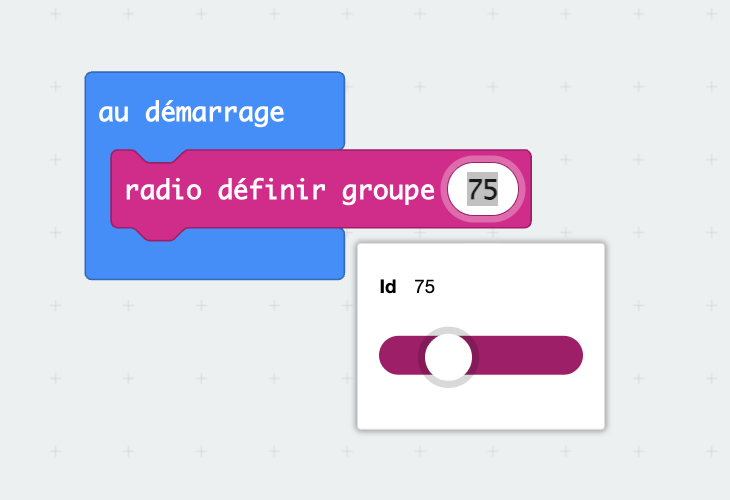

# Prendre en main MakeCode

MakeCode est l'éditeur dans lequel tu écris tes programmes. Il s'ouvre dans un navigateur, à [makecode.microbit.org](https://makecode.microbit.org). Rien à installer.

## Créer un projet

Sur la page d'accueil, **Nouveau projet**, puis un nom.

<figure class="screenshot" markdown>

<figcaption>Tes projets restent dans le navigateur de l'ordinateur où tu les as créés.</figcaption>
</figure>

> [!TIP] Un projet, plusieurs séances
> Donne un nom clair dès le début — `rover` — et reviens dans le même projet d'une séance à l'autre plutôt que d'en créer un nouveau à chaque fois.
>
> Les projets sont enregistrés dans le navigateur, pas dans un compte. Sur un autre ordinateur, tu ne les retrouveras pas. Si tu changes de poste, utilise le bouton de partage pour récupérer un lien vers ton projet.

## L'écran

Trois zones, de gauche à droite.

**Le simulateur** — un micro:bit dessiné qui exécute ton programme en direct, avant même de le téléverser. Il affiche l'écran, réagit aux boutons, joue les sons. Pratique pour tester une animation sans brancher la carte.

**La palette** — les catégories de blocs, chacune sa couleur. Base, Entrée, Musique, LED, Radio, Boucles, Logique, Variables, Maths, puis Extensions et Avancé.

**L'espace de travail** — où tu assembles tes blocs.

En bas à gauche, le bouton **Télécharger**. En haut au centre, la bascule **Blocs / JavaScript / Python**.

## Les deux blocs de départ

Un projet neuf contient déjà deux blocs, et la différence entre eux est la première chose à comprendre.

`au démarrage` s'exécute **une seule fois**, au moment où la carte s'allume ou redémarre. C'est là qu'on met ce qui se règle au début.

`toujours` s'exécute **en boucle, sans fin**, tant que la carte est alimentée. Arrivé en bas, il repart en haut. C'est là qu'on met ce qui doit se répéter.

> [!NOTE] Pourquoi il faut des pauses
> La carte exécute les instructions bien plus vite que l'œil ne suit. Un `toujours` qui allume puis éteint l'écran sans pause produit une image grise et immobile, pas un clignotement.
>
> Le bloc `pause (ms)` se règle en millisecondes : `1000` ms font une seconde. C'est lui qui rend un programme visible.

## Téléverser

Branche le micro:bit en USB, clique sur **Télécharger**, et suis les instructions.

<figure class="screenshot" markdown>

<figcaption>La première fois, l'éditeur demande l'autorisation d'accéder à la carte.</figcaption>
</figure>

La LED jaune au dos de la carte clignote pendant le transfert. Quand elle s'arrête, le programme démarre.

> [!TIP] Sache que ton programme tourne
> Mets toujours une icône et un son dans `au démarrage`. Quand quelque chose ne marchera pas, tu sauras au premier coup d'œil si c'est bien ton programme qui s'exécute — et tu t'épargneras de chercher dans le code un problème qui est dans les fils.

Une fois téléversé, le programme est **dans la carte**. Débranche l'USB, alimente par les accus : il repart tout seul. L'ordinateur n'est plus nécessaire.

## Les fonctions

Une fonction est un bloc que **tu** fabriques : tu lui donnes un nom, tu mets des blocs dedans, et tu l'appelles ensuite par son nom.

**Fonctions** → **Créer une fonction…** → nomme-la → **Terminé**.

<figure class="screenshot" markdown>

</figure>

Le nouveau bloc `fonction <nom>` apparaît dans l'espace de travail : glisse tes blocs dedans. Un bloc `appel <nom>` apparaît en même temps dans la catégorie **Fonctions** — c'est lui que tu places dans `toujours` ou dans `au démarrage`.

> [!NOTE] À quoi ça sert
> À écrire une fois ce qu'on utilise dix fois, et à se relire. `appel avancer` se comprend sans lire le détail ; trois blocs moteur avec des chiffres, non.

Deux règles qui évitent des heures perdues :

- **Un nom qui dit ce que ça fait.** `avancer`, pas `fonction2`.
- **On modifie la fonction, jamais ses copies.** Change la vitesse dans `avancer`, et tous les appels suivent. C'est tout l'intérêt.

Pour renommer une fonction ou lui ajouter un paramètre : clique sur la roue dentée du bloc `fonction`.

## Les variables

Une variable est une **boîte nommée** qui retient une valeur. Tu y ranges quelque chose, tu le relis quand tu veux.

**Variables** → **Créer une variable…** → donne-lui un nom qui dit ce qu'elle contient.

<figure class="screenshot" markdown>

</figure>

Deux blocs suffisent : `définir <nom> à …` pour y mettre une valeur, et le bloc `<nom>` lui-même pour la relire.

> [!NOTE] À quoi ça sert avec un capteur
> Lire un capteur deux fois de suite donne deux valeurs différentes — il bouge entre les deux lectures. Range la mesure dans une variable, et tous tes tests parleront bien du **même** instant.

→ [D'une mesure à une décision](mesure-vers-decision.md)

## La radio

Deux micro:bit savent se parler sans fil, sans réseau et sans rien à installer. Les blocs sont dans la catégorie **Radio**.

### Le groupe

Toutes les cartes de la salle émettent sur la même fréquence. Le **groupe** est le numéro qui les trie : une carte ne reçoit que les messages de son propre groupe, et ignore tous les autres.

Un seul bloc, dans `au démarrage`, **sur chacune des deux cartes** :

<figure class="screenshot" markdown>

</figure>

Le numéro va de `0` à `255`. Ce qui compte n'est pas lequel tu choisis, mais que **les deux cartes aient le même**, et que personne d'autre dans la salle ne l'utilise.

> [!NOTE] Groupe ≠ portée
> Changer de groupe ne rend pas la liaison plus sûre ni plus longue. Ça sépare les conversations, rien de plus : n'importe qui peut régler son groupe sur le tien et écouter.

### Envoyer, recevoir

Le bloc qu'on utilise sur le rover envoie **une clé et une valeur** :

```
envoyer la valeur  "avancer"  =  180  par radio
```

La **clé** est un mot : c'est l'ordre. La **valeur** est un nombre qui l'accompagne — une vitesse, une distance, une mesure.

En face, `quand une donnée est reçue par radio` se déclenche tout seul à chaque message, et apporte deux choses : `nom` (la clé) et `valeur` (le nombre).

On teste alors `nom` pour savoir quoi faire. Attention au bloc de comparaison : il en existe deux, et celui qui compare des **textes** a deux cases blanches. Celui qui compare des nombres ne marchera pas ici.

> [!CAUTION] La clé fait 8 caractères, pas un de plus
> Au-delà, la carte tronque sans prévenir.

| Ce que tu tapes | Ce qui part vraiment |
|---|---|
| `tournerAGauche` | `tournerA` |
| `tournerADroite` | `tournerA` |
| `gauche` | `gauche` |
| `droite` | `droite` |

Deux clés qui commencent pareil deviennent **le même message**. Le programme est juste, il se relit sans qu'on trouve rien, et le rover désobéit : compte les caractères avant de coder.

### Se mettre d'accord avant de coder

Deux machines qui échangent doivent s'entendre sur **le canal** et sur **le vocabulaire**. Cet accord s'appelle un **protocole**, et il s'écrit avant le programme.

| Clé | Valeur | Ce que fait le rover |
|---|---|---|
| `avancer` | inclinaison | Les deux moteurs en avant |
| `reculer` | inclinaison | Les deux moteurs en arrière |
| `gauche` | inclinaison | Pivot à gauche |
| `droite` | inclinaison | Pivot à droite |
| `arreter` | `0` | Tout s'arrête |

Note le tien dans ton carnet de bord. C'est ce que tu reliras quand ton coéquipier programmera l'autre carte.

### Quand rien ne passe

La radio est muette : elle ne signale ni l'échec, ni le succès. **Fais-la parler toi-même** — une flèche, une icône, un son à chaque message envoyé et à chaque message reçu. C'est le seul moyen de voir où la chaîne se coupe.

| Ce que tu vois | Où chercher |
|---|---|
| Rien ne s'affiche, même côté émetteur | Le programme n'envoie pas : seuils, conditions |
| L'émetteur affiche, le récepteur non | Les groupes diffèrent, ou une carte n'est pas alimentée |
| Le récepteur affiche, mais le mauvais ordre | Les clés ne correspondent pas — vérifie les 8 caractères |
| Ça marche, puis ça s'arrête | Les accus |

> [!TIP] Retire les témoins à la fin, pas avant
> Un écran qui clignote pendant une mission gêne. Mais tant que tu règles, laisse-les : c'est ce qui te fait gagner du temps.

## Blocs, JavaScript, Python

La bascule en haut de l'écran montre le même programme sous trois formes.

<figure class="screenshot" markdown>

<figcaption>Les blocs sont une façon d'écrire du code, pas une chose différente du code.</figcaption>
</figure>

Tu peux regarder, c'est instructif. Attention : en passant en texte puis en revenant aux blocs, une mise en page peut se perdre. Fais l'aller-retour sur un projet dont tu n'as pas peur de perdre l'agencement.
