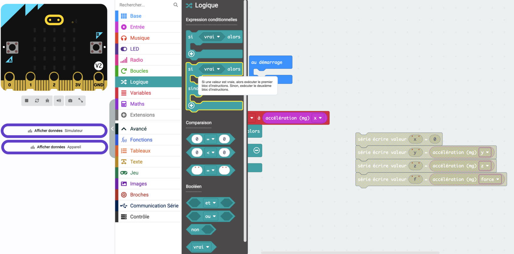

# D'une mesure à une décision

Un capteur ne dit jamais « penche à gauche ». Il dit `-247`. Il faut donc **transformer un nombre en décision**.

C'est le même geste pour un thermostat, un détecteur de présence, un capteur de ligne ou ta télécommande.

## 1. Regarde avant de décider

La faute classique est d'écrire le test avant d'avoir vu les chiffres. On se trompe de signe, d'ordre de grandeur, d'axe — et on cherche ensuite dans le code un problème qui n'y est pas.

Affiche les valeurs brutes, dans `toujours` :

```
série écrire valeur "x" = accélération (mg) x
```

Téléverse, puis **Afficher données Appareil**. Bouge la carte et regarde les courbes.

> [!NOTE] Ça passe par le câble
> `série écrire valeur` n'affiche rien sur la carte : il **envoie** les valeurs à l'ordinateur par la liaison série, dans le câble USB. C'est pour ça qu'il faut rester branché pour voir quelque chose, et c'est aussi pour ça que ces blocs ne servent qu'à la mise au point — une fois le rover autonome, personne ne les lit plus.

<figure class="screenshot" markdown>

</figure>

Trois questions, à chaque fois :

- **Quelle valeur au repos ?** C'est ton point zéro, et il n'est pas forcément à 0.
- **Ça monte ou ça descend** quand tu fais le geste ?
- **Jusqu'où ça va ?** Un capteur qui varie de 40 et un qui varie de 1000 ne se traitent pas pareil.

## L'accéléromètre du micro:bit

Il mesure une accélération sur trois axes, en **mg** (millièmes de g). À plat et immobile, la pesanteur donne environ `1000` sur `z` et environ `0` sur `x` et `y`.

| Axe | Ce qu'il sent |
|---|---|
| `x` | L'inclinaison gauche / droite — le **roulis** |
| `y` | L'inclinaison avant / arrière — le **tangage** |
| `z` | Le haut et le bas |
| `force` | L'intensité totale, tous axes confondus |

## 2. Choisis un seuil

Un seuil est la valeur à partir de laquelle tu décides que **ça compte**.

> [!NOTE] Pourquoi il en faut un
> Une carte posée à plat n'affiche jamais exactement `0`. Elle oscille, elle vibre, la table n'est pas d'équerre. Sans seuil, ta télécommande part dans tous les sens toute seule.

**Trop bas**, ça se déclenche sans que tu bouges. **Trop haut**, il faut pencher la carte à la verticale pour obtenir quelque chose. Entre les deux, il y a une zone morte confortable.

> [!TIP] Il n'y a pas de bon seuil
> Comme pour les vitesses de tes moteurs : le tien dépend de ta main et de ta façon de tenir la carte. Note-le, ne le recopie pas.

## 3. Écris la décision

Les blocs sont dans **Logique** : `si … alors`, et le `+` du bloc pour ajouter `sinon si` et `sinon`.

<figure class="screenshot" markdown>

</figure>

Range d'abord la mesure dans une variable — elle est lue une fois, et tu la relis autant que tu veux :

```
définir tangage à accélération (mg) y
si tangage < -100 alors    → montrer la flèche Nord
sinon si tangage > 100 alors → montrer la flèche Sud
sinon                       → effacer l'écran
```

**Le `sinon` n'est pas facultatif.** C'est lui qui éteint l'écran quand la carte revient à plat. Sans lui, la dernière flèche reste affichée pour toujours.

### Deux axes à la fois

Pour gérer aussi la gauche et la droite, ajoute une seconde variable sur `x` et imbrique son test dans le `sinon` du premier.

<figure class="screenshot" markdown>

</figure>

L'ordre compte : le premier test qui est vrai gagne, les suivants ne sont même pas lus. Mets en premier ce qui doit primer.

→ [Prendre en main MakeCode](makecode-prise-en-main.md) · [Quand ça ne marche pas](depannage.md)
