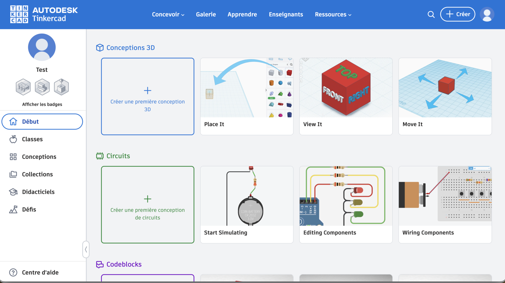
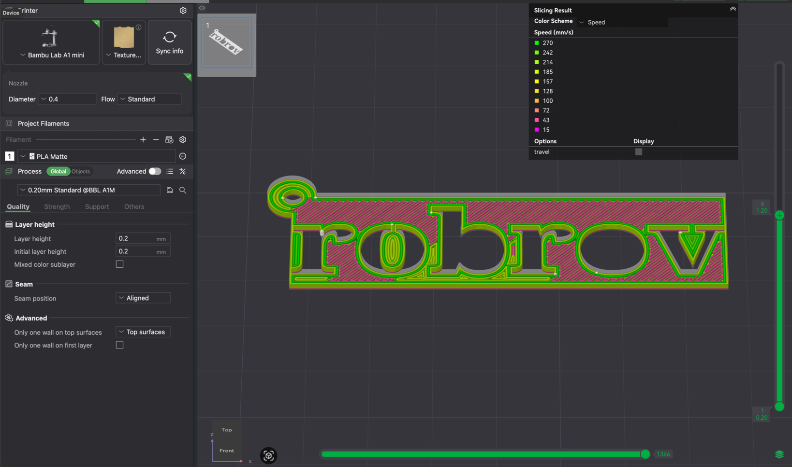

# Modéliser et imprimer en 3D

Dessiner une pièce à l'écran et la tenir dans la main une heure plus tard. Entre les deux, deux outils : **Tinkercad** pour dessiner, **le slicer** pour traduire.

## Tinkercad

Tu te connectes par [tinkercad.com/joinclass](https://www.tinkercad.com/joinclass), avec le code de classe et ton identifiant d'élève. Pas d'adresse mail : les comptes sont créés par l'animateur.

<figure class="screenshot" markdown>

</figure>

**Conceptions 3D** → **Créer** ouvre le *plan de construction* : la grille sur laquelle tu poses tes formes. Les unités sont des **millimètres**.

<figure class="screenshot" markdown>

</figure>

### Les quatre gestes

**Poser une forme** : tu la fais glisser de la palette vers le plan.

**La coter** : le panneau de propriétés donne longueur, largeur, hauteur. Tape les valeurs, ne les ajuste pas à la souris : la souris ne tombe jamais juste.

**Percer** : toute forme peut passer de **Solide** à **Perçage**. Une forme en perçage ne s'imprime pas : elle creuse ce qu'elle touche. C'est comme ça qu'on fait un trou.

**Regrouper** : <kbd>Ctrl</kbd> + <kbd>G</kbd>. Les formes sélectionnées deviennent une seule pièce, et les perçages sont creusés pour de bon.

> [!TIP] Regroupe en dernier
> Tant que tu n'as pas regroupé, tu peux tout déplacer et tout recoter. Après, c'est un bloc.

### Les îlots détachés

Dès que tu perces une forme de part en part, demande-toi **ce qui reste accroché à quoi**.

Le cas classique est le texte découpé : l'intérieur des lettres fermées (`o`, `b`, `a`, `d`, `p`) n'est relié à rien. Sur l'écran, ça se voit à peine. À l'impression, ces îlots se détachent, ou s'impriment à côté comme de petites pièces séparées.

<figure class="screenshot" markdown>

</figure>

Deux façons de s'en sortir :

- **Relier** l'îlot au reste de la pièce par un pont de matière. C'est ce que font les typographies dites « au pochoir »
- **Effacer** l'îlot, en posant une forme en perçage par-dessus

La règle vaut au-delà du texte : **une pièce imprimée est d'un seul tenant, ou elle est plusieurs pièces.**

### Aligner plutôt que viser

Tinkercad a un outil **Aligner** : tu sélectionnes plusieurs formes, et des poignées apparaissent pour les caler à gauche, au centre, à droite, devant, au milieu, derrière.

<figure class="screenshot" markdown>

</figure>

Centrer à la souris donne toujours un décalage d'un demi-millimètre qu'on ne voit qu'une fois la pièce imprimée.

### La vue de face, et l'altitude

Toute forme posée dans Tinkercad a une **altitude** : sa hauteur au-dessus du plan de construction. Vue de dessus, rien ne la trahit : deux formes qui paraissent superposées peuvent très bien flotter l'une au-dessus de l'autre.

<figure class="screenshot" markdown>

<figcaption>Vu de dessus, ce texte semblait posé sur la plaque. Il flotte.</figcaption>
</figure>

La poignée au sommet de la forme sélectionnée règle cette altitude. C'est elle qui décide si un texte est **posé sur** une plaque ou s'il la **traverse**, et donc si le perçage découpera quelque chose.

**Passe en vue de face avant chaque groupement.** C'est la seule qui montre les épaisseurs, les reliefs et ce qui surplombe dans le vide.

### Partir d'une esquisse

Trois outils de **Formes simples** partent d'un dessin à plat :

| Outil | Tu dessines | Tinkercad | Pour |
|---|---|---|---|
| **Faire pivoter l'esquisse** (révolution) | La moitié du profil, contre l'axe | Le fait tourner | Roue, moyeu, bouchon |
| **Extruder l'esquisse** (extrusion) | Le contour vu de dessus | Le fait monter tout droit | Plaque, pare-chocs, fourche |
| **Scribble** (esquisse libre) | À main levée | Lui donne une **Hauteur** | Logo, forme sans cote |

<figure class="screenshot" markdown>

</figure>

On quitte l'éditeur par **Terminer l'esquisse**.

### Exporter

**Regroupe d'abord toutes les formes de la pièce**, puis sélectionne le groupe.

**Exporter** → **La forme sélectionnée** → **.STL**

> [!NOTE] Tout regrouper avant d'exporter
> Seule la forme sélectionnée part dans le fichier. Une révolution, une extrusion et un Scribble posés l'un sur l'autre restent trois formes tant qu'on ne les regroupe pas : on n'en imprimerait qu'une.

Le `.STL` est le format que comprennent toutes les imprimantes 3D. Les autres servent à autre chose : `.OBJ` et `.glb` pour l'image de synthèse, `.SVG` pour la découpe laser.

## L'impression

### Le principe : on ajoute, on n'enlève pas

Une imprimante 3D dépose du plastique fondu **couche par couche**, de bas en haut. C'est l'inverse de la découpe du carton, où on retire de la matière.

> [!NOTE] Une pièce casse entre ses couches
> Les couches sont collées les unes aux autres, et ce collage est moins solide que le plastique lui-même. Une pièce se rompt donc presque toujours **dans le sens des couches**.
>
> Conséquence directe : on oriente une pièce pour que les efforts qu'elle subira soient **dans le plan des couches**, pas perpendiculaires.

### Le slicer

L'imprimante n'exécute pas ton modèle : elle exécute des déplacements. Le **slicer** tranche ta pièce en couches et écrit la liste des mouvements à exécuter.

<figure class="screenshot" markdown>

</figure>

Trois réglages :

| Réglage | Ce que ça change |
|---|---|
| **Hauteur de couche** | Plus fin = plus beau et plus long. 0,2 mm est le compromis courant |
| **Remplissage** | Une pièce n'est **pas pleine** : l'intérieur est un maillage. Plus de remplissage = plus solide et plus lent |
| **Adhérence** | Si la première couche ne colle pas au plateau, tout le reste rate |

> [!CAUTION] Un plateau partagé est un risque partagé
> Toutes les plaques du groupe s'impriment ensemble. Si une pièce se décolle, elle peut faire rater ses voisines. C'est pour ça qu'on vérifie la disposition collectivement avant de lancer.

### Estimer la durée d'impression

Sans installer de slicer : **Kiri:Moto**, dans le navigateur, gratuit et sans compte.

1. Ouvre [grid.space/kiri](https://grid.space/kiri/).
2. **Fichier** → **Importer** → ton `.STL`.
3. **Trancher**.
4. **Exporter** : la fenêtre affiche **estimation du temps**, en heures, minutes, secondes. Pas besoin de télécharger.

<figure class="screenshot" markdown>

</figure>

> [!NOTE] Un ordre de grandeur
> Chaque slicer calcule à sa façon, et l'imprimante ne tiendra pas la durée à la minute. Pour suivre un budget, lis toujours tes durées au même endroit.

### Concevoir pour la machine

Une pièce se dessine pour **une fonction** et pour **une machine**.

- **Ça doit tenir sur le plateau** : le tien et celui des autres
- **Ça doit tenir à l'usage** : assez de matière autour d'un trou, assez d'épaisseur sous un effort
- **Ça doit s'imprimer** : une forme qui surplombe dans le vide a besoin de supports, ou d'être réorientée

→ [Déboguer](deboguer.md)
