# Séance 1 — Fabrique ta lampe et allume-la

Tu montes ta lampe et tu allumes une LED avec le micro:bit, d'abord comme une pile, puis avec un programme. Ensuite, les deux bandes de cuivre deviennent un bouton.

## 1. Monte ta lampe

<figure markdown>
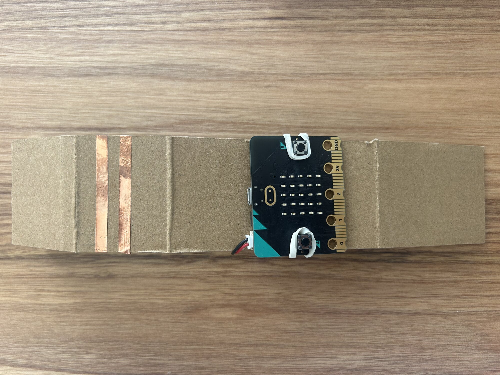
</figure>

[plan de découpe du support]

Plie le support le long des rainures. Le micro:bit se tient par deux élastiques, écran vers l'avant.

<figure markdown>
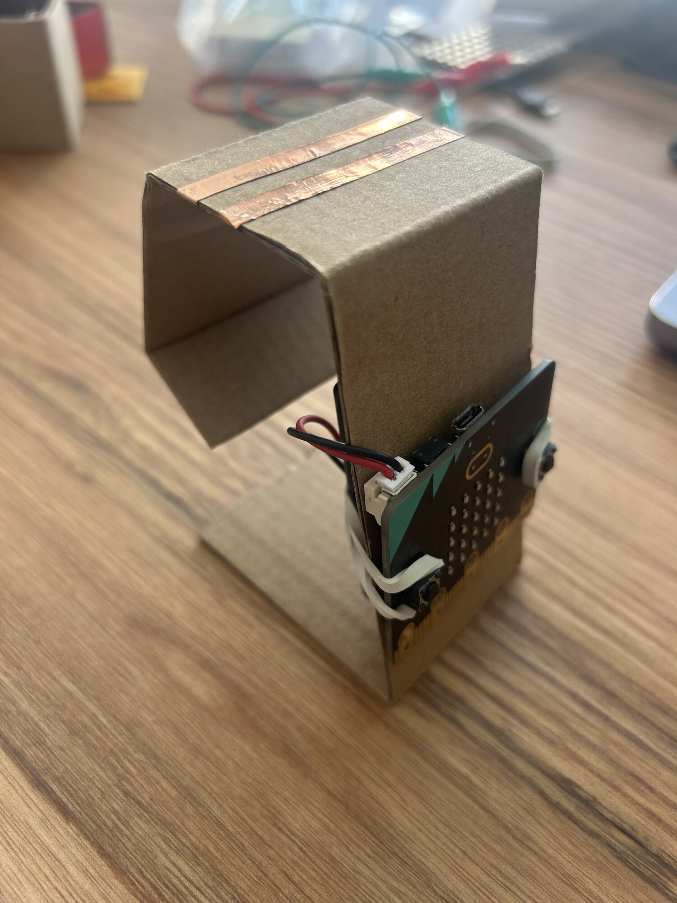
</figure>

<figure markdown>
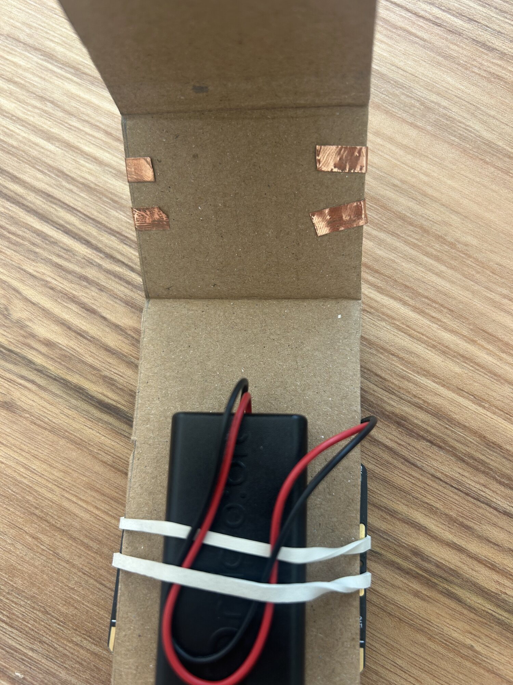
</figure>

Le boîtier de piles se tient derrière, par deux élastiques. Branche-le au micro:bit.

## 2. Prépare ta LED

<figure markdown>

</figure>

Replie et enroule chaque patte en boucle : elle touchera mieux le cuivre.

Avant d'enrouler, repère la **patte longue** : c'est le `+`.

## 3. Le micro:bit comme une pile

<figure markdown>
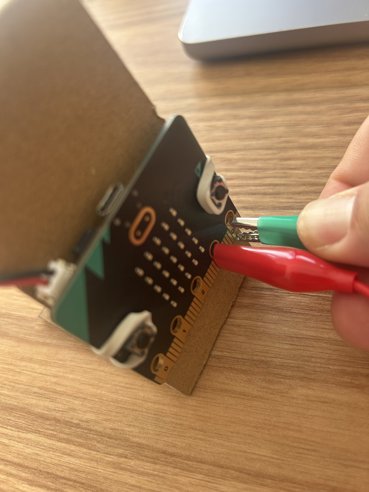
</figure>

Une pince sur `3V`, une pince sur `GND`.

<figure markdown>
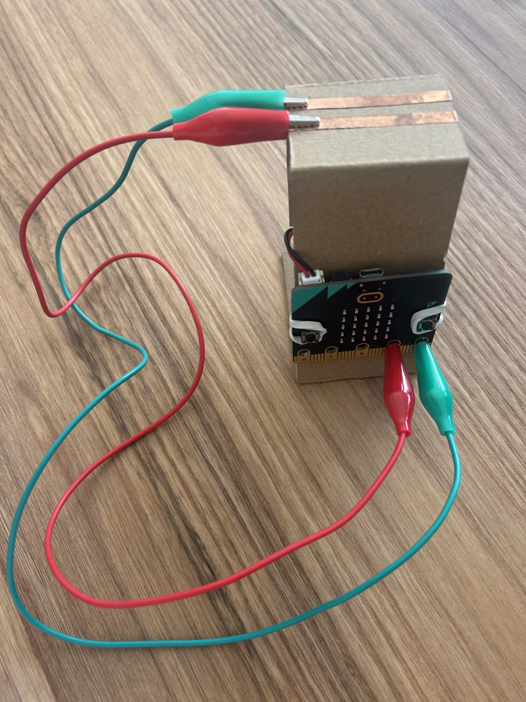
</figure>

L'autre bout de chaque pince sur une bande de cuivre. Retiens quelle bande est reliée à `3V`.

## 4. Allume la LED

<figure markdown>

</figure>

Pose la LED à cheval sur les deux bandes, une boucle sur chacune. Elle ne s'allume pas ? Retourne-la.

> [!NOTE] Un circuit, c'est une boucle
> Le courant part de `3V`, traverse une bande, la LED, l'autre bande, et revient à `GND`. La LED ne le laisse passer que dans un sens : patte longue côté `3V`.

> [!IMPORTANT] Point de contrôle
> Montre ta LED allumée, et dis quelle patte est sur la bande reliée à `3V`.

## 5. Passe sur une broche

<figure markdown>

</figure>

Déplace la pince de `3V` à `2`.

<figure markdown>
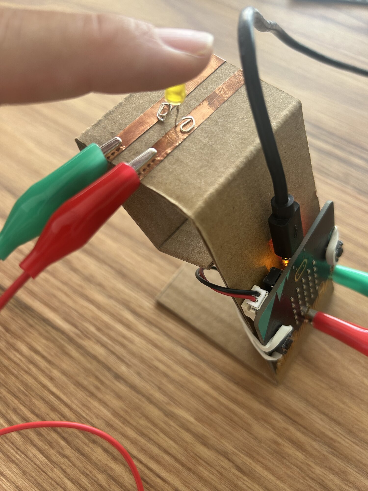
</figure>

La LED s'éteint : la broche `P2` n'envoie rien tant qu'aucun programme ne le lui demande.

## 6. Le programme qui allume

[makecode.microbit.org](https://makecode.microbit.org) → **Nouveau projet** → nomme-le `lampe`.

→ [Prendre en main MakeCode](../../../fiches/makecode-prise-en-main.md)

Dans `au démarrage` : `écrire sur la broche P2 la valeur 1` (**Broches**, sous **Avancé**).

<figure class="screenshot" markdown>
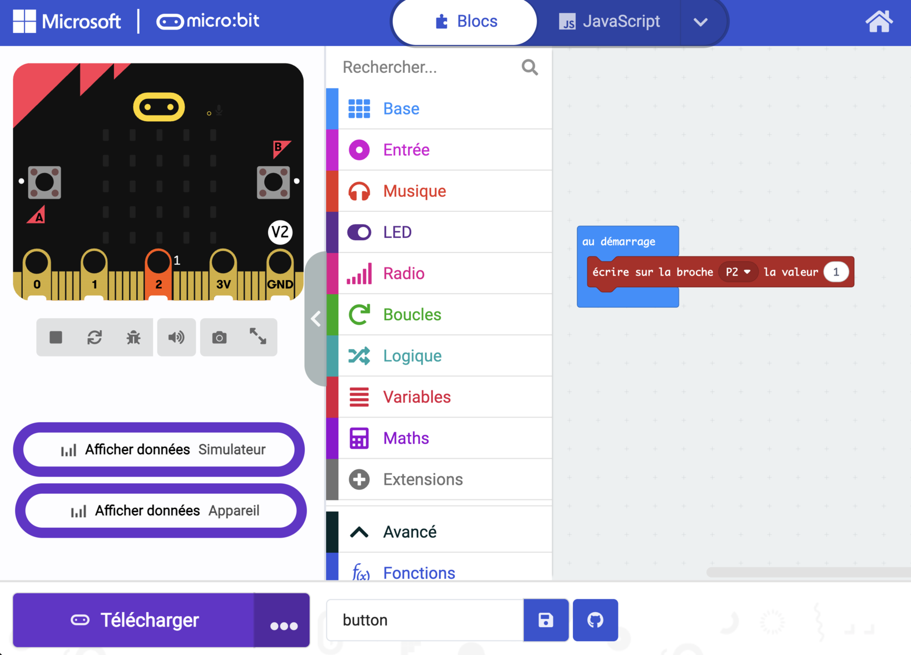
</figure>

Téléverse.

<figure markdown>
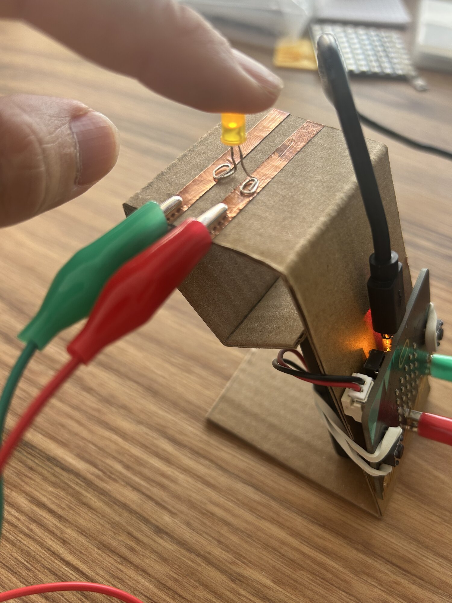
</figure>

> [!NOTE] Une sortie
> `1`, la broche envoie du courant. `0`, elle n'envoie rien. `P2` est ici une **sortie** : c'est le programme qui décide.

## 7. Fais-la clignoter

**À toi.** La LED s'allume une demi-seconde, s'éteint une demi-seconde, sans fin. Il te faut `toujours` (**Base**), `pause` (**Base**) et le bloc de la broche.

La solution

<figure class="screenshot" markdown>
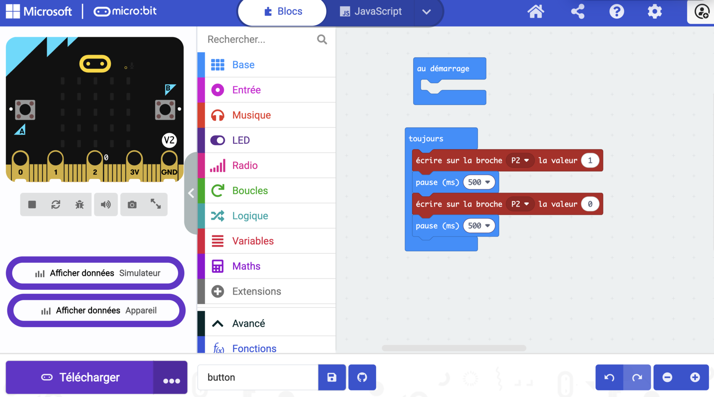
</figure>

<figure markdown>
<video controls playsinline preload="metadata" src="../../../../assets/objets-connectes-s01/video-clignotement.mp4"></video>
<figcaption>Ce que tu dois obtenir.</figcaption>
</figure>

## 8. Les bandes deviennent un bouton

Enlève la LED. Garde les deux pinces : une sur `GND`, une sur `2`.

Cette fois, `P2` est une **entrée** : le programme lit ce qui y arrive.

Dans `toujours` : `série écrire valeur` (**Communication Série**, sous **Avancé**), avec `lire la broche analogique P2` (**Broches**). Nomme la valeur `p2`.

<figure class="screenshot" markdown>
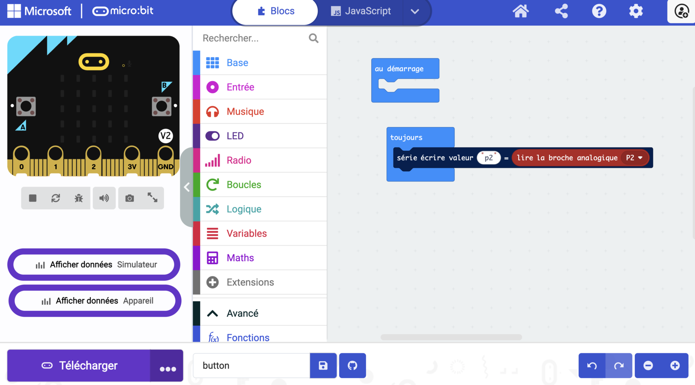
</figure>

Téléverse, USB branché, puis **Afficher données Appareil**.

## 9. Touche les deux bandes

Pose un doigt à cheval sur les deux bandes, et regarde la courbe.

<figure class="screenshot" markdown>
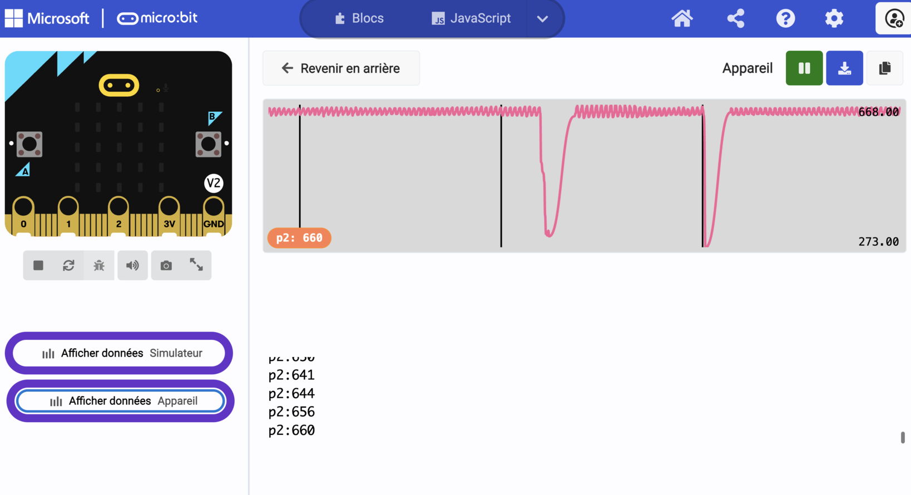
</figure>

<figure markdown>
<video controls playsinline preload="metadata" src="../../../../assets/objets-connectes-s01/video-valeurs-au-toucher.mp4"></video>
</figure>

> [!NOTE] Ton doigt ferme la boucle
> La peau conduit un peu le courant. Quand ton doigt relie les deux bandes, la valeur lue sur `P2` chute.

Note au carnet ta valeur au repos et ta valeur quand tu touches.

## 10. Affiche quelque chose quand on touche

**À toi.** Quand la valeur passe sous un seuil choisi entre tes deux valeurs, le micro:bit affiche une icône. Il te faut `si … alors` (**Logique**), une comparaison (**Logique**) et `montrer l'icône` (**Base**).

La solution

<figure class="screenshot" markdown>
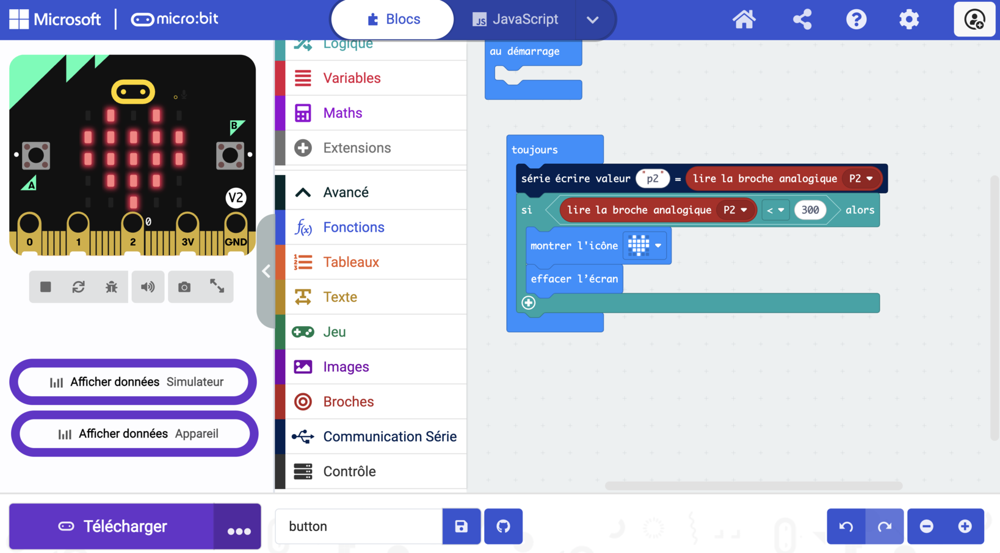
</figure>

`300` est le seuil de ce montage. Prends le tien, d'après tes valeurs.

<figure markdown>
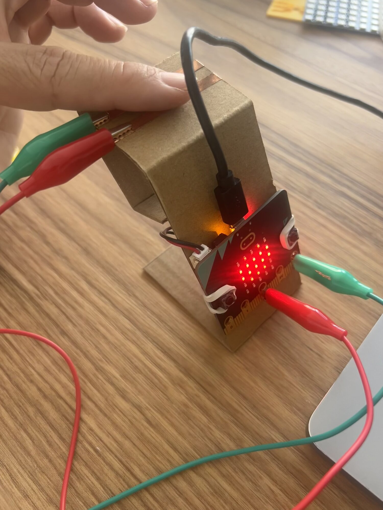
</figure>

<figure markdown>
<video controls playsinline preload="metadata" src="../../../../assets/objets-connectes-s01/video-toucher-coeur.mp4"></video>
</figure>

> [!IMPORTANT] Point de contrôle
> Montre ton bouton en cuivre à l'animateur.

## 11. Va plus loin

Une animation et un son

Quand on touche les bandes, une petite animation : plusieurs icônes à la suite. Ajoute un son (**Musique**).

---

## Ce que tu dois avoir à la fin

- [ ] Ta lampe montée, micro:bit et piles en place
- [ ] La LED allumée par `3V`, puis par le programme
- [ ] La LED qui clignote
- [ ] Tes valeurs au repos et au toucher notées au carnet
- [ ] Une icône qui s'affiche quand tu touches le cuivre
- [ ] Ton [carnet de bord](../../../carnet-de-bord/objets-connectes-s01.md) rempli

## Avant de partir

Lampe, LED et pinces dans ton bac.
