# Séance 1 — Fabrique ta lampe et allume-la

1. **[Monte ta lampe et allume la LED](#1-monte-ta-lampe-et-allume-la-led)** : le micro:bit sert de pile, la LED s'allume.
2. **[Le programme commande la LED](#2-le-programme-commande-la-led)** : la LED clignote.
3. **[Les bandes deviennent un bouton](#3-les-bandes-deviennent-un-bouton)** : tu touches le cuivre, une icône s'affiche.

## 1. Monte ta lampe et allume la LED

**Ce que tu vas obtenir :**

<figure markdown>
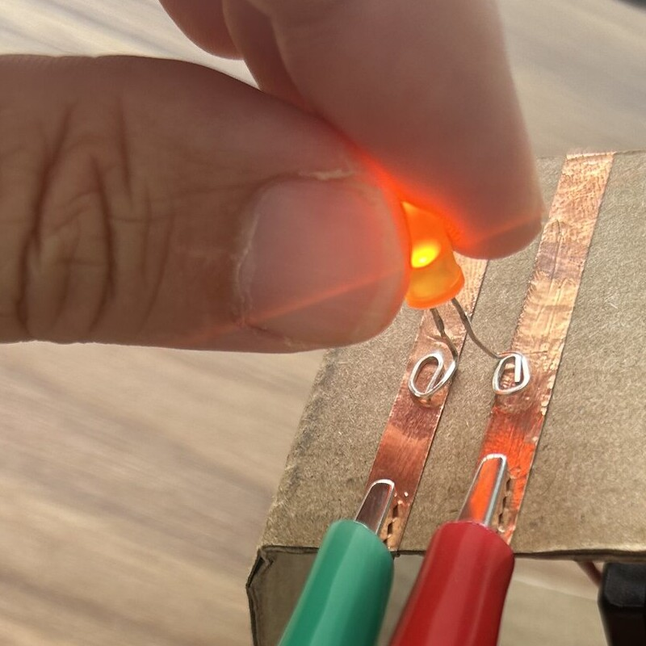
</figure>

### Le support

<figure class="plan" markdown>

</figure>

Imprime [le plan (PDF)](../../../assets/plans/lampe-support-v5.pdf) en A4, **à 100 %**. Colle-le sur le carton : la face imprimée sera l'intérieur de ta lampe.

<figure markdown>
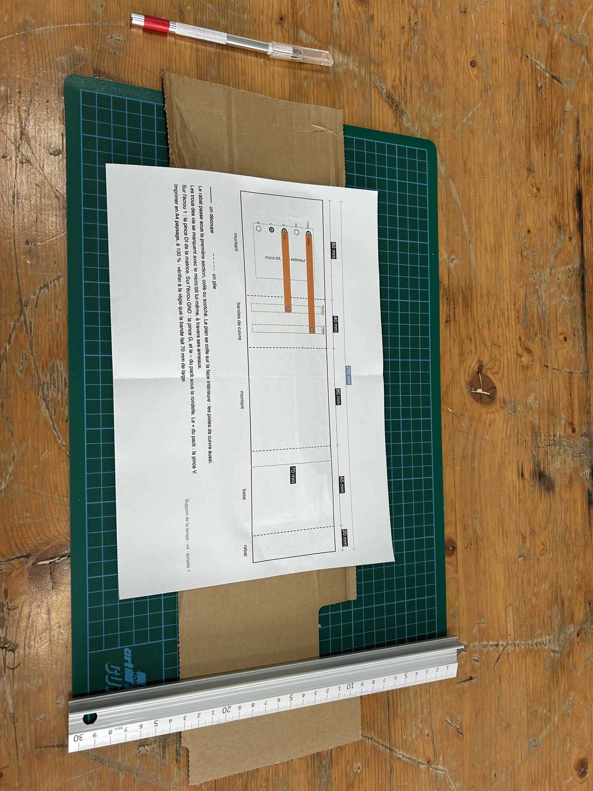
</figure>

Trait plein : tu découpes, à la règle. Pointillé : tu plies. Le rabat passe sous la première section, collé ou scotché.

> [!CAUTION] L'outil de découpe
> - Règle métallique **à rebord**, toujours.
> - Doigts **posés sur la règle, derrière le rebord**.
> - **Plusieurs passes légères**, sans forcer.
> - **Protection de lame remise** dès que tu poses l'outil.

<div class="photo-row" markdown>

<figure markdown>
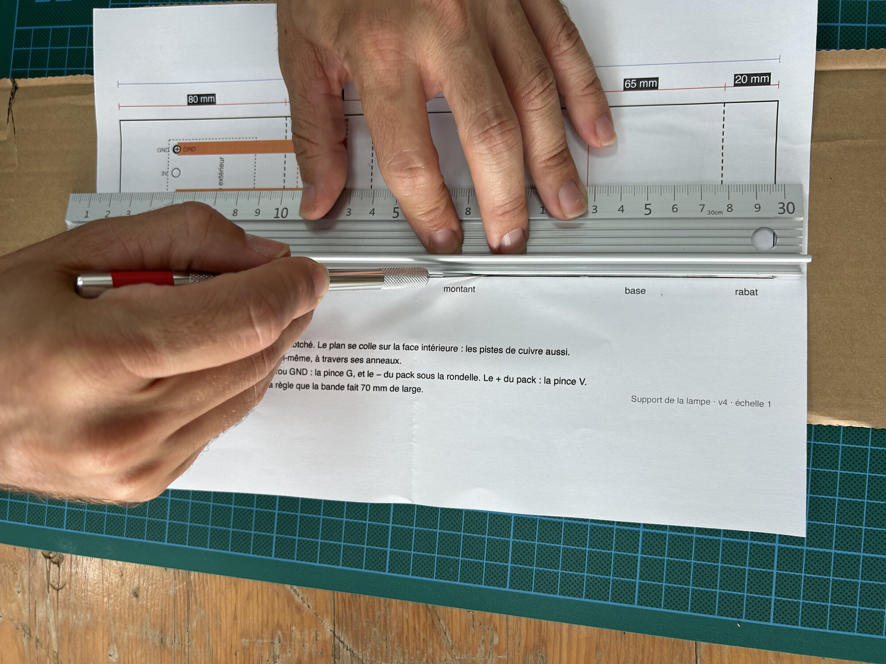
</figure>

<figure markdown>
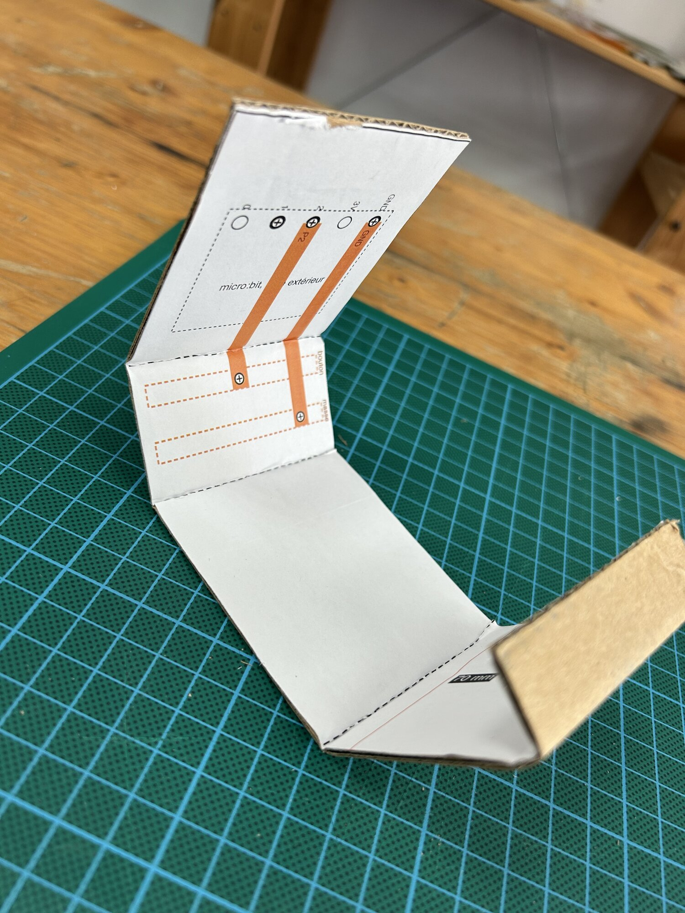
</figure>

</div>

→ [Tracer, découper, plier le carton](../../../fiches/carton-tracer-decouper-plier.md)

### Les deux bandes de cuivre

Sur le dessus, deux vis sont dessinées, une par bande. Pique chacune avec une punaise, depuis l'intérieur : les trous traversent le carton.

Retourne le support. Colle une bande de cuivre de 62 mm sur chaque trou, face extérieure : la bande `bouton` et la bande `masse`.

<figure markdown>
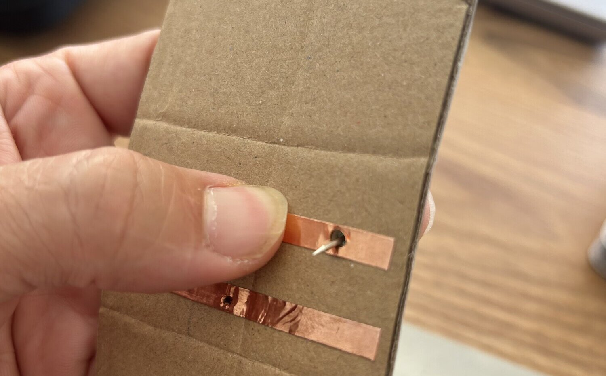
</figure>

Le micro:bit se pose sur le premier montant, écran vers l'extérieur, tenu par deux élastiques. Il sera vissé à la séance 2.

### La LED

<figure markdown>
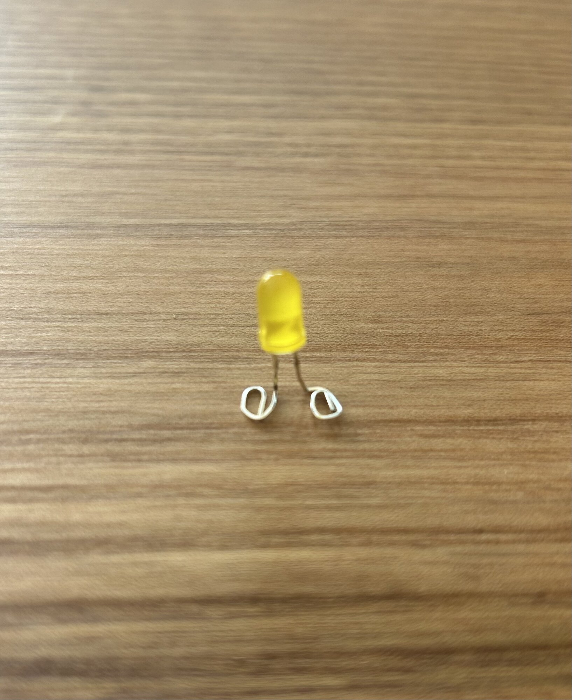
</figure>

Repère la **patte longue** : c'est le `+`. Puis replie et enroule chaque patte en boucle : elle touchera mieux le cuivre.

### Le micro:bit comme une pile

Une pince sur `3V`, une pince sur `GND`, et l'autre bout de chacune sur une bande de cuivre. Retiens quelle bande est reliée à `3V`.

<div class="photo-row" markdown>

<figure markdown>
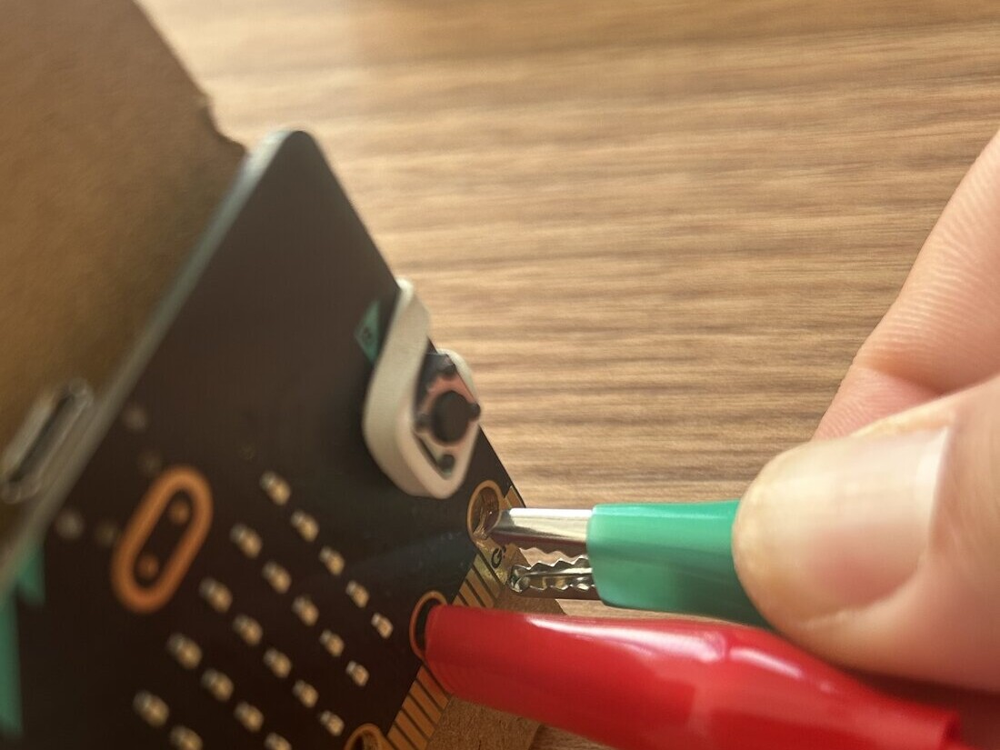
</figure>

<figure markdown>
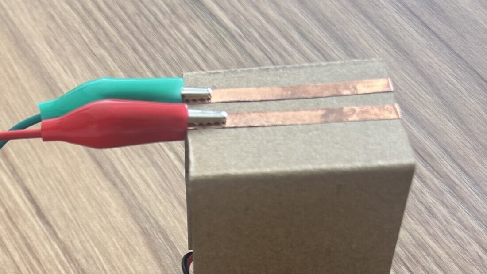
</figure>

</div>

Pose la LED à cheval sur les deux bandes, une boucle sur chacune. Elle ne s'allume pas ? Retourne-la : patte longue côté `3V`.

→ [Câbler un circuit](../../../fiches/cabler-un-circuit.md)

> [!IMPORTANT] Point de contrôle
> Montre ta LED allumée, et dis quelle patte est sur la bande reliée à `3V`.

## 2. Le programme commande la LED

**Ce que tu vas obtenir :**

<video controls playsinline preload="metadata" src="../../../../assets/objets-connectes-s01/video-clignotement.mp4"></video>

Déplace la pince de `3V` à `2`. La LED s'éteint : la broche `P2` n'envoie rien tant qu'aucun programme ne le lui demande.

<figure markdown>
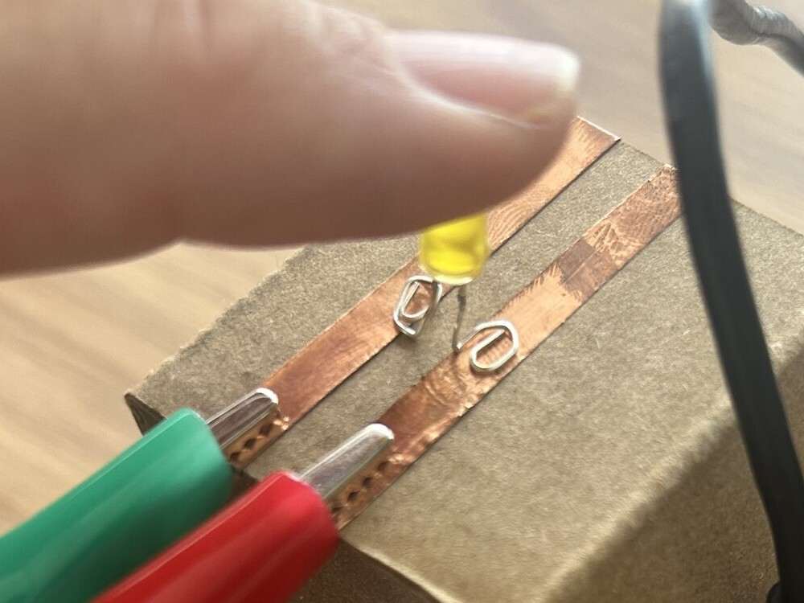
</figure>

[makecode.microbit.org](https://makecode.microbit.org) → **Nouveau projet** → nomme-le `lampe`.

→ [Prendre en main MakeCode](../../../fiches/makecode-prise-en-main.md)

Dans `au démarrage` : `écrire sur la broche P2 la valeur 1`, dans **Broches**, sous **Avancé**. Téléverse : la LED s'allume.

```blocks
pins.digitalWritePin(DigitalPin.P2, 1)
```

<figure markdown>
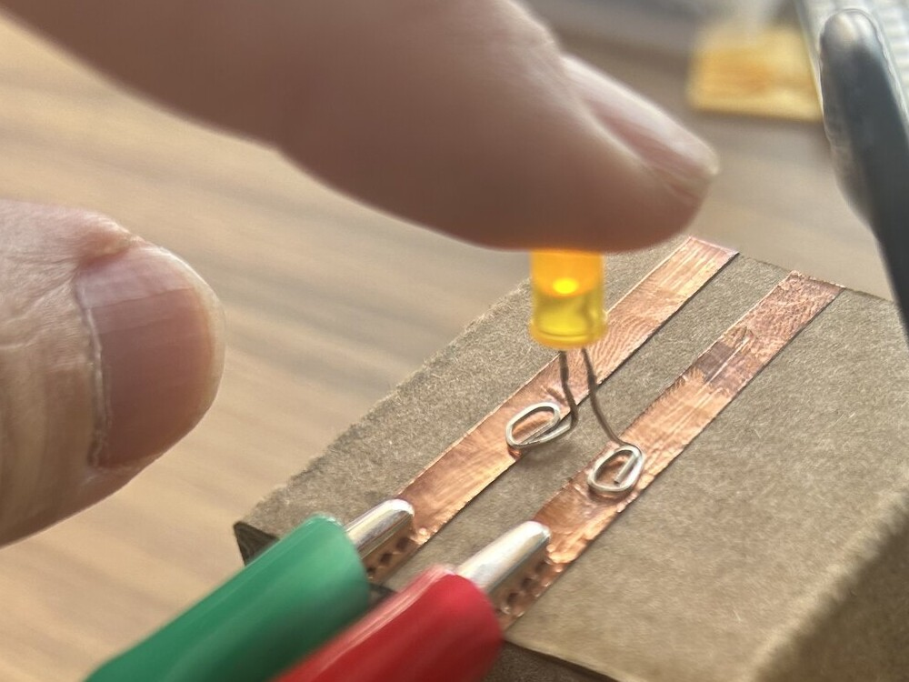
</figure>

`1`, la broche envoie du courant ; `0`, elle n'envoie rien. `P2` est une **sortie** : c'est le programme qui décide.

**À toi.** La LED s'allume une demi-seconde, s'éteint une demi-seconde, sans fin. Il te faut `toujours` et `pause (ms)`, dans **Base**, et le bloc de la broche.

<details markdown>
<summary>La solution</summary>

```blocks
basic.forever(function () {
    pins.digitalWritePin(DigitalPin.P2, 1)
    basic.pause(500)
    pins.digitalWritePin(DigitalPin.P2, 0)
    basic.pause(500)
})
```

</details>

> [!TIP] Ça marche si…
> La LED clignote, au rythme d'une demi-seconde.

## 3. Les bandes deviennent un bouton

**Ce que tu vas obtenir :**

<video controls playsinline preload="metadata" src="../../../../assets/objets-connectes-s01/video-toucher-coeur.mp4"></video>

Enlève la LED. Garde les deux pinces : une sur `GND`, une sur `2`. Cette fois, `P2` est une **entrée** : le programme lit ce qui y arrive.

Dans `toujours` : `série écrire valeur`, dans **Avancé** → **Communication Série**, avec `lire la broche analogique P2`, dans **Broches**. Nomme la valeur `p2`.

```blocks
basic.forever(function () {
    serial.writeValue("p2", pins.analogReadPin(AnalogPin.P2))
})
```

Téléverse, USB branché, puis **Afficher données Appareil**. Pose un doigt à cheval sur les deux bandes, et regarde la courbe.

<figure class="screenshot" markdown>
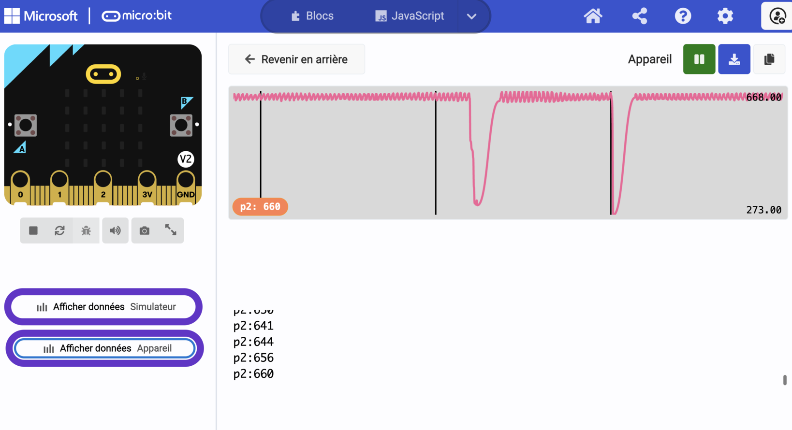
</figure>

Ton doigt relie les deux bandes : la valeur chute. Note ta valeur au repos et ta valeur quand tu touches.

**À toi.** Quand la valeur passe sous un seuil choisi entre tes deux valeurs, le micro:bit affiche une icône. Il te faut `si … alors` et une comparaison, dans **Logique**, et `montrer l'icône`, dans **Base**.

<details markdown>
<summary>La solution</summary>

```blocks
basic.forever(function () {
    if (pins.analogReadPin(AnalogPin.P2) < 300) {
        basic.showIcon(IconNames.Heart)
    } else {
        basic.clearScreen()
    }
})
```

`300` est le seuil de ce montage. Prends le tien, d'après tes valeurs.

</details>

> [!IMPORTANT] Point de contrôle
> Montre ton bouton en cuivre à l'animateur : l'icône au toucher, rien au repos.

Le micro:bit a ce test tout fait : `lorsque la broche P2 est activée`, dans **Entrée**. Il compare lui-même la valeur à un seuil, et se déclenche une fois à chaque toucher : ici, le cœur s'affiche une seconde, puis s'efface. Tu t'en serviras en séance 3.

```blocks
input.onPinPressed(TouchPin.P2, function () {
    basic.showIcon(IconNames.Heart)
    basic.pause(1000)
    basic.clearScreen()
})
```

## Va plus loin

- **Une animation et un son.** Quand on touche les bandes, plusieurs icônes à la suite, et un son, dans **Musique**.
