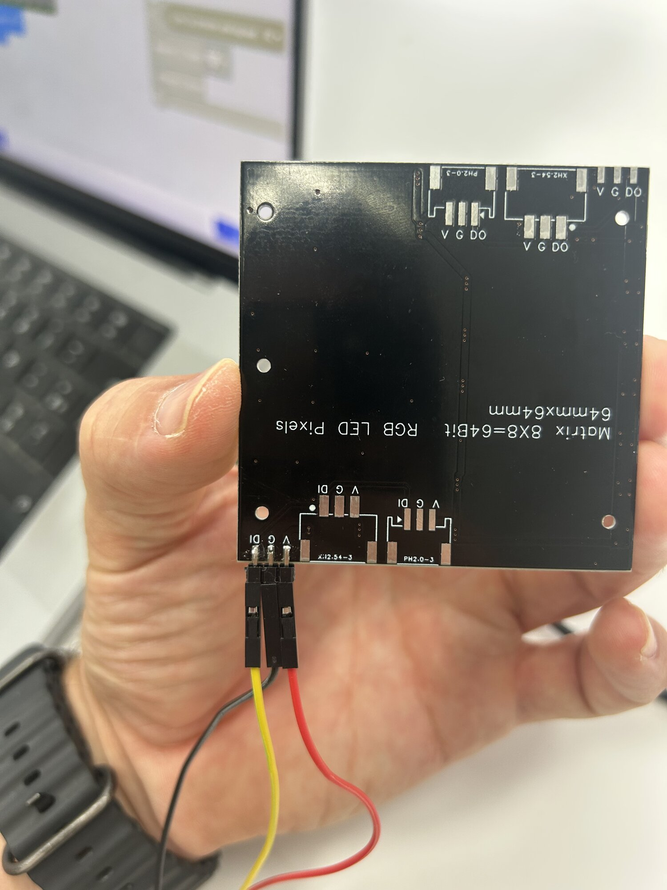
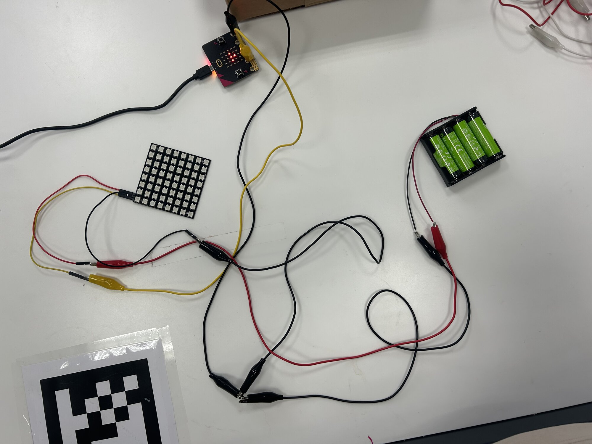

# Séance 2 — Compose la lumière de ta lampe

Ta lampe reçoit une matrice de 64 LED de couleur. Tu la câbles, tu dessines ton image et tu l'animes.

## 1. La matrice

<figure markdown>

</figure>

64 LED, et un seul fil de données. Trois broches, au dos :

| Broche | Va sur |
|---|---|
| `V` | Le `+` du pack d'accus |
| `G` | Le `−` du pack d'accus, **et** le `GND` du micro:bit |
| `DI` | La broche `P1` du micro:bit |

→ [La matrice de LED RGB](../../../fiches/matrice-rgb.md)

## 2. Câble-la

<figure markdown>

</figure>

Un câble Dupont sur chaque broche de la matrice, puis des pinces :

1. `V` au `+` du pack.
2. `G` au `−` du pack. Une seconde pince relie le `−` du pack au `GND` du micro:bit.
3. `DI` sur `P1`. `P2` reste à ton bouton de cuivre.

**Ne branche pas encore le pack.**

> [!NOTE] La masse commune
> Le signal de `P1` se mesure par rapport au `GND` du micro:bit. Si la matrice ne partage pas ce `GND`, elle reçoit un signal sans référence.

> [!CAUTION] Les pinces du pack
> Les pinces du `+` et du `−` ne se touchent jamais.

## 3. L'extension

Dans ton projet `lampe` : **Extensions** → colle cette adresse → clique sur **neopixel-extended**.

```
https://github.com/pasalt/pxt-neopixel-matrix-extension
```

<span class="todo-media">[capture : la fenêtre Extensions avec l'adresse collée et la carte neopixel-extended]</span>

Les blocs sont en anglais : cherche-les tels qu'ils sont écrits.

## 4. Le premier programme

<span class="todo-media">[capture : au démarrage → set strip to NeoPixel strip at pin P1 with 64 Neopixel as RGB (GRB format), strip set brightness 50, strip show color rouge]</span>

> [!CAUTION] La luminosité d'abord
> `set brightness` à **50** dans le premier programme, avant de brancher le pack. À fond, la matrice tire trop de courant, et la carte redémarre.

Téléverse. Puis branche le pack : la matrice s'allume en rouge.

> [!IMPORTANT] Point de contrôle
> Fais vérifier ton câblage et ta luminosité avant de brancher le pack.

> [!TIP] Rien ne s'allume ?
> `DI` sur `P1` ? Le `GND` du micro:bit relié au `−` du pack ?

## 5. Dessine ton image

Remplace `show color` par `set NeoPixel 8x8` : une grille de 8 × 8, une couleur par case. Clique sur une case pour choisir sa couleur.

<span class="todo-media">[capture : le bloc set NeoPixel 8x8 avec un visage dessiné, suivi de show changes]</span>

Puis `show changes`, et téléverse.

> [!NOTE] Préparer, puis afficher
> `set NeoPixel 8x8` prépare l'image. Rien ne change sur la matrice avant `show changes`.

Une case laissée en gris s'allume en gris. Pour l'éteindre, choisis le noir.

<span class="todo-media">[photo : la matrice qui affiche un visage]</span>

## 6. Fais-la défiler

**À toi.** Dans `toujours` : `rotate pixels by 8`, `show changes`, une pause de 200 ms. Les blocs sont dans **neopixel-extended** et **Base**.

<details markdown>
<summary>La solution</summary>

<span class="todo-media">[capture : toujours → strip rotate pixels by 8, strip show changes, pause 200 ms]</span>

</details>

<span class="todo-media">[vidéo : l'image qui défile ligne par ligne]</span>

> [!NOTE] Pourquoi 8
> La matrice est un ruban de 64 LED, posé en 8 lignes. Décaler de 8, c'est décaler d'une ligne. Essaie avec 1.

## 7. Deux images

**À toi.** Deux images qui alternent, chacune une seconde. Il te faut deux `set NeoPixel 8x8`, deux `show changes` et des pauses, dans `toujours`.

<details markdown>
<summary>La solution</summary>

<span class="todo-media">[capture : toujours → set NeoPixel 8x8 image 1, show changes, pause 1000 ms, set NeoPixel 8x8 image 2, show changes, pause 1000 ms]</span>

</details>

## 8. Pose-la sur la lampe

<span class="todo-media">[photo : la matrice tenue sur la lampe par deux élastiques, papier calque devant]</span>

Deux élastiques tiennent la matrice. Le papier calque devant adoucit la lumière.

Le micro:bit reste à l'avant, **écran vers la pièce**.

## 9. Va plus loin

<details markdown>
<summary>Un arc-en-ciel</summary>

`show rainbow from 1 to 360`, dans **neopixel-extended**, sous **… plus**.

</details>

<details markdown>
<summary>Une respiration</summary>

Dans une boucle, `set brightness` monte de 0 à 50, puis redescend. N'oublie pas `show changes` à chaque pas.

</details>

<details markdown>
<summary>Une seule case</summary>

`set matrix color at x 3 y 5` allume une case par ses coordonnées, comme `allumer x y` sur l'écran du micro:bit.

</details>

<details markdown>
<summary>Ton bouton de cuivre</summary>

Reprends le programme du bouton de la séance 1 : quand tu touches les bandes, la matrice change d'image.

</details>

---

## Ce que tu dois avoir à la fin

- [ ] La matrice câblée, masse commune comprise
- [ ] La luminosité réglée dans le programme
- [ ] Ton image, et ton animation
- [ ] La matrice fixée sur la lampe
- [ ] Ton [carnet de bord](../../../carnet-de-bord/objets-connectes-s02.md) rempli

## Avant de partir

Débranche une pince du pack. Lampe dans ton bac, accus en charge.
