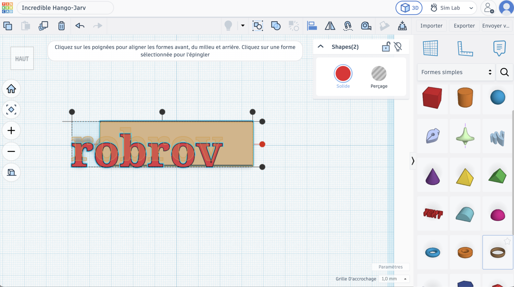
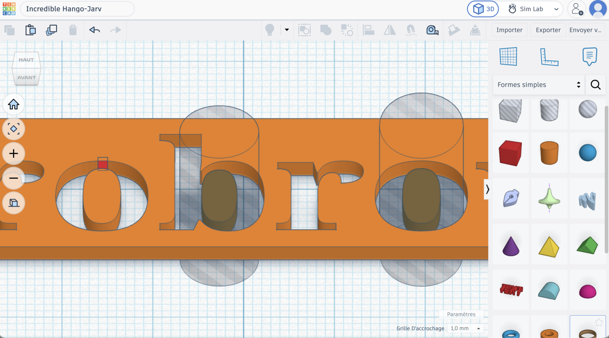

# Séance 4 — Dessine l'emblème de ta lampe

Tu dessines en 3D l'emblème qui décorera ta lampe : ta forme, ton motif, ton nom. Il s'imprime avant la prochaine séance.

## 1. L'emblème

[photo : un emblème imprimé accroché à la lampe par un élastique]

Il s'accroche à la lampe par un élastique, passé dans son trou.

## 2. Les contraintes

| | |
|---|---|
| Taille | **50 × 50 mm** au plus |
| Épaisseur | **3 mm** |
| Trou d'accroche | **5 mm**, avec 3 mm de matière autour |

> [!CAUTION] Une contrainte de groupe
> Tous les emblèmes s'impriment ensemble, sur un seul plateau. Un emblème hors cotes ne part pas à l'impression.

## 3. Ouvre Tinkercad

[tinkercad.com/joinclass](https://www.tinkercad.com/joinclass) → code de classe, identifiant → **Créer** → nomme-la `lampe-<ton prénom>`.

→ [Modéliser et imprimer en 3D](../../../fiches/modeliser-imprimer-3d.md#tinkercad)

## 4. Ta forme

[capture : une forme de base posée et cotée, 50 × 50 × 3 mm au plus]

Pars d'une forme simple (**Cylindre**, **Étoile**, **Cœur**, **Boîte**), ou dessine la tienne avec **Scribble**. Hauteur : 3 mm.

Tape les cotes dans le panneau, ne les ajuste pas à la souris.

## 5. Ton motif

[capture : un texte et une forme posés sur la base, en relief]

Ajoute ton nom, un symbole, un motif : en **relief** (posé dessus), ou en **creux** (en **Perçage**, qui traverse).

Centre avec l'outil **Aligner**, pas à l'œil.

<figure class="screenshot" markdown>

</figure>

## 6. Le trou d'accroche

Un **Cylindre** en **Perçage**, de 5 mm, près du bord. Laisse au moins 3 mm de matière autour : sinon l'élastique arrache le bord.

## 7. Vérifie

**Vue de face** : ce qui doit être en relief est posé sur la base, ce qui doit être en creux la traverse.

**Est-ce que tout tient ?** L'intérieur des lettres fermées (`o`, `b`, `a`, `d`) n'est relié à rien quand le texte est en creux.

<figure class="screenshot" markdown>

<figcaption>Ils tombent, ou ils s'impriment tout seuls à côté.</figcaption>
</figure>

→ [Les îlots détachés](../../../fiches/modeliser-imprimer-3d.md#les-ilots-detaches)

## 8. Regroupe et exporte

Sélectionne tout, **Regroupe** (<kbd>Ctrl</kbd> + <kbd>G</kbd>).

**Exporter** → **La forme sélectionnée** → **.STL**. Nomme le fichier `lampe-<ton prénom>.stl` et dépose-le dans le dossier partagé.

> [!IMPORTANT] Point de contrôle
> Fais valider ton emblème avant d'exporter : cotes, trou, rien de détaché.

## 9. L'impression

[capture : le plateau du slicer avec les emblèmes du groupe]

> [!NOTE] On ajoute, on n'enlève pas
> L'imprimante dépose du plastique fondu couche par couche, de bas en haut. Elle ne pose rien dans le vide.

→ [Modéliser et imprimer en 3D : l'impression](../../../fiches/modeliser-imprimer-3d.md#limpression)

## 10. Va plus loin

Deux hauteurs

Un relief à 2 mm et un autre à 4 mm : ton emblème prend du volume.

Un emblème qui laisse passer la lumière

Des motifs en creux qui traversent : posé devant la matrice, il laisse passer la lumière par ses trous.

---

## Ce que tu dois avoir à la fin

- [ ] Ton emblème dans les cotes, trou d'accroche compris
- [ ] Rien de détaché
- [ ] Le fichier `lampe-<ton prénom>.stl` dans le dossier partagé
- [ ] Ton [carnet de bord](../../../carnet-de-bord/objets-connectes-s04.md) rempli

## Avant de partir

Lampe dans ton bac. L'animateur imprime les emblèmes avant la prochaine séance.
