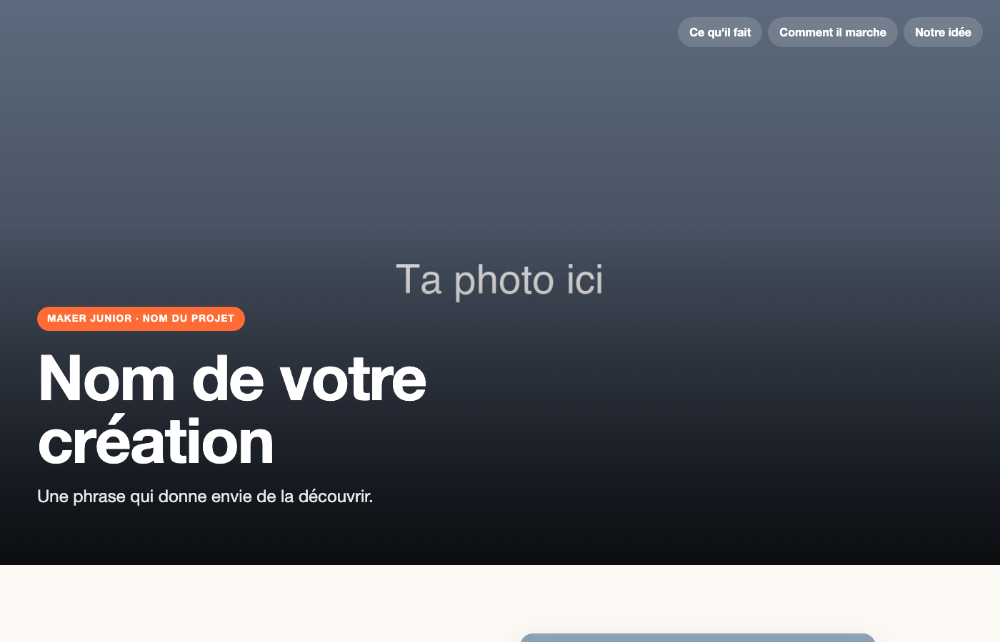

# Séance 10 — Présentez vos objets connectés

Vous remplissez la page web de votre objet, qui sera publiée : ce que vous avez construit, et pourquoi. Puis vous le présentez pendant la démonstration.

## 1. Tout est prêt ?

Chaque produit, un par un, sur le tableau de bord. Un produit hors ligne : on le répare si on peut, sinon c'est le plan B.

## 2. Ouvrez le gabarit

→ [Télécharger le gabarit](../../../assets/gabarit-page.zip) · [Le voir en ligne](../../../assets/gabarit-page/index.html)

Décompresse-le. Tu trouves `index.html`, `style.css` et un dossier `images`.

<figure class="screenshot" markdown>

</figure>

Ouvre `index.html` deux fois : dans l'éditeur, et dans le navigateur.

## 3. Lisez une balise

Le texte se place entre une balise ouvrante et une balise fermante.

```html
<h1>Nom de votre création</h1>
<p class="sous-titre">Une phrase qui donne envie de la découvrir.</p>
```

`<h1>` est le titre, `<p>` un paragraphe. La balise fermante a une barre : `</p>`.

Remplace le titre par le nom de votre objet. Enregistre, recharge le navigateur.

## 4. Changez les photos

Mets vos photos dans le dossier `images`. Puis écris leur nom dans `src` :

```html

```

`alt` décrit l'image pour qui ne la voit pas.

> [!TIP] L'image ne s'affiche pas ?
> Vérifie le nom du fichier, lettre par lettre, extension comprise.

> [!CAUTION] Avant de mettre une photo
> Pas de visage ni de nom de famille.

## 5. Racontez votre objet

Trois sections : à quoi il sert, ce qu'il mesure jusqu'au tableau de bord, votre meilleure idée. Remplacez les textes d'exemple.

> [!NOTE] Un choix, une raison
> Pas « on a mis le capteur en hauteur ». Plutôt : « on a mis le capteur en hauteur parce que la salle est grande. »

Votre [cahier des charges](../cahier-des-charges.md) vous sert de brouillon.

## 6. Ajoutez vos lampes

1. Copie une section entière, du commentaire jusqu'à `</section>` compris.
2. Colle-la juste avant `<!-- Le bas de la page -->`.
3. Change son `id` en `lampes`, et ajoute son lien dans le menu : `<a href="#lampes">Nos lampes</a>`.
4. Mets-y les photos de vos lampes : leur couleur, leur animation, leur emblème.

## 7. Choisissez vos couleurs

Ouvre `style.css`. Tout en haut, **TES RÉGLAGES** :

```css
--couleur-principale: #ff6b35;
```

Change le code couleur, enregistre, recharge : l'étiquette, les sous-titres et le menu changent ensemble.

> [!IMPORTANT] Point de contrôle
> Votre page s'ouvre dans le navigateur, avec vos photos et votre choix justifié.

## 8. La démonstration

Dans l'ordre de la répétition. À votre objet :

1. Votre minute de présentation.
2. La démonstration.
3. Votre page, projetée.
4. Les questions.

> [!TIP] Une question difficile
> « Je ne sais pas, mais voilà comment je chercherais » est une bonne réponse.

---

## Ce que vous devez avoir à la fin

- [ ] Le nom de l'objet et de l'équipe
- [ ] Vos photos à la place des photos d'exemple
- [ ] Trois sections, dont un choix et sa raison
- [ ] La section de vos lampes
- [ ] Vos couleurs
- [ ] La page qui s'ouvre dans le navigateur
- [ ] La démonstration faite
- [ ] Ton [carnet de bord](../../../carnet-de-bord/objets-connectes-s10.md) rempli

## Avant de partir

Le dossier de la page enregistré, copié là où l'animateur l'indique. Le magasin rangé.
