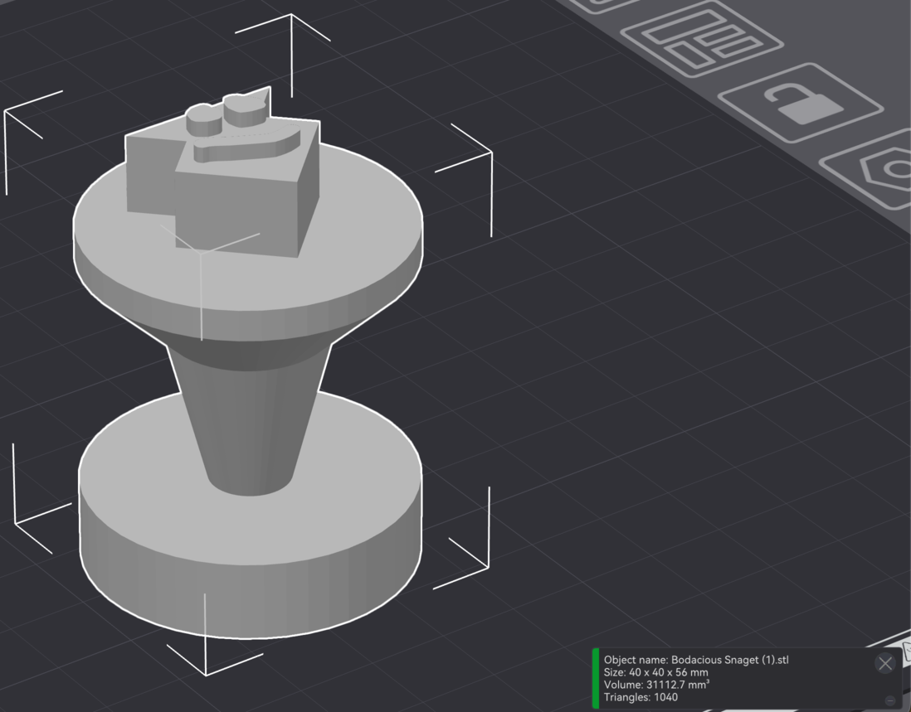

# Le cahier des charges du rover d'équipe

Ce que votre rover doit être, et les épreuves qu'il courra à la dernière séance. Cochez une case quand vous l'avez vérifiée : ce tableau sert aussi pour la revue de conception.

**Équipe :**  ·  **Votre numéro**, donné par l'animateur :

Ce numéro est à la fois l'id de votre tag, votre bande à la télécommande et votre groupe sur la table.

## Le rover

| | Ce qu'il faut | Comment on vérifie |
|---|---|---|
| **Pente** | 10° : 30 cm de long, environ 5,2 cm de haut | ☐ Il monte jusqu'en haut à la télécommande, sans reculer |
| **Échantillon** | La pièce ci-dessous, 40 × 40 × 56 mm, **posée debout** — poussée, saisie ou soulevée, au choix | ☐ Déplacé de 50 cm, toujours debout à l'arrivée |
| **Tag** | 90 mm de noir, et sa marge blanche : 112 mm de côté une fois découpé | ☐ À plat, visible du dessus, marge blanche comprise, en place après la pente |
| **Encombrement** | 25 × 25 × 20 cm au maximum, tout compris | ☐ Il entre dans le gabarit |
| **Électronique** | Au maximum : 1 carte DFR0548, 2 micro:bit, 4 moteurs, 2 servomoteurs | ☐ On compte |
| **Impression 3D** | 3 h au maximum pour l'équipe, durée lue dans Kiri:Moto. Une pièce ratée compte, sauf si c'est la machine qui a raté | ☐ Total du suivi ci-dessous : 3 h au plus |

Matériaux libres : carton, impression 3D, et tout ce que vous récupérez.

<figure markdown>

<figcaption>L'échantillon : 40 × 40 × 56 mm.</figcaption>
</figure>

### Notre suivi d'impression

| Pièce | Durée | Total |
|---|---|---|
| | | |
| | | |
| | | |
| | | |
| | | |

## Le pilotage

Votre rover fonctionne selon plusieurs modes.

| Mode | Ce que le rover reçoit | Ce qu'il doit faire |
|---|---|---|
| **Télécommande** | De votre télécommande, sur la bande *votre numéro* : les cinq clés de la séance 4 | ☐ Obéir aux cinq clés |
| **Table** | De la table, sur la bande `83`, groupe *votre numéro* : les mêmes cinq clés. La valeur, de `0` à `1023`, donne la vitesse | ☐ `avancer` : 5 cm au moins en 1,5 s ☐ `gauche` et `droite` : deux sens opposés ☐ Plus de message pendant 1 s : il s'arrête ☐ Il suit la figure de la table |
| **Guidage** — *optionnel* | De la table, sur la bande `83`, groupe *votre numéro* : `cap`, de `-180` à `180` : les degrés à tourner pour viser la cible, négatif à gauche — 10 fois par seconde `dist`, de `0` à `999` : la distance à la cible, en cm — 2 fois par seconde | ☐ Rejoindre la cible. Quand tourner, de quel côté, quand s'arrêter : à vous de le trouver |
| **Changer de mode** | Comment : c'est à vous de choisir | ☐ L'écran montre le mode actif |

> [!TIP] Tester le guidage sans la table
> Votre télécommande, le temps des essais, peut envoyer `cap` et `dist` à la place de la table.

## Les épreuves

| Épreuve | Règles |
|---|---|
| **Le parcours** | Slalom et pente, chronométrés. Un rover à la fois, deux passages, le meilleur temps gagne |
| **Le capture the flag** | Sur la table, toutes les équipes en même temps, à la télécommande. Échantillon debout au centre, départ et retour dans une zone commune. Ramené **debout** : **+2**. Renversé : **−1** pour l'équipe qui l'a renversé, et il est remis au centre. Trois manches, ou 15 minutes |
