# Séance 1 — Fabrique et monte la base motrice

<div class="session-meta" markdown>
<span markdown>**Tu repars avec** une base de rover qui roule</span>
<span markdown>**Durée** 1 h 45</span>
<span markdown>**Prérequis** aucun</span>
</div>

Aujourd'hui tu câbles ton électronique, tu écris le programme qui fait tourner les moteurs, et tu fabriques le châssis une fois que tout fonctionne. À la fin de la séance, tu assembles le tout !

---

## 1. Le moteur tout seul

Que peut-on faire avec un moteur branché directement sur le bloc d'accus ?

<figure markdown>
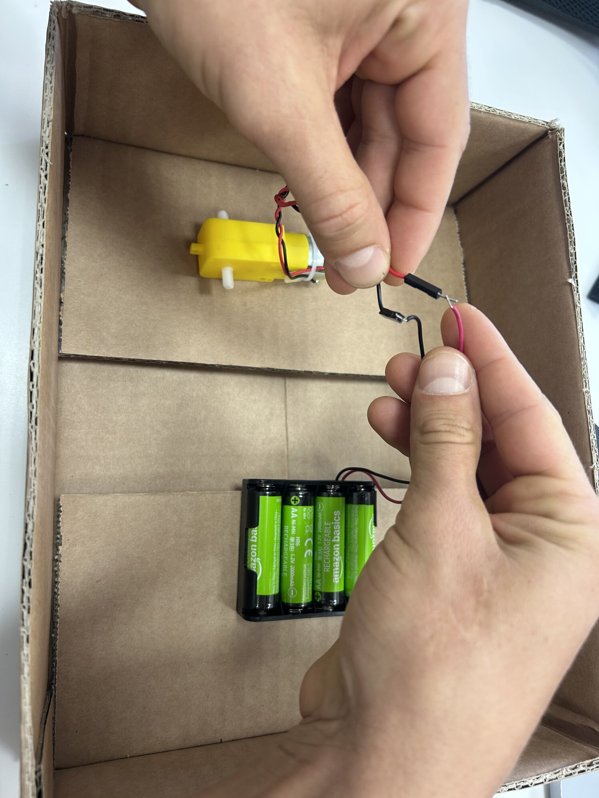
<figcaption>Un moteur, deux fils, un bloc d'accus. Rien de plus.</figcaption>
</figure>

Il tourne à fond, tout de suite. Et c'est tout ce qu'il sait faire : pour inverser le sens, il faut intervertir les deux fils à la main.

> [!CAUTION] Le moteur s'échappe du bureau
> Un moteur alimenté en direct part à pleine vitesse et s'entraîne lui-même hors de la table. Chaque essai de moteur, aujourd'hui et toutes les séances suivantes, se fait **à l'intérieur de la boîte en carton prévue pour ça**. Le rover aussi : tant qu'il n'est pas sur la piste, il tourne dans la boîte.

## 2. Pourquoi une carte entre les deux

<figure markdown>
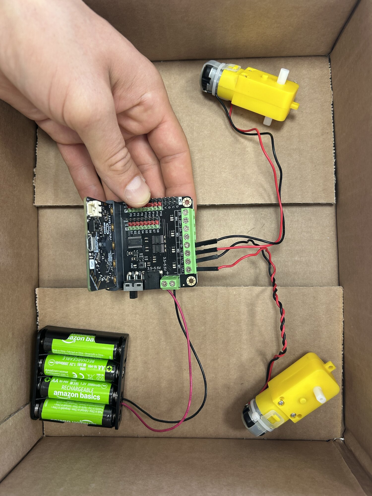
<figcaption>Ce que tu vas câbler : la carte au centre, les deux moteurs, le pack d'accus.</figcaption>
</figure>

> [!NOTE] Ce qu'une broche peut donner, ce qu'un moteur réclame
> Une broche du micro:bit fournit quelques milliampères — de quoi allumer une LED. Un moteur en réclame plusieurs centaines. Brancher l'un sur l'autre, c'est demander à un robinet de jardin de remplir une piscine.
>
> Et même avec assez de courant, une broche ne sait faire que deux choses : envoyer du courant, ou pas. Elle ne sait ni inverser le sens de rotation, ni doser la vitesse.
>
> La carte d'extension règle les deux problèmes à la fois. Elle prend le courant du bloc d'accus, et elle reçoit du micro:bit un ordre : quel moteur, dans quel sens, à quelle vitesse.

Le micro:bit commande. La carte exécute. Les accus fournissent l'énergie.

→ Pour les détails de la carte : [La carte DFR0548](../../../fiches/carte-dfr0548.md)

## 3. Assemble ton électronique

> [!NOTE] Pourquoi on câble et on teste avant de fabriquer
> Une fois la carte sanglée sur le châssis et le pack d'accus par-dessus, les borniers deviennent difficilement accessibles et les fils passent sous les élastiques. Corriger un fil mal serré demande alors de tout démonter, et de retrouver quel fil va où au milieu du montage.
>
> Sur la table, tout est visible et accessible, et une erreur se répare rapidement. **On assemble, on fait fonctionner, et on ne monte que ce qui a déjà été testé.**

Garde l'interrupteur de la carte sur **off** pendant tout le câblage : on ne câble jamais un circuit alimenté.

### Le micro:bit sur la carte

Enfiche le micro:bit dans le connecteur de la carte, **écran vers l'extérieur**, boutons A et B accessibles. Le connecteur est détrompé : il ne rentre que dans un sens. S'il résiste, c'est qu'il est à l'envers — ne force pas.

<figure markdown>
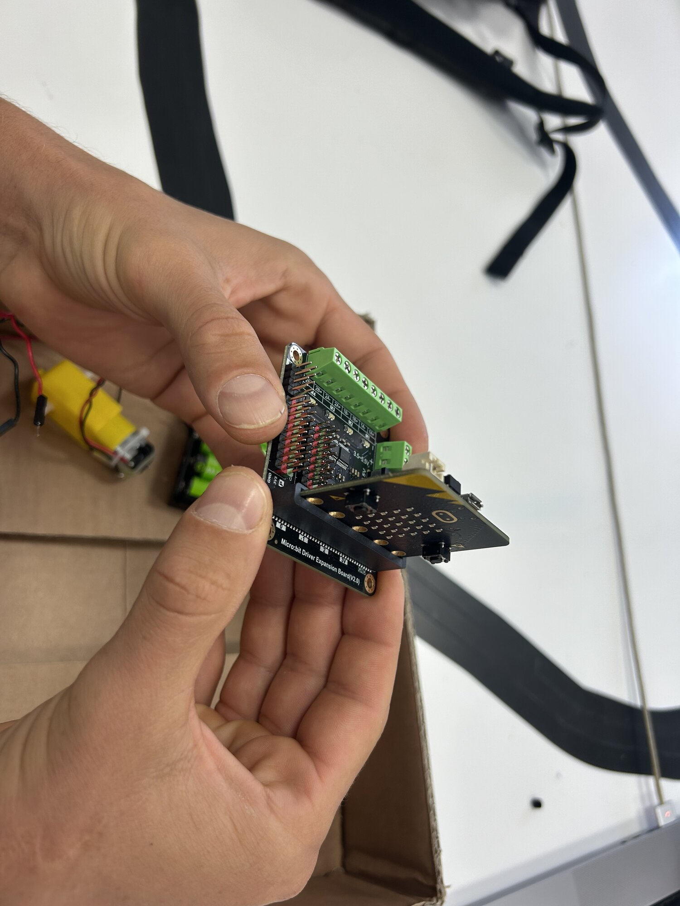
<figcaption>Écran vers l'extérieur, boutons A et B accessibles.</figcaption>
</figure>

### Les moteurs sur les borniers

De chaque moteur sortent deux fils :

- Moteur **gauche** → bornier `M1`
- Moteur **droit** → bornier `M2`

Desserre la vis du bornier, glisse la partie dénudée du fil, resserre.

<figure markdown>
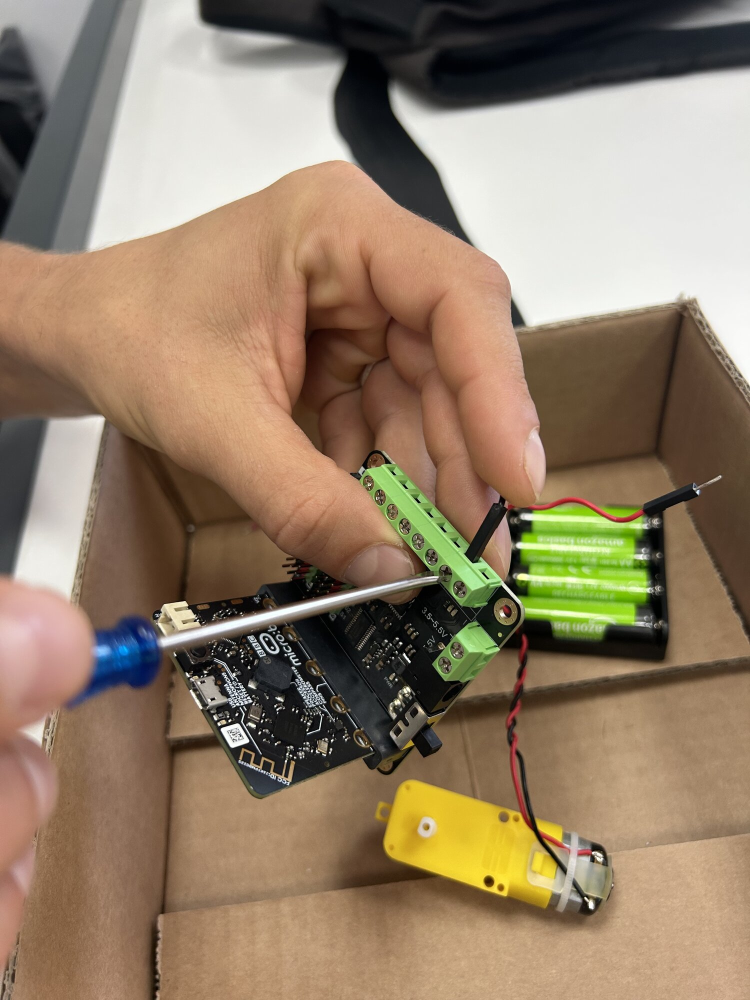
<figcaption>Les borniers sont repérés M1 à M4 sur la carte.</figcaption>
</figure>

L'ordre des deux fils d'un moteur décide de son sens de rotation. À ce stade il n'y a pas de bon ordre : on réglera le sens une fois les moteurs montés sur le châssis.

> [!TIP] Le test de la traction
> Tire doucement sur chaque fil après l'avoir vissé. S'il ressort, il n'était pas serré — et il ressortira tout seul à la première secousse du rover.

<figure markdown>
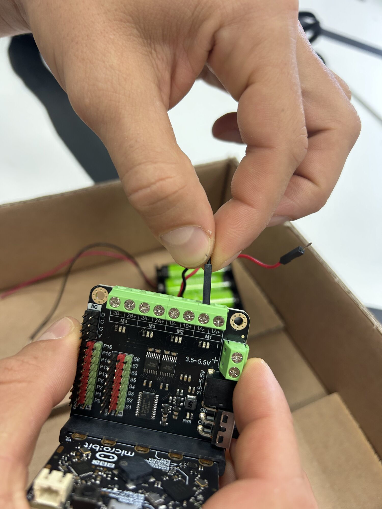
<figcaption>Un fil qui ressort n'était pas serré. Recommence.</figcaption>
</figure>

### Le pack d'accus

Fil rouge sur `+`, fil noir sur `−`, dans le bornier d'alimentation — le petit connecteur vert à deux vis, marqué `3.5~5.5V`, à l'écart du bornier des moteurs.

> [!CAUTION] La polarité ne se rattrape pas
> Inverser le `+` et le `−` peut endommager la carte. Vérifie deux fois avant de basculer l'interrupteur, et fais contrôler par l'animateur si tu as le moindre doute.

> [!IMPORTANT] Point de contrôle
> Fais valider ton câblage avant de mettre sous tension : polarité du pack, fils serrés, micro:bit dans le bon sens.

## 4. Ouvre MakeCode

Va sur [makecode.microbit.org](https://makecode.microbit.org), puis clique sur **Nouveau projet**.

<figure class="screenshot" markdown>

<figcaption>La page d'accueil. Tous tes projets seront rangés ici.</figcaption>
</figure>

Nomme-le `rover`.

<figure class="screenshot" markdown>
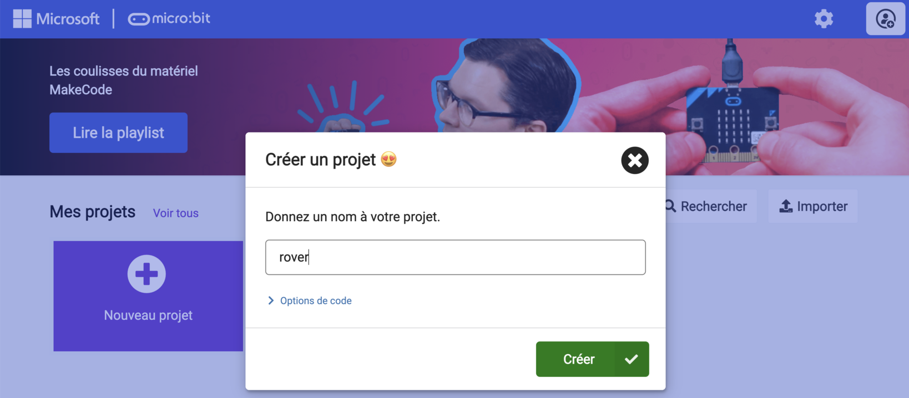
<figcaption>Un nom clair : tu vas revenir dans ce projet pendant plusieurs séances.</figcaption>
</figure>

→ L'interface expliquée : [Prendre en main MakeCode](../../../fiches/makecode-prise-en-main.md)

## 5. Ton premier programme

Dans le bloc `au démarrage`, mets deux choses : une icône et un son.

<figure class="screenshot" markdown>
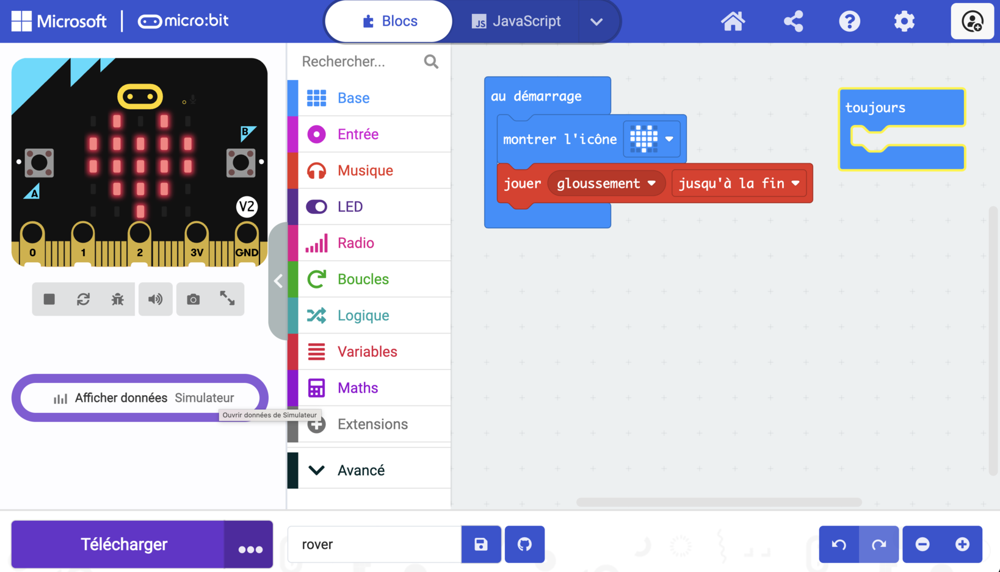
<figcaption>« montrer l'icône » vient de la catégorie Base, « jouer » de la catégorie Musique.</figcaption>
</figure>

Branche le câble USB sur le micro:bit, clique sur **Télécharger**, et suis les instructions à l'écran.

<figure class="screenshot" markdown>

<figcaption>Le téléversement en trois étapes, la première fois.</figcaption>
</figure>

> [!NOTE] Pourquoi une icône et un son dès le démarrage
> `au démarrage` s'exécute une seule fois, au moment où la carte s'allume. En y mettant une icône et un son, tu te donnes un signal : d'un coup d'œil et d'une oreille, tu sais que **ton** programme est bien celui qui tourne.
>
> Sans ce signal, quand plus tard rien ne bougera, tu ne sauras pas si le problème vient du code, du téléversement ou du câblage. Ce réflexe va te servir pendant les onze séances qui viennent.

## 6. Fais clignoter l'écran

Le bloc `au démarrage` ne passe qu'une fois. Pour qu'une action se répète sans fin, il faut le bloc `toujours` : il boucle, indéfiniment, tant que la carte est alimentée.

**À toi.** Écris un programme qui, sans s'arrêter, affiche une flèche vers le haut pendant une seconde, puis éteint l'écran pendant une seconde.

Tu auras besoin de quatre blocs, tous dans la catégorie **Base** : un pour afficher une flèche, un pour marquer une pause, un pour effacer l'écran.

Cherche d'abord. Déplie la solution seulement après avoir essayé.

<details markdown>
<summary>La solution</summary>

<figure class="screenshot" markdown>
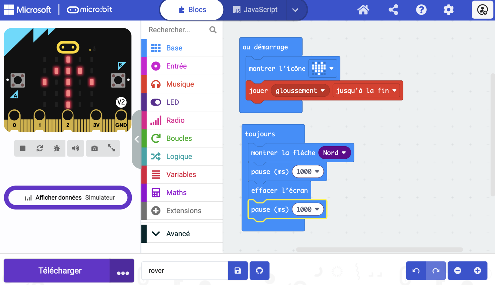
<figcaption>L'ordre compte : sans les pauses, l'écran changerait trop vite pour que l'œil le voie.</figcaption>
</figure>

La pause se règle en millisecondes : `1000` ms font une seconde.

</details>

<details markdown>
<summary>Pour aller plus loin — le même programme, en texte</summary>

En haut de l'écran, bascule de **Blocs** vers **Python** : c'est le même programme, écrit autrement.

<figure class="screenshot" markdown>

<figcaption>Les blocs ne sont qu'une façon d'écrire. Dessous, c'est du texte.</figcaption>
</figure>

</details>

## 7. Ajoute l'extension DF-Driver

Ton programme sait parler à l'écran, mais il ne connaît pas encore les moteurs. Il lui manque le vocabulaire.

Ouvre la catégorie **Extensions**, et colle cette adresse dans la barre de recherche :

```
https://github.com/DFRobot/pxt-motor
```

<figure class="screenshot" markdown>
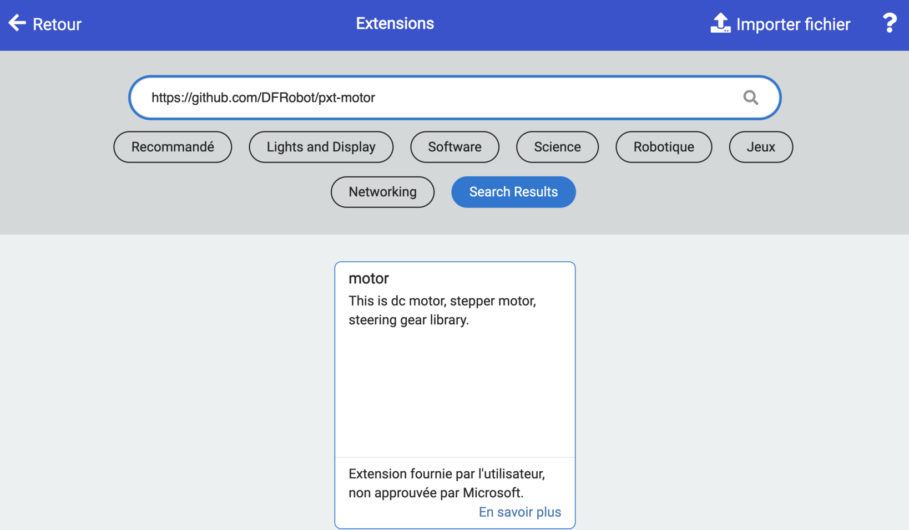
<figcaption>Clique sur la carte « motor » pour l'ajouter à ton projet.</figcaption>
</figure>

> [!NOTE] Ce qu'est une extension
> Une extension est une bibliothèque de blocs écrite par quelqu'un d'autre, que tu ajoutes à ton éditeur. Ici, c'est DFRobot — le fabricant de ta carte — qui l'a écrite, parce qu'eux seuls savent exactement comment leur carte veut qu'on lui parle.
>
> MakeCode affiche un avertissement : « extension fournie par l'utilisateur, non approuvée par Microsoft ». C'est normal et attendu : Microsoft ne vérifie que ses propres extensions. Celle-ci vient du fabricant.

Une nouvelle catégorie orange, **DF-Driver**, apparaît dans la palette.

<figure class="screenshot" markdown>
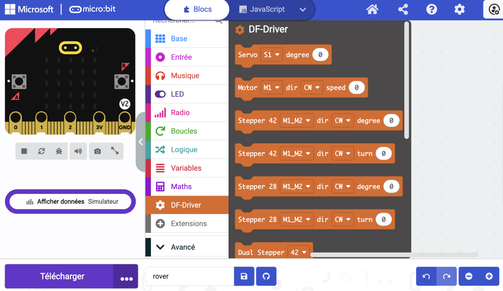
<figcaption>Les blocs de l'extension sont en anglais : elle n'est pas traduite.</figcaption>
</figure>

→ Le détail des blocs : [L'extension DF-Driver](../../../fiches/extension-df-driver.md)

## 8. Fais tourner les moteurs

Reprends ton programme clignotant et glisse les blocs moteurs dedans :

- sous la flèche : `Motor M1 dir CW speed 100` puis `Motor M2 dir CW speed 100`
- après `effacer l'écran` : `Motor Stop All`

<figure class="screenshot" markdown>
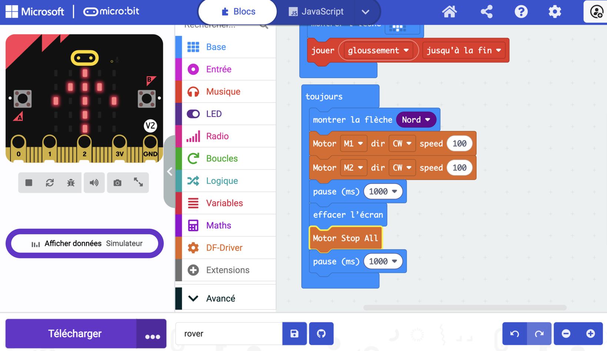
<figcaption>Le programme de la séance, au complet.</figcaption>
</figure>

Lis le programme à voix haute, dans l'ordre : flèche affichée, les deux moteurs partent, on attend une seconde, écran éteint, moteurs arrêtés, on attend une seconde, et ça recommence.

Téléverse. La flèche clignote, mais rien ne tourne encore : les moteurs sont alimentés par le pack d'accus, pas par l'USB.

> [!CAUTION] Deux moteurs libres, ça saute
> Posés sur la table, les moteurs sautent, tirent sur leurs fils et les arrachent des borniers. **Mets tout l'ensemble dans la boîte de test** avant de basculer l'interrupteur, et tiens le câble USB pour qu'il ne tire pas sur la carte.

Bascule maintenant l'interrupteur de la carte sur **on**.

### Ce que tu vérifies, maintenant que tout est accessible

C'est le moment de la séance où une erreur se corrige sans rien démonter. Prends-le au sérieux.

- [ ] Les **deux** moteurs tournent
- [ ] Ils s'arrêtent tous les deux quand l'écran s'éteint
- [ ] En coupant le bloc `M2`, tu identifies lequel est branché sur `M1` — colle un morceau de ruban dessus pour t'en souvenir
- [ ] Aucun fil ne sort de son bornier quand les moteurs vibrent

> [!TIP] Le premier réflexe de débogage
> Si la flèche s'affiche mais que rien ne tourne, **le problème n'est pas dans le code**. Le programme se déroule, tu le vois à l'écran. Cherche ailleurs : l'interrupteur, les fils dans les borniers, la charge des accus.
>
> C'est le raisonnement le plus utile de la séance, et il resservira à chaque panne : séparer ce qui marche de ce qui ne marche pas, au lieu de tout reprendre au hasard.

→ Si ça coince : [Quand ça ne marche pas](../../../fiches/depannage.md)

<figure markdown>
<video controls playsinline preload="metadata" src="../../../../assets/rover-s01/video-test-moteurs.mp4"></video>
<figcaption>Ce que tu dois obtenir : l'écran s'allume, les moteurs tournent.</figcaption>
</figure>

> [!IMPORTANT] Point de contrôle
> Électronique validée par l'animateur avant de passer au carton. Coupe l'interrupteur et débranche l'USB : tu vas avoir besoin de tes deux mains.

## 9. Fabrique ton châssis

### Reporte le plan

<figure class="plan" markdown>
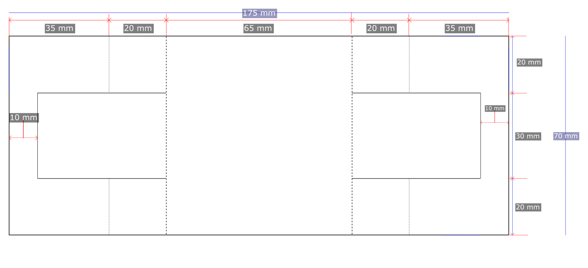
<figcaption>Le châssis du rover, version 0.3.</figcaption>
</figure>

À télécharger : [le plan à imprimer (PDF)](../../../assets/plans/rover-base-chassis-v0.3.pdf) · [le fichier source (SVG)](../../../assets/plans/rover-base-chassis-v0.3.svg)

La plaque fait **175 × 70 mm**. De gauche à droite : 35, 20, 65, 20, 35 mm. De haut en bas : 20, 30, 20 mm. Les deux rectangles commencent à 10 mm du bord.

| Sur le plan                   | Ce que ça veut dire                     |
| ----------------------------- | --------------------------------------- |
| Trait plein                   | Tu découpes                             |
| Trait pointillé               | Tu plies                                |
| Trait rouge ou bleu, chiffres | Ce sont les cotes, tu ne les traces pas |

Il te faut maintenant ce plan sur une feuille, que tu colleras sur ton carton. Deux façons de l'obtenir.

### Solution 1 — tu imprimes le plan

Imprime le PDF **à 100 %**, en décochant « ajuster à la page » : c'est la seule façon d'obtenir les vraies dimensions.

Avant de coller, **vérifie à la règle que le grand côté fait bien 175 mm**. Une imprimante mal réglée réduit tout de quelques pour cent, et un châssis trop petit ne laisse plus la place aux moteurs.

### Solution 2 — tu recopies le plan

Sur du papier quadrillé **5 × 5 mm**, et avec une seule consigne :

> [!TIP] Compte les carreaux, ne mesure pas
> Le plan est dessiné sur une grille de 5 mm : **chaque trait tombe pile sur un trait du quadrillage**, sans exception. La plaque fait 35 carreaux sur 14.
>
> Compter va deux fois plus vite que mesurer, et supprime la moitié des erreurs. Sors la règle seulement pour tracer droit, pas pour repérer.

C'est plus long que d'imprimer, mais c'est toi qui tiens le crayon — et savoir relever un plan coté te servira le jour où tu dessineras le tien.

> [!CAUTION] Colle la feuille du bon côté
> Tu vas rainer tes plis avec un outil, **du côté extérieur du pli**. Si la feuille est collée de ce côté-là, l'outil la déchire et le pli sort sale.
>
> Repère donc quelle face sera à l'extérieur une fois plié, et colle la feuille **sur l'autre face**.

<figure markdown>
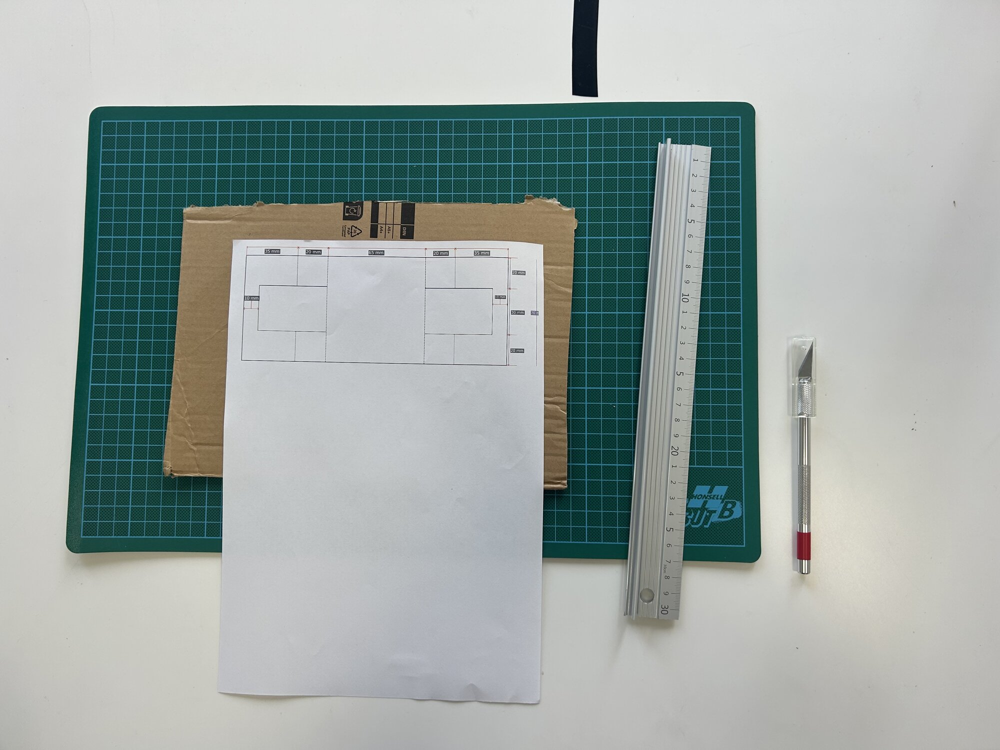
<figcaption>Le plan collé sur le carton, prêt à être découpé.</figcaption>
</figure>

### Découpe

> [!CAUTION] Le cutter, les trois règles qui ne se discutent pas
> **La règle métallique guide toujours la lame.** Jamais de règle en plastique : la lame y mord et dérape.
>
> **Ta main d'appui reste derrière la règle**, jamais dans l'axe de la lame ni devant elle. Si la lame ripe, elle part vers l'avant.
>
> **Plusieurs passes légères**, jamais une passe en force. Le carton se coupe en trois ou quatre allers-retours ; forcer, c'est faire déraper la lame.
>
> Et dès que tu poses l'outil, même deux secondes : **lame rentrée**.

<figure markdown>
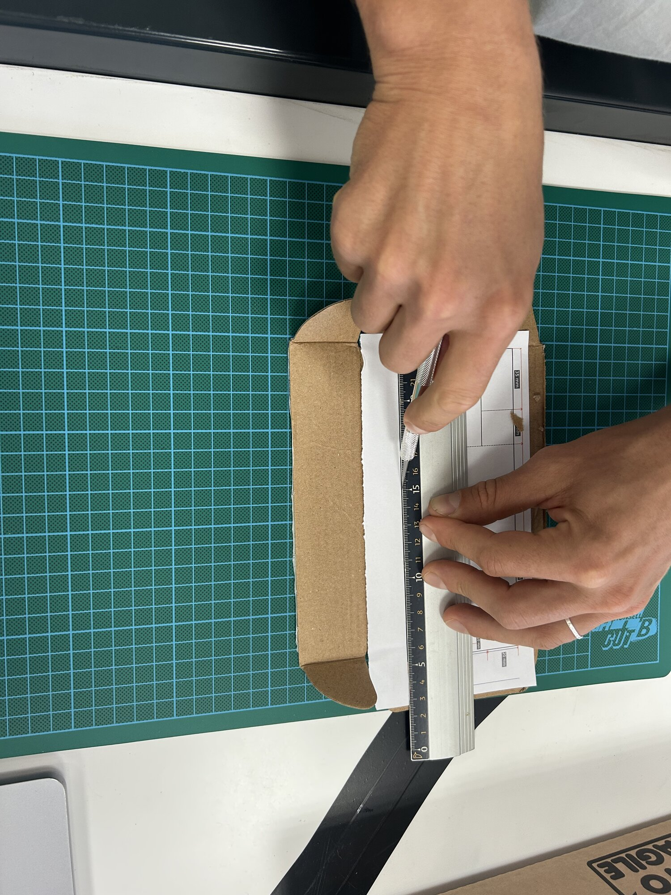
<figcaption>La règle métallique guide la lame, la main est derrière la règle.</figcaption>
</figure>

→ La version complète : [Sécurité à l'atelier](../../../fiches/securite-atelier.md)

### Plie

Marque d'abord le pli avec un outil pointu, **du côté extérieur du pli**, puis plie contre la règle. Le carton plie alors net, au lieu de s'écraser.

> [!TIP] Vérifie tes plis
> Les rabats latéraux doivent tenir d'équerre tout seuls. S'ils s'affaissent, c'est que le pli a été écrasé au lieu d'être marqué. Reprends-le à l'outil.

→ Les gestes en détail : [Tracer, découper, plier le carton](../../../fiches/carton-tracer-decouper-plier.md)

## 10. Monte ton rover

Ton électronique fonctionne et tu sais quel moteur est sur quel bornier. Tu peux monter sans crainte.

### Les moteurs

Pose les deux moteurs entre les rabats, axes vers l'extérieur et bien parallèles. Le moteur marqué `M1` va à gauche.

<div class="photo-row" markdown>
<figure markdown>
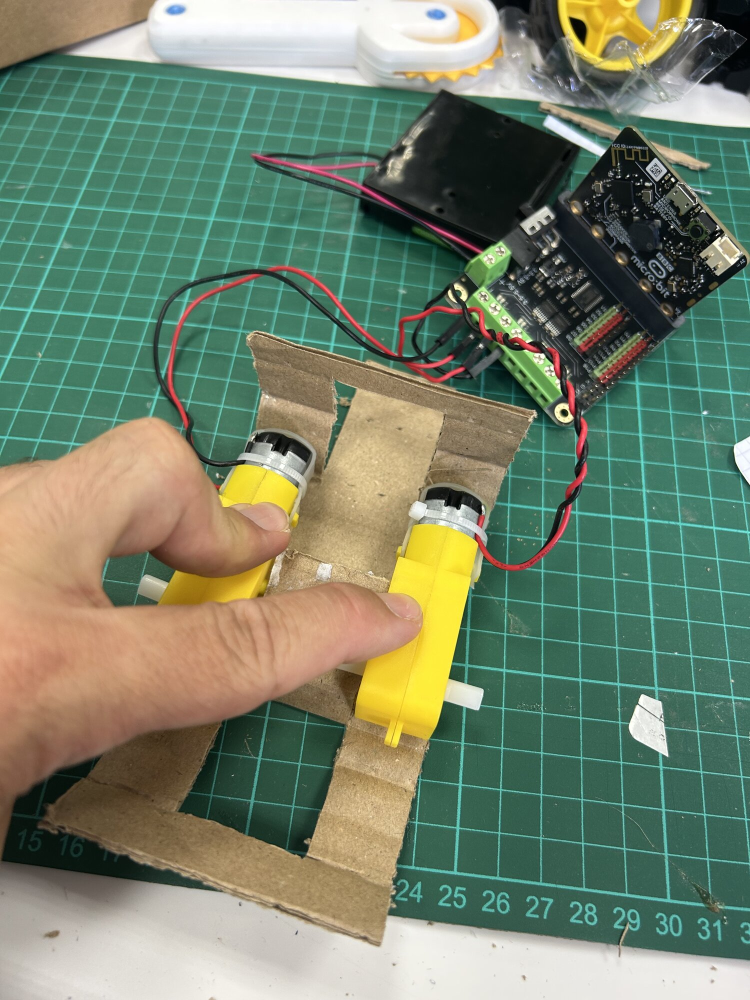
<figcaption>Les moteurs en place.</figcaption>
</figure>
<figure markdown>
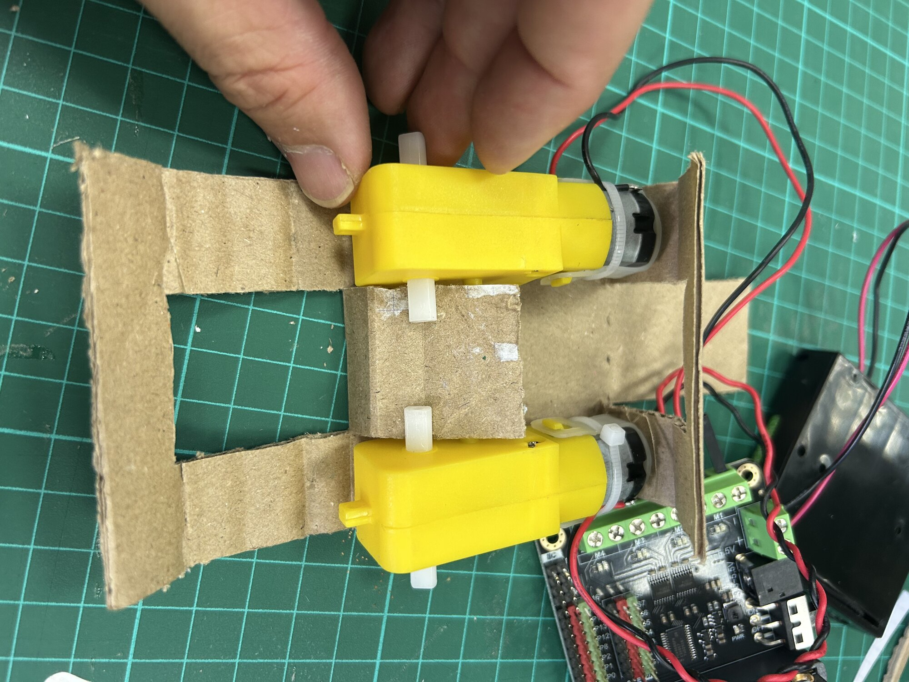
<figcaption>Vus de dessus : les axes doivent être parallèles.</figcaption>
</figure>
<figure markdown>
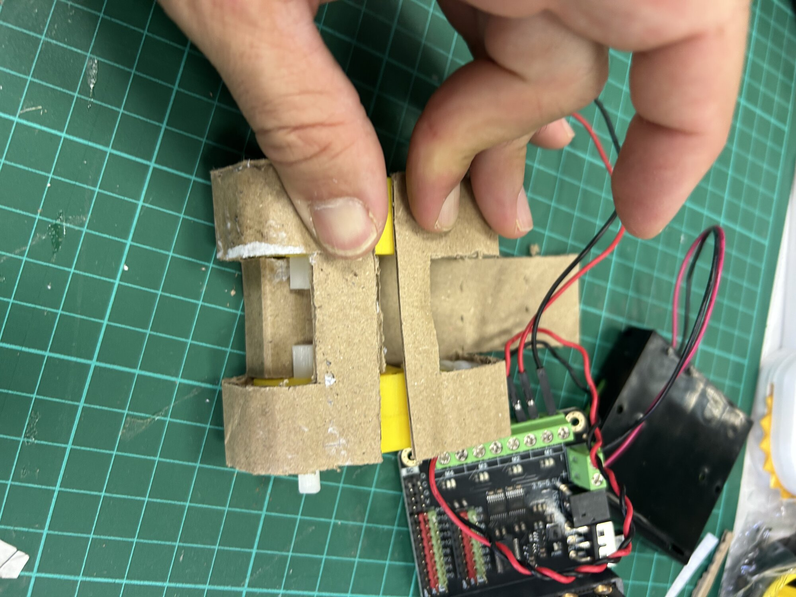
<figcaption>On relève les rabats autour des moteurs.</figcaption>
</figure>
</div>

Verrouille l'ensemble avec deux élastiques croisés.

<figure markdown>
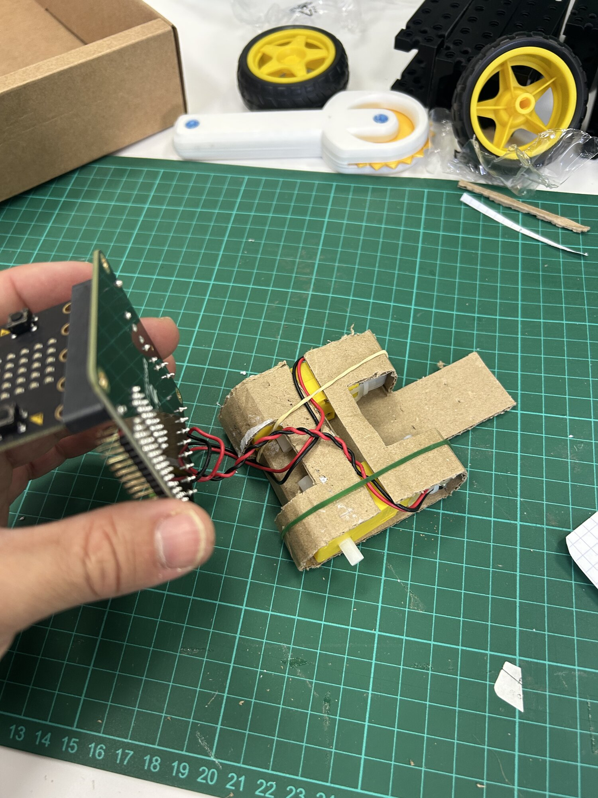
<figcaption>Deux élastiques suffisent, et ça se démonte en trois secondes.</figcaption>
</figure>

> [!TIP] Le test du doigt
> Fais tourner un moteur et appuie légèrement sur son axe. Si le moteur bouge dans son logement, reprends la fixation maintenant — sinon il se déplacera dès que le rover rencontrera un obstacle.

### La carte et les accus

Pose la carte, micro:bit dessus, sur l'étage du haut du châssis, puis le pack d'accus par-dessus, sanglé par un deuxième élastique. Fais passer les fils sans les coincer ni les tendre.

<div class="photo-row" markdown>
<figure markdown>
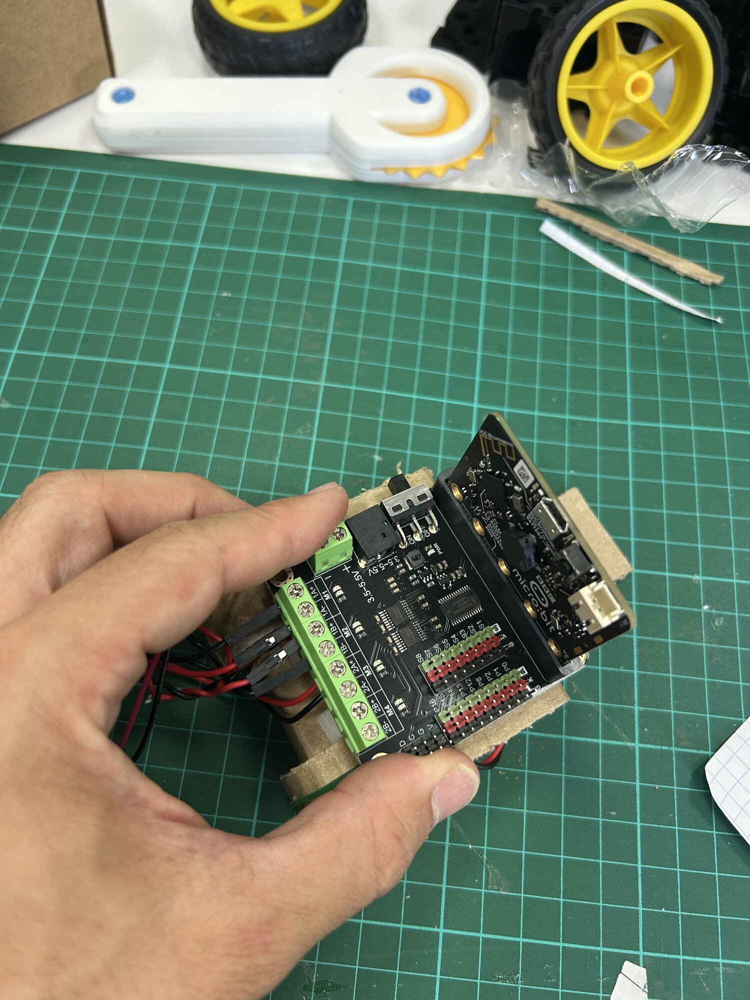
<figcaption>La carte se pose sur l'étage du dessus.</figcaption>
</figure>
<figure markdown>
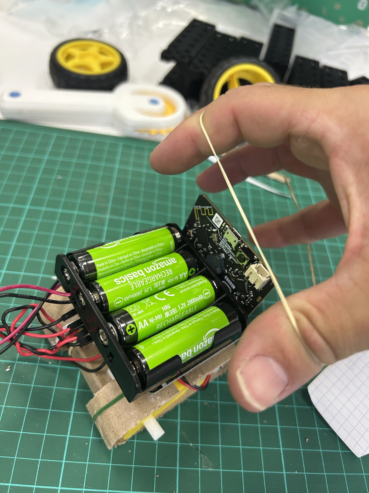
<figcaption>Le pack se pose au-dessus de la carte.</figcaption>
</figure>
<figure markdown>
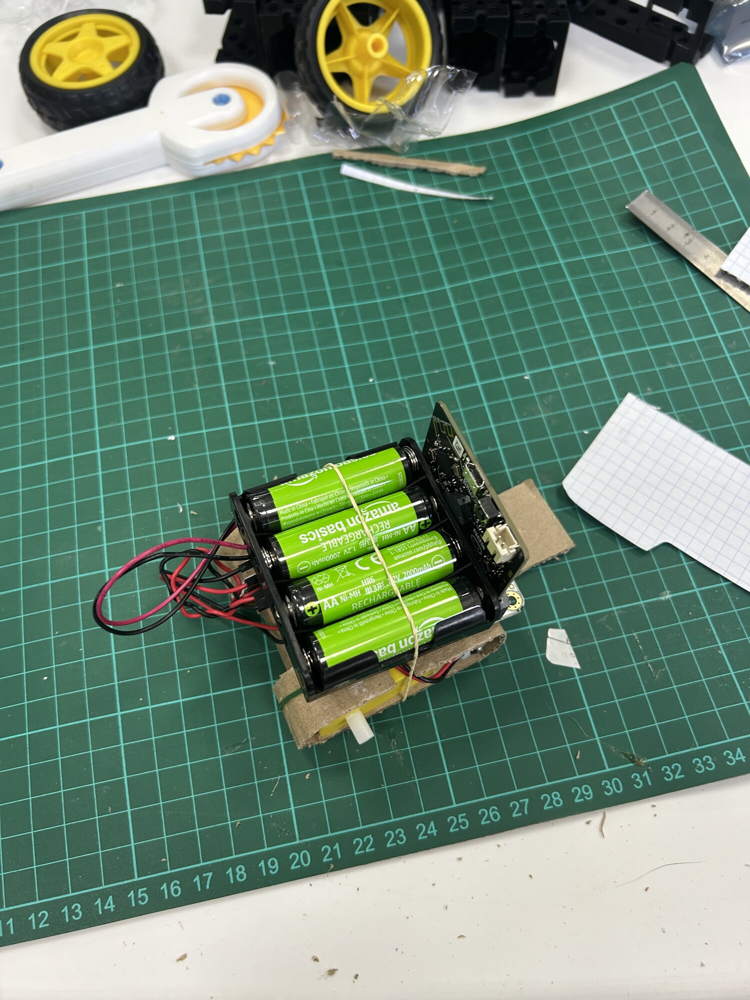
<figcaption>Sanglé. Rien ne doit pouvoir glisser.</figcaption>
</figure>
</div>

### La roue folle et les roues

À l'arrière, rabats la languette de carton sous le châssis et scotche-la. Elle frotte au sol et remplace une roue : c'est ta roue folle.

<figure markdown>
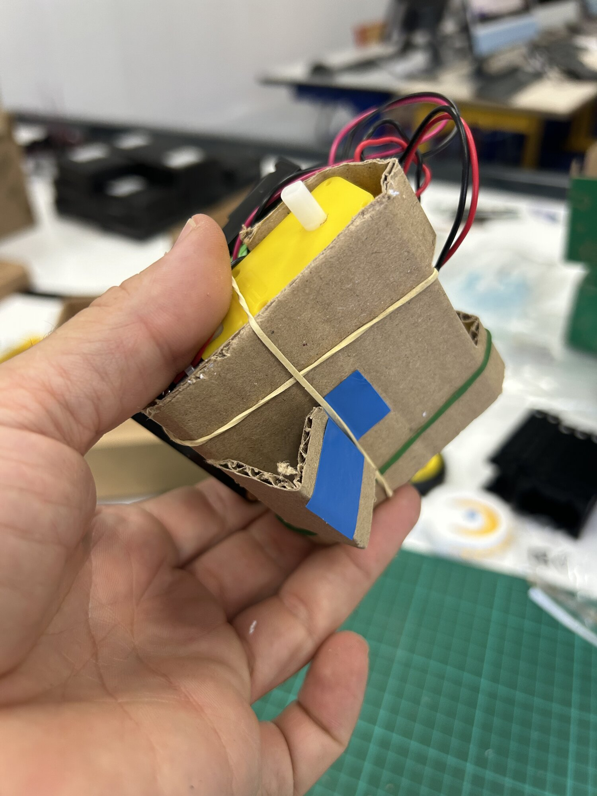
<figcaption>La languette arrière scotchée : elle glisse au sol et tient le rover à l'horizontale.</figcaption>
</figure>

Enfonce enfin les deux roues sur les axes des moteurs.

<div class="photo-row" markdown>
<figure markdown>
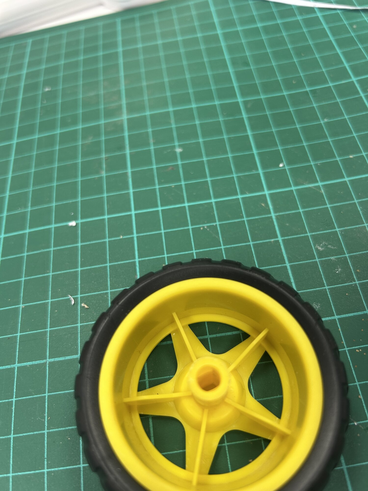
<figcaption>La roue s'enfonce à fond sur l'axe.</figcaption>
</figure>
<figure markdown>
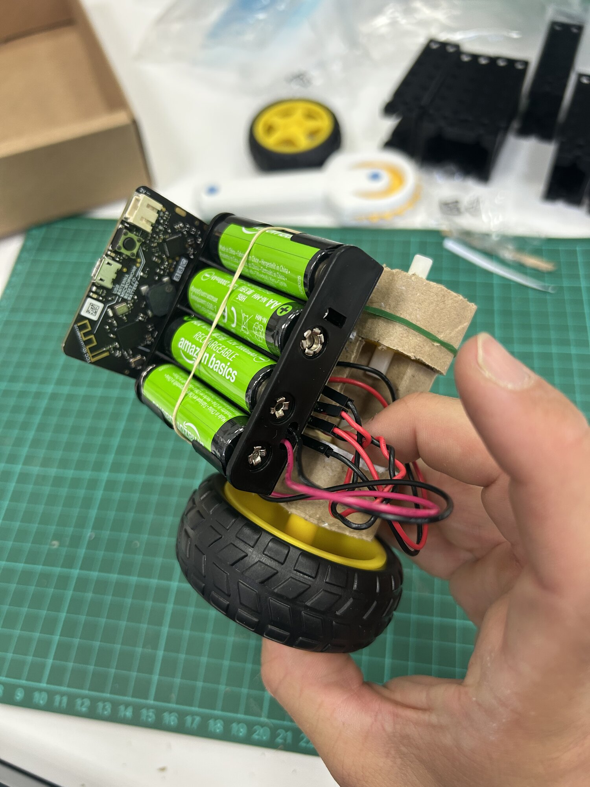
<figcaption>Vu de dessous, une fois la première roue montée.</figcaption>
</figure>
<figure markdown>
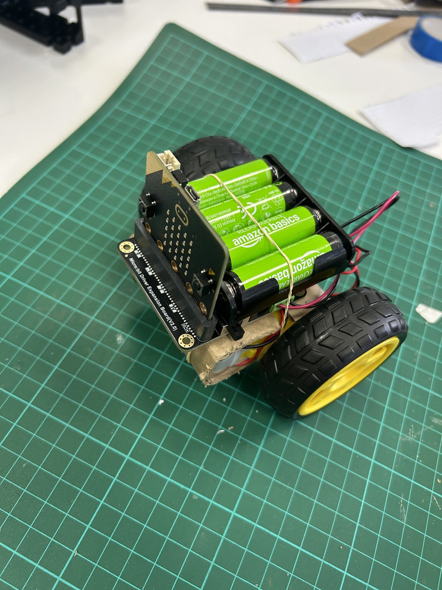
<figcaption>La base motrice est finie.</figcaption>
</figure>
</div>

### Règle le sens de rotation

Remets sous tension, rover dans la boîte de test. Les deux moteurs sont montés tête-bêche sur le châssis : il est normal qu'à ce stade l'un pousse en avant et l'autre en arrière.

Pour celui qui tourne à l'envers, au choix :

- inverse ses deux fils dans le bornier,
- ou passe son bloc de `CW` à `CCW` dans le programme.

Les deux solutions se valent. **Note celle que tu as choisie dans ton carnet de bord** — dans deux séances, tu ne t'en souviendras plus.

<figure markdown>
<video controls playsinline preload="metadata" src="../../../../assets/rover-s01/video-rover-roule.mp4"></video>
<figcaption>Autonome : plus d'ordinateur, le programme vit dans la carte.</figcaption>
</figure>

Débranche l'USB s'il est encore là : le programme est dans la carte, il n'a plus besoin de l'ordinateur.

---

## Ce que tu dois avoir à la fin

- [ ] Une électronique câblée, testée, et dont tu connais le moteur `M1`
- [ ] Un châssis découpé et plié, rabats d'équerre
- [ ] Deux moteurs fixés, axes parallèles, roues qui tournent librement
- [ ] La carte, le micro:bit et les accus sanglés sur le châssis
- [ ] Les deux moteurs qui poussent dans le même sens
- [ ] Le rover qui fonctionne sans l'ordinateur, sur ses accus
- [ ] Ton [carnet de bord](../../../carnet-de-bord/rover-s01.md) rempli

## Avant de partir

Matériel dans ton bac nominatif, chutes de carton triées, **cutter rendu et compté**, accus en charge.

La prochaine séance est annoncée en fin d'atelier.
