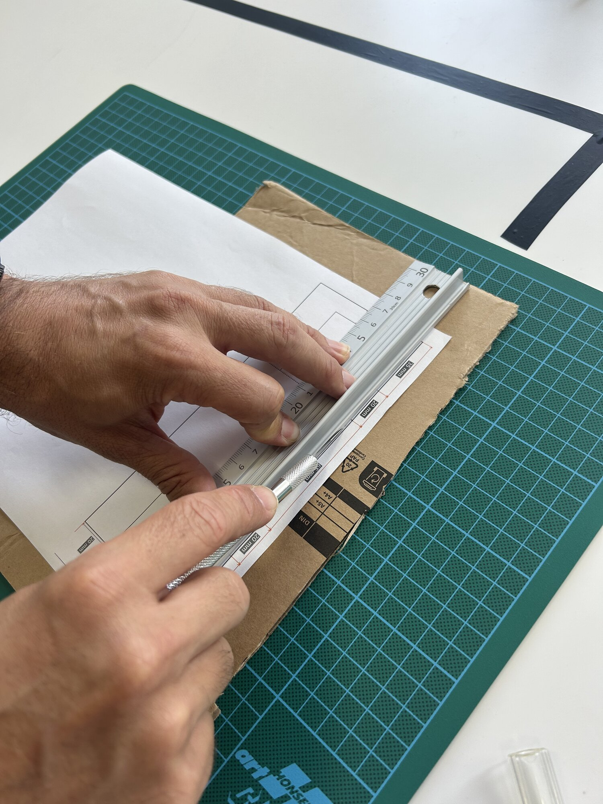

# Séance 2 — Fabrique ton rover et fais-le rouler droit

Tu découpes ton châssis, tu montes ton rover, et tu le règles pour qu'il roule droit.

## 1. Fabrique ton châssis

<figure class="plan" markdown>

</figure>

Trait plein : tu découpes. Pointillé : tu plies.

### Reporte le plan

Imprime [le plan (PDF)](../../../assets/plans/rover-base-chassis-v0.3.pdf) **à 100 %**. Vérifie à la règle : le grand côté fait 175 mm.

Pas d'imprimante ? Recopie le plan

Sur papier quadrillé 5 × 5 mm. **Compte les carreaux, ne mesure pas** : la plaque en fait 35 × 14.

Le fichier source : [SVG](../../../assets/plans/rover-base-chassis-v0.3.svg).

Colle la feuille sur la face **intérieure** des plis.

<figure markdown>

</figure>

### Découpe

> [!CAUTION] L'outil de découpe
> - Règle métallique **à rebord**, toujours.
> - Doigts **posés sur la règle, derrière le rebord**.
> - **Plusieurs passes légères**, sans forcer.
> - **Protection de lame remise** dès que tu poses l'outil.

<figure markdown>

<figcaption>Le rebord relevé est ce qui sépare tes doigts de la lame.</figcaption>
</figure>

→ [Tracer, découper, plier le carton](../../../fiches/carton-tracer-decouper-plier.md#decouper)

### Plie

Règle **sur sa tranche**, pas à plat, le long du pointillé : appuie fort, puis plie contre la règle. Les rabats doivent tenir d'équerre tout seuls.

→ [Tracer, découper, plier le carton](../../../fiches/carton-tracer-decouper-plier.md)

## 2. Monte ton rover

### Les moteurs

Moteurs entre les rabats, axes parallèles, `M1` à gauche. Deux élastiques croisés.

<figure markdown>

</figure>
<figure markdown>

</figure>
<figure markdown>

</figure>

<figure markdown>

</figure>

Appuie sur un axe : si le moteur bouge dans son logement, resserre.

### La carte et les accus

Carte sur l'étage du haut, accus par-dessus, un élastique. Fils ni coincés ni tendus.

<figure markdown>

</figure>
<figure markdown>

</figure>
<figure markdown>

</figure>

### Les roues

Languette arrière rabattue dessous et scotchée : c'est ta roue folle. Enfonce les deux roues sur les axes.

<figure markdown>

</figure>

<figure markdown>

</figure>
<figure markdown>

</figure>
<figure markdown>

</figure>

## 3. Les deux roues dans le même sens

Pose ton rover **sur l'arrière, roues en l'air**, dans la boîte de test. Lance ton programme de la séance 1.

<figure markdown>

<figcaption>Roues en l'air : tu vois les deux sens sans courir après ton rover.</figcaption>
</figure>

Un moteur tourne à l'envers : c'est normal. Inverse ses deux fils, ou passe son bloc en `CCW`. **Note ton choix dans le carnet.**

<figure markdown>
<video controls playsinline preload="metadata" src="../../../../assets/rover-s01/video-rover-roule.mp4"></video>
<figcaption>USB débranché : le programme vit dans la carte.</figcaption>
</figure>

## 4. Ta première fonction

Une fonction est un bloc que tu fabriques, que tu nommes, et que tu réutilises ensuite par son nom.

**Fonctions** → **Créer une fonction…**

<figure class="screenshot" markdown>

</figure>

Appelle-la `avancer`, puis **Terminé**.

<figure class="screenshot" markdown>

</figure>

Glisse tes deux blocs `Motor` dans la fonction. Reprends **Fonctions** : le bloc `appel avancer` est apparu. Mets-le dans `toujours`, à la place des blocs que tu viens de déplacer.

<figure class="screenshot" markdown>

</figure>

> [!NOTE] À quoi sert une fonction
> Un programme se lit comme une phrase : `appel avancer` se comprend sans lire le détail. Tu réutiliseras ces fonctions telles quelles quand ton rover aura une télécommande.

## 5. Fais-le rouler droit

Ton rover tire d'un côté. **Regarde la mécanique avant de toucher au code.**

- [ ] La languette arrière glisse sans frotter d'un côté
- [ ] Le rover est d'aplomb, il ne se balance pas
- [ ] Les deux moteurs sont bien plaqués contre les rabats, parallèles
- [ ] Les roues sont enfoncées à fond et ne voilent pas
- [ ] Le pack d'accus est centré

Il dévie encore ? Alors les deux moteurs ne tournent pas exactement à la même vitesse. Mets-les **tous les deux à 80**, puis monte celui qui est le plus lent, 5 par 5, jusqu'à ce que le rover suive la ligne.

> [!NOTE] Il n'y a pas de bonne valeur
> Chaque moteur est unique. Sur le rover des photos, l'équilibre tombe à 110 ; le tien sera ailleurs, entre 80 et 120. **Note tes deux valeurs dans le carnet.**

<figure markdown>

<figcaption>Le L cale le rover au départ, toujours au même endroit.</figcaption>
</figure>

Cale ton rover dans le L, lance-le, et mesure de combien il s'est écarté de la ligne au bout d'**1,50 m**. Fais trois passages : l'écart change à chaque fois, et c'est déjà une information.

> [!TIP] Ce qu'on vise
> Un écart de moins d'une largeur de rover au bout d'1,50 m. Le reste se rattrapera à la télécommande.

Mesure aussi ta **vitesse minimale** : descends la valeur jusqu'à ce que le rover refuse de démarrer, alors qu'une pichenette suffit à le lancer. Note-la.

→ [Rouler droit et tourner](../../../fiches/rouler-droit.md)

---

## Ce que tu dois avoir à la fin

- [ ] Châssis découpé, rabats d'équerre
- [ ] Moteurs fixés, roues qui tournent librement
- [ ] Carte et accus sanglés
- [ ] Les deux roues dans le même sens
- [ ] La fonction `avancer`, appelée dans `toujours`
- [ ] Il roule droit sur 1,50 m sans s'écarter de la ligne
- [ ] Ton [carnet de bord](../../../carnet-de-bord/rover-s02.md) rempli

## Avant de partir

Matériel dans ton bac, chutes triées, **outil de découpe rendu**, banc dégagé, accus en charge.
