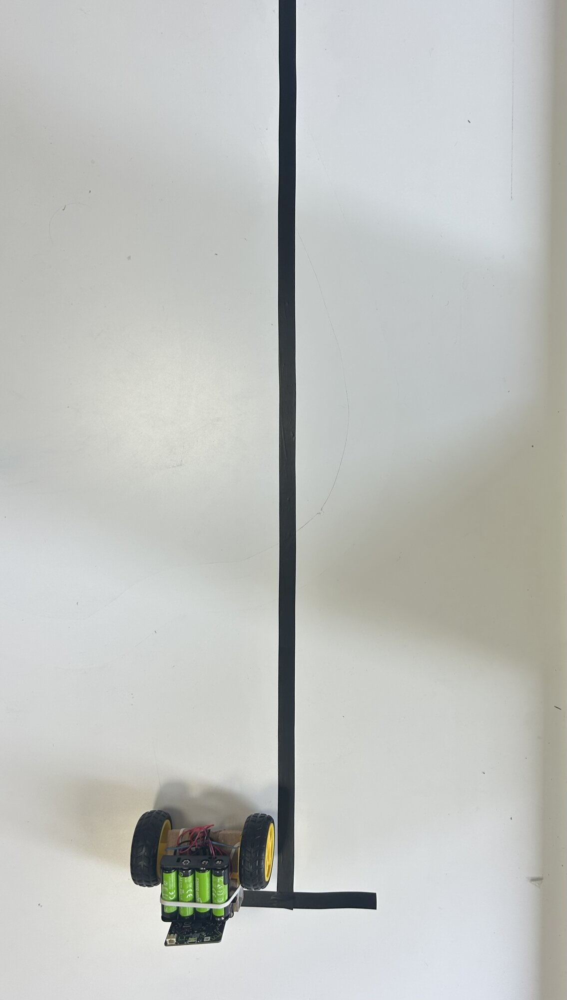

# Séance 2 — Ton rover obéit

Ton rover apprend cinq mouvements, tu le règles pour qu'il roule droit, et tu l'envoies au garage.

## 1. Termine ton rover

Tu n'as pas fini la séance 1 ? Reprends où tu t'es arrêté : [fabrique ton châssis](s01-base-motrice.md#9-fabrique-ton-chassis), puis [monte ton rover](s01-base-motrice.md#10-monte-ton-rover).

> [!IMPORTANT] Point de contrôle
> Fais valider ton montage avant de coder. Tout le réglage d'aujourd'hui repose dessus.

## 2. Les deux roues dans le même sens

Pose ton rover **sur l'arrière, roues en l'air**, dans la boîte de test. Lance ton programme de la séance 1.

<figure markdown>

<figcaption>Roues en l'air : tu vois les deux sens sans courir après ton rover.</figcaption>
</figure>

- [ ] Les deux roues tournent dans le même sens
- [ ] Sinon, inverse les deux fils d'un moteur, ou passe son bloc en `CCW`

## 3. Ta première fonction

Une fonction est un bloc que tu fabriques, que tu nommes, et que tu réutilises ensuite par son nom.

**Fonctions** → **Créer une fonction…**

<figure class="screenshot" markdown>

</figure>

Appelle-la `avancer`, puis **Terminé**.

<figure class="screenshot" markdown>

</figure>

Glisse tes deux blocs `Motor` dans la fonction. Reprends **Fonctions** : le bloc `appel avancer` est apparu — mets-le dans `toujours`, à la place des blocs que tu viens de déplacer.

<figure class="screenshot" markdown>

</figure>

> [!NOTE] À quoi sert une fonction
> Un programme se lit comme une phrase : `appel avancer` se comprend sans lire le détail. Tu réutiliseras ces fonctions telles quelles quand ton rover aura une télécommande.

## 4. Fais-le rouler droit

Ton rover tire d'un côté. **Regarde la mécanique avant de toucher au code.**

- [ ] La languette arrière glisse sans frotter d'un côté
- [ ] Le rover est d'aplomb, il ne se balance pas
- [ ] Les deux moteurs sont bien plaqués contre les rabats, parallèles
- [ ] Les roues sont enfoncées à fond et ne voilent pas
- [ ] Le pack d'accus est centré

Il dévie encore ? Alors les deux moteurs ne tournent pas exactement à la même vitesse. Mets-les **tous les deux à 80**, puis monte celui qui est le plus lent, 5 par 5, jusqu'à ce que le rover suive la ligne.

> [!NOTE] Il n'y a pas de bonne valeur
> Chaque moteur est unique. Sur le rover des photos, l'équilibre tombe à 110 ; le tien sera ailleurs, entre 80 et 120. **Note tes deux valeurs dans le carnet.**

<figure markdown>

<figcaption>Le L cale le rover au départ, toujours au même endroit.</figcaption>
</figure>

Cale ton rover dans le L, lance-le, et mesure de combien il s'est écarté de la ligne au bout d'**1,50 m**. **Trois passages** — l'écart change à chaque fois, et c'est déjà une information.

> [!TIP] Ce qu'on vise
> Un écart de moins d'une largeur de rover au bout d'1,50 m. Le reste se rattrapera à la télécommande.

Mesure aussi ta **vitesse minimale** : descends la valeur jusqu'à ce que le rover refuse de démarrer, alors qu'une pichenette suffit à le lancer. Note-la.

→ [Rouler droit et tourner](../../../fiches/rouler-droit.md)

## 5. Les quatre autres mouvements

**À toi.** Fabrique `reculer`, `tournerAGauche`, `tournerADroite` et `arreter`, sur le même modèle.

Pour tourner : **une roue à l'arrêt, l'autre en marche.** Le rover pivote autour de la roue arrêtée.

C'est la façon de tourner de tout le parcours. Tous les rovers tournent pareil, et c'est ce qui permettra plus tard à ton programme de piloter le rover d'un coéquipier.

La solution

<figure class="screenshot" markdown>

<figcaption>Les cinq fonctions, appelées l'une après l'autre.</figcaption>
</figure>

Sur les photos, `arreter` contient les deux blocs `Motor` à `speed 0`. `Motor Stop All` fait la même chose en un seul bloc — les deux se valent.

→ [La carte DFR0548 et ses blocs](../../../fiches/carte-dfr0548.md#lextension-df-driver)

## 6. Le défi du retour au garage

<figure markdown>

</figure>

Départ derrière la **ligne jaune**. Ton rover doit dépasser la **ligne bleue** en contournant l'obstacle, puis revenir derrière la jaune. Trois fois de suite, avec le même programme.

Deux changements dans ton code :

1. **Supprime le bloc `toujours`.** Tu ne veux plus que ça tourne sans fin.
2. Prends `lorsque le bouton A est pressé`, et mets dedans `répéter 3 fois` — dans la catégorie **Boucles**.

<figure class="screenshot" markdown>

</figure>

Dans la boucle : ta manœuvre, puis une pause assez longue pour que tu aies le temps de **replacer ton rover sur le point de départ**.

**Réussi si 2 passages sur 3 reviennent dans la zone.**

> [!NOTE] Ton rover n'a aucun retour de position
> Il exécute des durées, pas des positions. Rien n'a changé entre deux passages, et pourtant il ne s'arrête pas au même endroit.

Note tes trois résultats dans le carnet.

---

## Ce que tu dois avoir à la fin

- [ ] Rover terminé, les deux roues dans le même sens
- [ ] Cinq fonctions : `avancer`, `reculer`, `tournerAGauche`, `tournerADroite`, `arreter`
- [ ] Il roule droit sur 1,50 m sans s'écarter de la ligne
- [ ] Le défi tenté, les trois résultats notés
- [ ] Ton [carnet de bord](../../../carnet-de-bord/rover-s02.md) rempli

## Avant de partir

Matériel dans ton bac, chutes triées, **cutter rendu**, banc dégagé, accus en charge.
