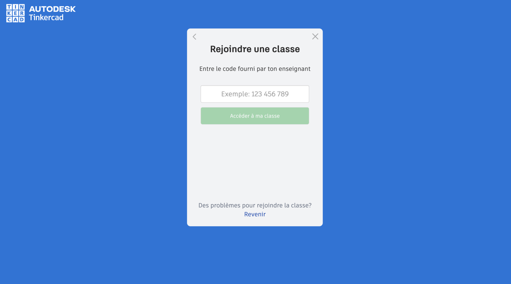
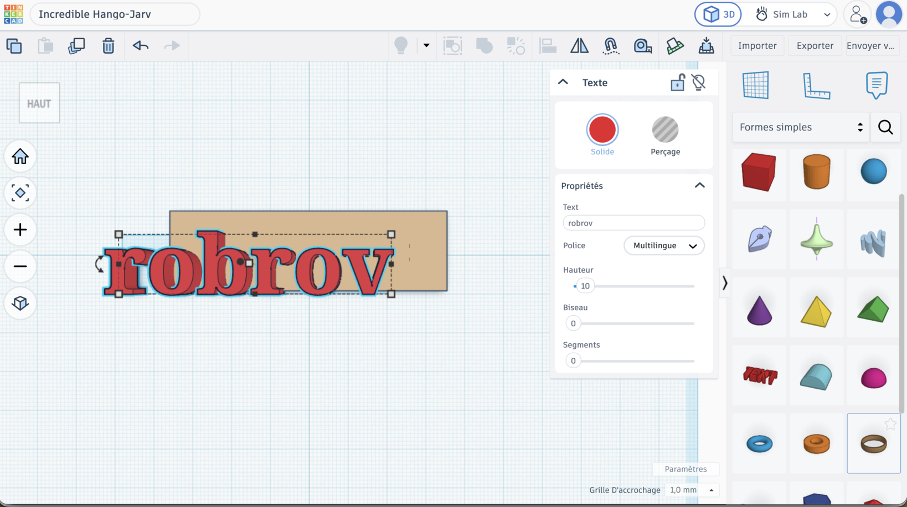
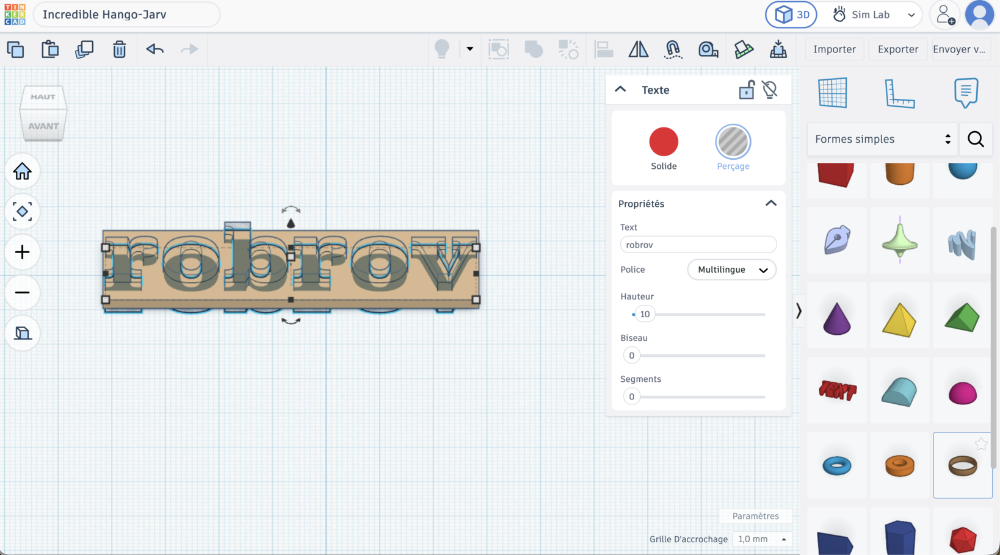
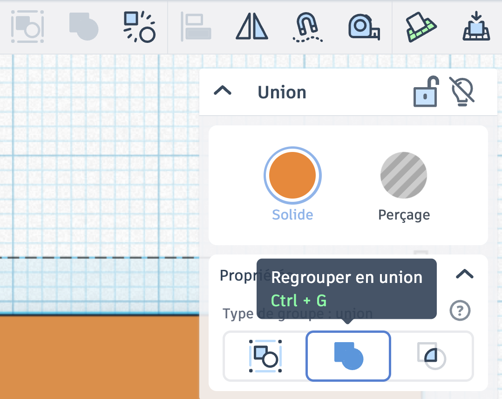
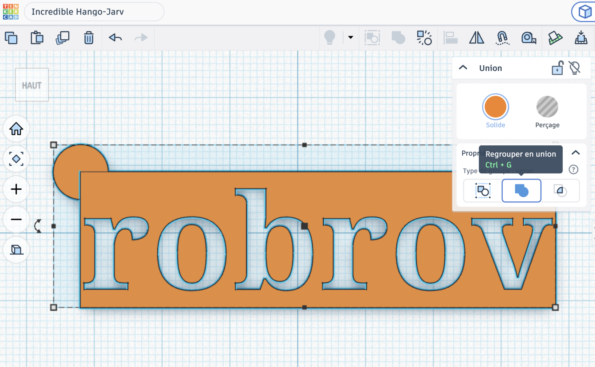
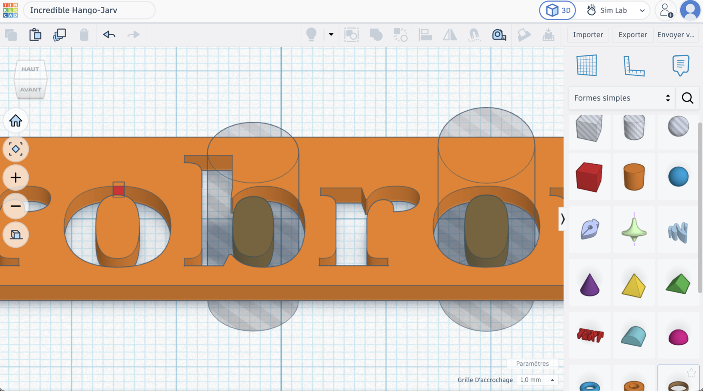
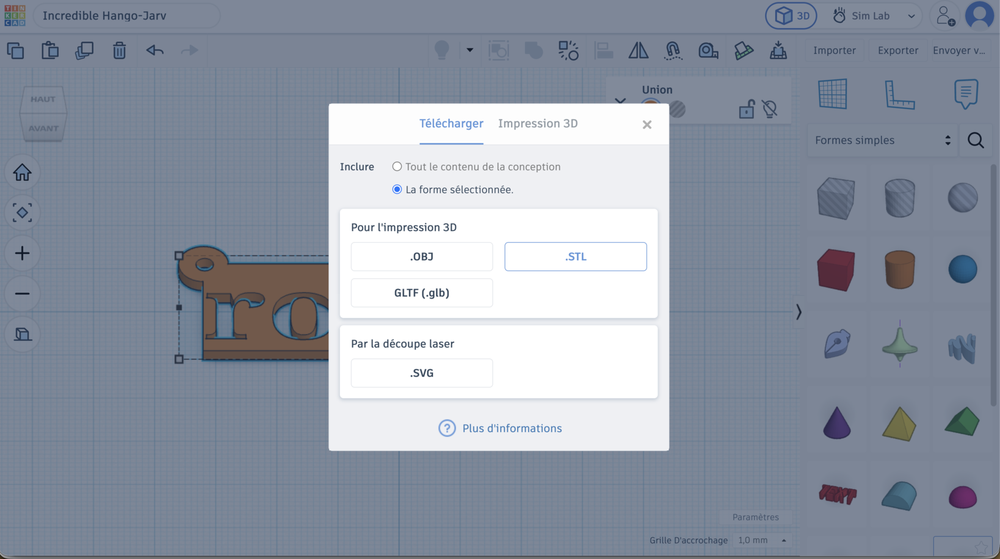
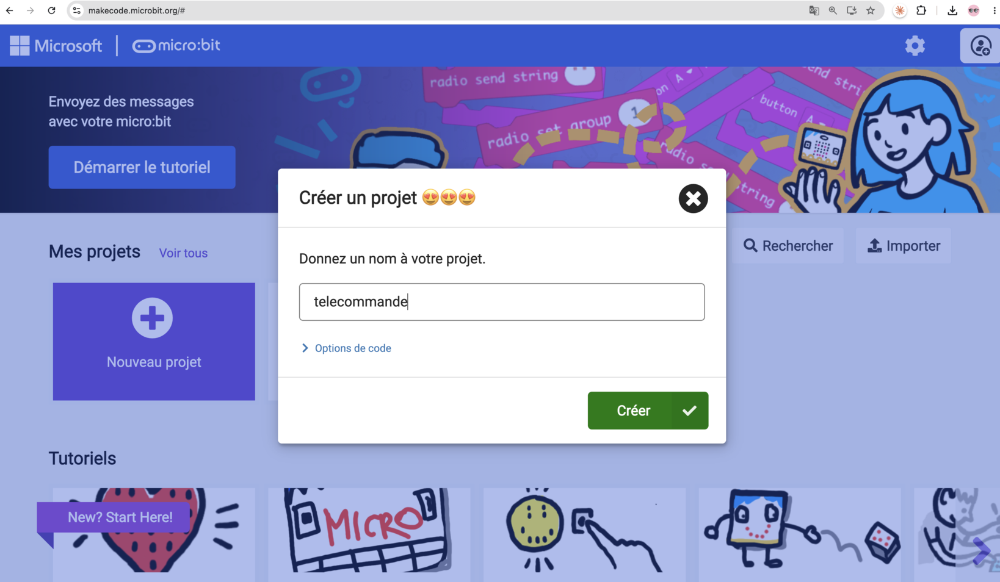
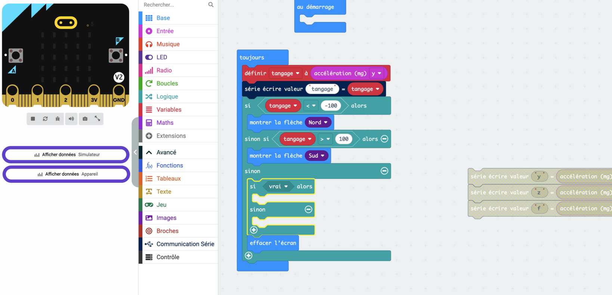
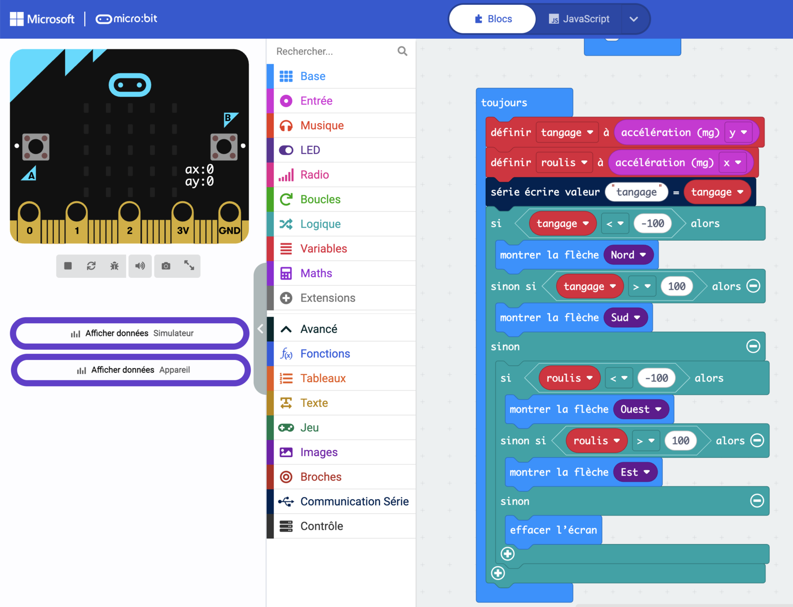

# Séance 3 — Ton identité, et le problème de la télécommande

Tu dessines la plaque qui portera ton nom, tu l'envoies à l'impression, puis tu commences la conception de ta télécommande.

## 1. Rejoins la classe Tinkercad

Va sur [tinkercad.com/joinclass](https://www.tinkercad.com/joinclass), entre le **code de classe** que donne l'animateur, puis ton **identifiant d'élève**.

<figure class="screenshot" markdown>

</figure>

## 2. Dessine ta plaque

Immatriculation sur le rover aujourd'hui, porte-clés quand il sera démonté : dessine-la en pensant aux deux.

Pose une **Boîte**, et règle-la à **70 × 20 × 2 mm**.

<figure class="screenshot" markdown>

</figure>

> [!CAUTION] Le gabarit est une contrainte de groupe
> Toutes les plaques doivent tenir sur **un seul plateau d'imprimante**. Une plaque hors cotes ne part pas à l'impression, et tu repars sans rien.

Ajoute une forme **Texte**, tape ton nom, pose-la sur la plaque.

<figure class="screenshot" markdown>

</figure>

Centre-la avec l'outil **Aligner**, pas à l'œil.

<figure class="screenshot" markdown>

</figure>

Passe en vue **de face** : ton texte est posé **au-dessus** de la plaque. Descends-le avec la poignée d'altitude jusqu'à ce qu'il la traverse de part en part.

<figure class="screenshot" markdown>

</figure>

Passe le texte en **Perçage** : il devient transparent. Il ne s'imprimera pas, il creusera.

<figure class="screenshot" markdown>

</figure>

Sélectionne la plaque et le texte, puis **Regroupe** — <kbd>Ctrl</kbd> + <kbd>G</kbd>. L'icône est **le carré et le rond soudés en une seule forme bleue**.

<figure class="screenshot" markdown>

<figcaption>À gauche, les formes restent séparées. Au milieu, elles fusionnent. À droite, l'une creuse l'autre.</figcaption>
</figure>

Tes lettres sont découpées dans la plaque.

## 3. Ajoute ton trou de porte-clés

Il en faut **deux, l'un dans l'autre**.

Le premier reste **Solide** : pose-le à l'extrémité de la plaque, débordant du bord. C'est lui qui fabrique l'oreille arrondie.

<figure class="screenshot" markdown>

</figure>

Le second passe en **Perçage** : plus petit, centré dans le premier — avec l'outil Aligner. C'est lui qui fait le trou.

> [!TIP] Laisse de la matière
> Au moins **3 mm** entre le trou et le bord de l'oreille. Sinon l'anneau arrache le coin au premier trousseau de clés.

Sélectionne tout et **regroupe** une dernière fois : le trou est creusé pour de bon.

<figure class="screenshot" markdown>

</figure>

## 4. Vérifie avant d'exporter

Ton imprimante empile des couches de plastique, de bas en haut, et ne pose rien dans le vide.

Regarde ta plaque et réponds à deux questions.

**Est-ce que tout tient ?** Cherche les morceaux qui ne touchent plus rien. L'intérieur des lettres fermées — `o`, `b`, `a`, `d` — n'est relié à rien.

<figure class="screenshot" markdown>

<figcaption>Ils tombent, ou ils s'impriment tout seuls à côté.</figcaption>
</figure>

Deux façons de corriger :

- **Relie** l'îlot au reste de la plaque par un petit pont de matière
- **Efface-le** : pose un cylindre en perçage par-dessus, la lettre devient une boucle ouverte

**Est-ce que tout s'imprime ?** Rien ne doit flotter au-dessus du vide.

Deux fois oui ? Tu peux exporter.

## 5. Exporte ta plaque

**Exporter** → **La forme sélectionnée** → **.STL**

<figure class="screenshot" markdown>

</figure>

Nomme le fichier `prenom-plaque.stl` et dépose-le où l'animateur te l'indique.

> [!IMPORTANT] Point de contrôle
> Fais valider ta plaque avant d'exporter. Après, elle part à l'impression telle quelle.

→ [Modéliser et imprimer en 3D](../../../fiches/modeliser-imprimer-3d.md)

## 6. Combien d'ordres pour ton rover ?

Liste ce que tu veux commander : avancer, reculer, gauche, droite, stop…

Puis ce que ta carte sait recevoir : les boutons `A` et `B`, les deux à la fois, le logo tactile, les broches `P0`, `P1`, `P2`. De quoi faire.

Mais essaie de conduire en appuyant sur des boutons. La carte sait aussi **sentir comment tu la tiens** — c'est plus direct.

> [!CAUTION] Cette carte-là ne monte jamais sur le rover
> C'est ta télécommande. Elle reste dans ton bac entre les séances.

## 7. Regarde ce que dit le capteur

Nouveau projet MakeCode, nommé `telecommande`.

<figure class="screenshot" markdown>

</figure>

**Regarde les chiffres avant de décider quoi que ce soit.** Dans `toujours`, écris les quatre valeurs de l'accéléromètre :

<figure class="screenshot" markdown>

</figure>

> [!NOTE] La liaison série
> `série écrire valeur` envoie les chiffres à ton ordinateur par le câble USB. USB débranché, la carte mesure toujours — mais plus personne ne l'écoute.

Téléverse, garde le câble branché, puis clique sur **Afficher données Appareil**. Penche la carte dans tous les sens.

<figure class="screenshot" markdown>

</figure>

- [ ] Quelle courbe bouge quand tu penches vers l'avant ?
- [ ] Quelles valeurs quand la carte est à plat ?

## 8. Transforme la mesure en décision

Le capteur donne un nombre. Toi, tu veux une direction. Il te faut un **seuil** : à partir de quelle valeur décide-t-on que ça penche vraiment ?

Range d'abord la mesure dans une **variable** — une boîte nommée où tu poses une valeur pour la relire plus loin. Appelle-la `tangage`.

Puis décide avec **`si … alors`**, qui n'exécute une branche que si sa condition est vraie ; `sinon` attrape tout le reste.

<figure class="screenshot" markdown>

<figcaption>−100 et 100 sont les seuils de ce rover. Trouve les tiens.</figcaption>
</figure>

**Note tes seuils dans le carnet** : la séance 4 les reprendra tels quels.

### À toi : ajoute le roulis

`tangage` gère l'avant et l'arrière. Pour la gauche et la droite, crée une seconde variable `roulis` sur l'axe `x`, et teste-la **dans le `sinon`** du premier test.

<figure class="screenshot" markdown>

<figcaption>Le second test vient se loger ici. À toi de le remplir.</figcaption>
</figure>

La solution

<figure class="screenshot" markdown>

</figure>

Le premier test vrai gagne : deux tests mis à la suite afficheraient deux flèches coup sur coup, et tu ne verrais que la dernière.

Remarque où descend `effacer l'écran` — tout au fond, là où **aucun** des deux tests n'a rien trouvé.

→ [D'une mesure à une décision](../../../fiches/mesure-vers-decision.md)

---

## Ce que tu dois avoir à la fin

- [ ] Ta plaque exportée, nommée `prenom-plaque.stl`, déposée au bon endroit
- [ ] Aucun îlot détaché dans tes lettres fermées
- [ ] Tes cotes respectées : 70 × 20 × 2 mm
- [ ] Ta seconde carte reconnue comme ta télécommande
- [ ] Un programme qui affiche une flèche quand tu penches
- [ ] Tes seuils notés dans ton [carnet de bord](../../../carnet-de-bord/rover-s03.md)

## Avant de partir

Seconde carte dans ton bac — **elle revient la semaine prochaine**. Accus en charge. Un coup d'œil à l'imprimante en sortant.
