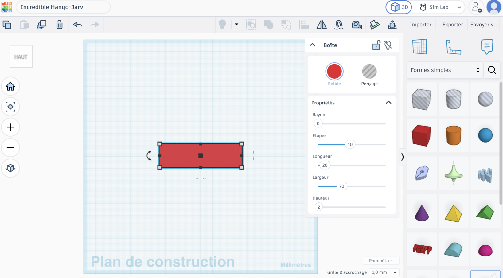
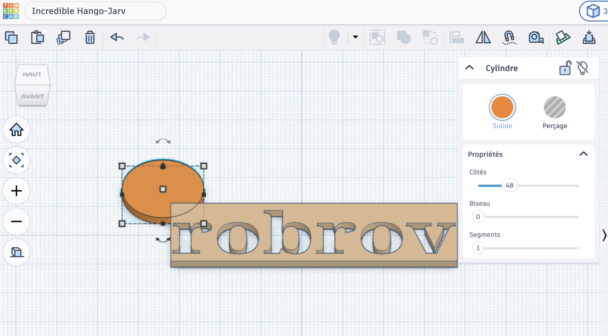
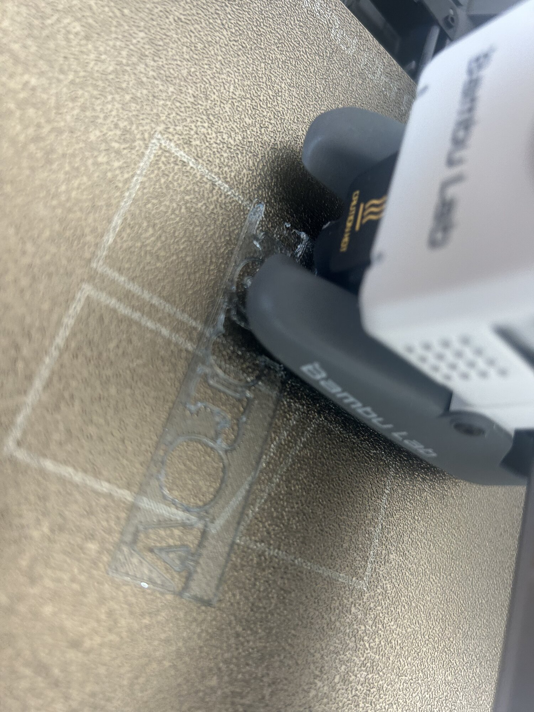
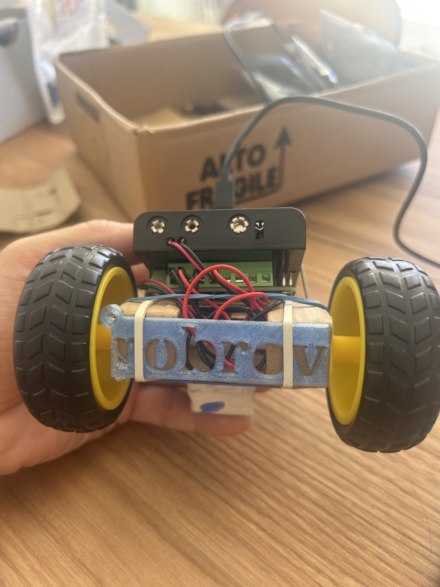
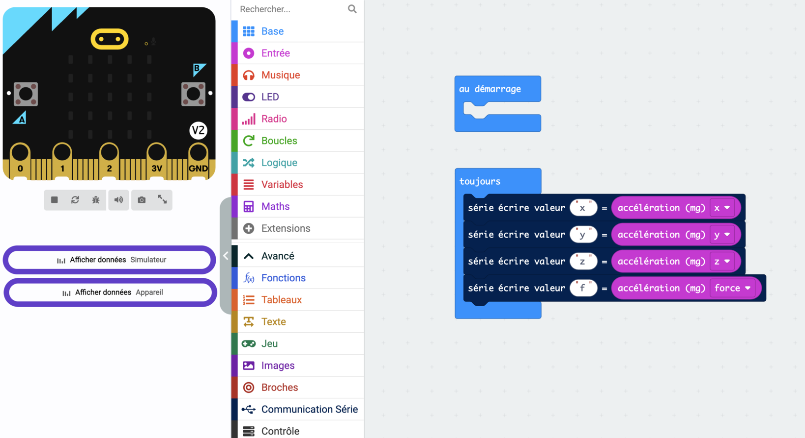
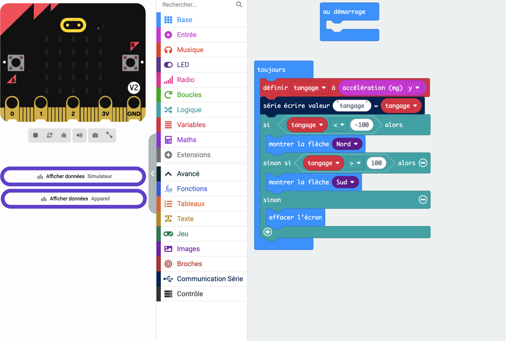

# Séance 3 — Ton identité, et le problème de la télécommande

Tu dessines la plaque qui portera ton nom, tu la lances à l'impression, et tu attaques une énigme : comment commander un rover avec seulement deux boutons ?

## 1. Rejoins la classe Tinkercad

Va sur [tinkercad.com/joinclass](https://www.tinkercad.com/joinclass), entre le **code de classe** que donne l'animateur, puis ton **identifiant d'élève**.

<figure class="screenshot" markdown>

</figure>

Pas d'adresse mail à donner : c'est l'animateur qui a créé ton compte.

## 2. Dessine ta plaque

Ta plaque a deux vies : **immatriculation** sur le rover aujourd'hui, **porte-clés** quand le rover sera démonté. Dessine-la en pensant aux deux.

Pose une **Boîte**, et règle-la à **70 × 20 × 2 mm**.

<figure class="screenshot" markdown>

<figcaption>Ces trois valeurs ne se négocient pas : c'est le gabarit.</figcaption>
</figure>

Ajoute une forme **Texte**, tape ton nom, pose-la sur la plaque.

<figure class="screenshot" markdown>

</figure>

Centre-la avec l'outil **Aligner** plutôt qu'à l'œil : tu sélectionnes la plaque et le texte, et tu cliques sur la poignée du milieu.

<figure class="screenshot" markdown>

</figure>

> [!CAUTION] Le gabarit est une contrainte de groupe
> Toutes les plaques doivent tenir sur **un seul plateau d'imprimante**. Une plaque hors cotes ne part pas à l'impression, et tu repars sans rien.

Si tu laisses ton texte en relief, il ne dépasse pas de **plus de 2 mm**, et seulement par endroits.

## 3. Le piège des lettres fermées

Si tu passes ton texte en **Perçage**, les lettres sont découpées à travers la plaque — et l'intérieur des lettres fermées comme `o`, `b`, `a`, `d` ne tient plus à rien.

<figure class="screenshot" markdown>

<figcaption>Ces îlots ne sont reliés à rien : ils tombent, ou ils s'impriment tout seuls à côté.</figcaption>
</figure>

Deux solutions, au choix :

- **Relie-les** au reste de la plaque par un petit pont de matière
- **Efface-les** : pose un cylindre en perçage par-dessus, la lettre devient une simple boucle ouverte

Regarde ta plaque **de face** avant de continuer : c'est la seule vue qui montre les épaisseurs.

<figure class="screenshot" markdown>

</figure>

## 4. Ajoute ton trou de porte-clés

Pose un **Cylindre**, place-le près d'un bord, et passe-le en **Perçage**.

<figure class="screenshot" markdown>

</figure>

> [!TIP] Laisse de la matière
> Au moins **3 mm** entre le trou et le bord. Sinon l'anneau arrache le coin au premier trousseau de clés.

Sélectionne tout, puis **Regrouper** — <kbd>Ctrl</kbd> + <kbd>G</kbd>. Ta plaque devient une seule pièce.

<figure class="screenshot" markdown>

</figure>

## 5. Exporte ta plaque

**Exporter** → **La forme sélectionnée** → **.STL**

<figure class="screenshot" markdown>

</figure>

Nomme le fichier `prenom-plaque.stl` et dépose-le où l'animateur te l'indique.

> [!TIP] Vérifie l'extension
> Selon le navigateur, le `.stl` saute au téléchargement. Si ton fichier n'a pas d'extension, ajoute-la à la main.

> [!IMPORTANT] Point de contrôle
> Fais vérifier tes cotes, ton trou et ton nom avant d'exporter. Après, la plaque part à l'impression telle quelle.

## 6. De l'écran à l'objet

L'imprimante n'enlève pas de matière : elle **empile des couches** de plastique fondu.

> [!NOTE] Une pièce casse entre ses couches
> C'est sa direction faible. Tu t'en souviendras quand tu dessineras les supports de ton mécanisme.

→ [Modéliser et imprimer en 3D](../../../fiches/modeliser-imprimer-3d.md)

## 7. Combien d'ordres pour ton rover ?

Ta télécommande aura **deux boutons**. A, B, et A+B : trois possibilités.

Compte les ordres que tu veux vraiment envoyer — avancer, reculer, gauche, droite, stop… Ça ne rentre pas.

Alors cherche autre chose dans la carte. Elle sait aussi **sentir comment tu la tiens**.

> [!CAUTION] Cette carte-là ne monte jamais sur le rover
> C'est ta télécommande. Elle reste dans ton bac entre les séances.

## 8. Regarde ce que dit le capteur

Nouveau projet MakeCode, nommé `telecommande`.

<figure class="screenshot" markdown>

</figure>

Avant de décider quoi que ce soit, **regarde les chiffres**. Dans `toujours`, écris les quatre valeurs de l'accéléromètre :

<figure class="screenshot" markdown>

</figure>

Téléverse, puis clique sur **Afficher données Appareil**. Penche la carte dans tous les sens et regarde les courbes bouger.

<figure class="screenshot" markdown>

</figure>

- [ ] Quelle courbe bouge quand tu penches vers l'avant ?
- [ ] Quelles valeurs quand la carte est à plat ?

## 9. Transforme la mesure en décision

Le capteur donne un nombre. Toi, tu veux une direction. Il te faut un **seuil** : à partir de quelle valeur décide-t-on que ça penche vraiment ?

Range d'abord la mesure dans une variable `tangage`, puis décide :

<figure class="screenshot" markdown>

<figcaption>−100 et 100 sont les seuils de ce rover. Trouve les tiens.</figcaption>
</figure>

**Note tes seuils dans le carnet** : la séance 4 les reprendra tels quels.

→ [D'une mesure à une décision](../../../fiches/mesure-vers-decision.md)

---

## Ce que tu dois avoir à la fin

- [ ] Ta plaque exportée, nommée `prenom-plaque.stl`, déposée au bon endroit
- [ ] Aucun îlot détaché dans tes lettres fermées
- [ ] Tes cotes respectées : 70 × 20 × 2 mm
- [ ] Ta seconde carte reconnue comme ta télécommande
- [ ] Un programme qui affiche une flèche quand tu penches
- [ ] Tes seuils notés dans ton [carnet de bord](../../../carnet-de-bord/rover-s03.md)

## Avant de partir

Seconde carte dans ton bac — **elle revient la semaine prochaine**. Accus en charge. Un coup d'œil à l'imprimante en sortant.
