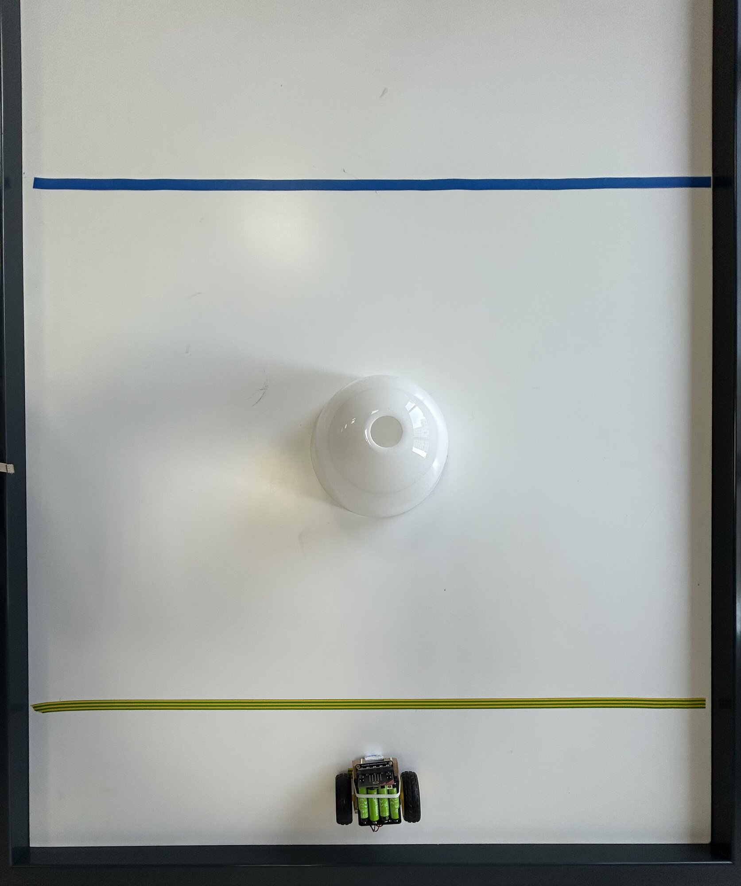

# Séance 3 — Ta plaque, et les mouvements de ton rover

Tu dessines la plaque qui portera ton nom et tu l'envoies à l'impression. Puis ton rover apprend ses cinq mouvements, et tu écris le programme qui les vérifie.

## 1. Rejoins la classe Tinkercad

Va sur [tinkercad.com/joinclass](https://www.tinkercad.com/joinclass), entre le **code de classe** que donne l'animateur, puis ton **identifiant d'élève**.

<figure class="screenshot" markdown>

</figure>

## 2. Dessine ta plaque

Immatriculation sur le rover aujourd'hui, porte-clés quand il sera démonté : dessine-la en pensant aux deux.

Pose une **Boîte**, et règle-la à **70 × 20 × 2 mm**.

<figure class="screenshot" markdown>

</figure>

> [!CAUTION] Le gabarit est une contrainte de groupe
> Toutes les plaques doivent tenir sur **un seul plateau d'imprimante**. Une plaque hors cotes ne part pas à l'impression, et tu repars sans rien.

Ajoute une forme **Texte**, tape ton nom, pose-la sur la plaque.

<figure class="screenshot" markdown>

</figure>

Centre-la avec l'outil **Aligner**, pas à l'œil.

<figure class="screenshot" markdown>

</figure>

Passe en vue **de face** : ton texte est posé **au-dessus** de la plaque. Descends-le avec la poignée d'altitude jusqu'à ce qu'il la traverse de part en part.

<figure class="screenshot" markdown>

</figure>

Passe le texte en **Perçage** : il devient transparent. Il ne s'imprimera pas, il creusera.

<figure class="screenshot" markdown>

</figure>

Sélectionne la plaque et le texte, puis **Regroupe** — <kbd>Ctrl</kbd> + <kbd>G</kbd>. L'icône est **le carré et le rond soudés en une seule forme bleue**.

<figure class="screenshot" markdown>

<figcaption>À gauche, les formes restent séparées. Au milieu, elles fusionnent. À droite, l'une creuse l'autre.</figcaption>
</figure>

Tes lettres sont découpées dans la plaque.

## 3. Ajoute ton trou de porte-clés

Il en faut **deux, l'un dans l'autre**.

Le premier reste **Solide** : pose-le à l'extrémité de la plaque, débordant du bord. C'est lui qui fabrique l'oreille arrondie.

<figure class="screenshot" markdown>

</figure>

Le second passe en **Perçage** : plus petit, centré dans le premier — avec l'outil Aligner. C'est lui qui fait le trou.

> [!TIP] Laisse de la matière
> Au moins **3 mm** entre le trou et le bord de l'oreille. Sinon l'anneau arrache le coin au premier trousseau de clés.

Sélectionne tout et **regroupe** une dernière fois : le trou est creusé pour de bon.

<figure class="screenshot" markdown>

</figure>

## 4. Vérifie avant d'exporter

Ton imprimante empile des couches de plastique, de bas en haut, et ne pose rien dans le vide.

Regarde ta plaque et réponds à deux questions.

**Est-ce que tout tient ?** Cherche les morceaux qui ne touchent plus rien. L'intérieur des lettres fermées — `o`, `b`, `a`, `d` — n'est relié à rien.

<figure class="screenshot" markdown>

<figcaption>Ils tombent, ou ils s'impriment tout seuls à côté.</figcaption>
</figure>

Deux façons de corriger :

- **Relie** l'îlot au reste de la plaque par un petit pont de matière
- **Efface-le** : pose un cylindre en perçage par-dessus, la lettre devient une boucle ouverte

**Est-ce que tout s'imprime ?** Rien ne doit flotter au-dessus du vide.

Deux fois oui ? Tu peux exporter.

## 5. Exporte ta plaque

**Exporter** → **La forme sélectionnée** → **.STL**

<figure class="screenshot" markdown>

</figure>

Nomme le fichier `prenom-plaque.stl` et dépose-le où l'animateur te l'indique.

> [!IMPORTANT] Point de contrôle
> Fais valider ta plaque avant d'exporter. Après, elle part à l'impression telle quelle.

→ [Modéliser et imprimer en 3D](../../../fiches/modeliser-imprimer-3d.md)

## 6. Tes quatre autres mouvements

**À toi.** Fabrique `reculer`, `tournerAGauche`, `tournerADroite` et `arreter`, sur le modèle d'`avancer`.

Pour tourner : **une roue à l'arrêt, l'autre en marche.** Le rover décrit une courbe autour de la roue arrêtée — il tourne **en avançant**.

C'est ce qui te permettra de viser. Deux moteurs en sens opposés font pivoter le rover sur place : il faut s'arrêter, tourner, repartir. La courbe, elle, se corrige en roulant, comme un volant.

Teste-les avec un programme qui n'utilise que tes cinq fonctions. Dans `toujours`, appelle-les toutes, **toujours dans le même ordre**, une pause après chacune. Les durées ne comptent pas : tu vérifies que chaque mouvement fait ce que dit son nom.

Termine par une **pause plus longue** avant que la boucle reparte : tu sais où la séquence commence et où elle s'arrête.

La solution

<figure class="screenshot" markdown>

<figcaption>Une flèche avant chaque appel : tu sais quel mouvement tu regardes.</figcaption>
</figure>

`tournerAGauche` : `M1` à `speed 0`, `M2` en marche. `tournerADroite` : l'inverse. `reculer` : le sens inverse d'`avancer`, sur les deux moteurs.

`arreter` contient les deux blocs `Motor` à `speed 0`. `Motor Stop All` fait la même chose en un seul bloc — les deux se valent.

→ [La carte DFR0548 et ses blocs](../../../fiches/carte-dfr0548.md#lextension-df-driver)

## 7. Va plus loin — le retour au garage

<figure markdown>

</figure>

Départ derrière la **ligne jaune**. Ton rover doit dépasser la **ligne bleue** en contournant l'obstacle, puis revenir derrière la jaune. Trois fois de suite, avec le même programme.

Deux changements dans ton code :

1. **Supprime le bloc `toujours`.** Tu ne veux plus que ça tourne sans fin.
2. Prends `lorsque le bouton A est pressé`, et mets dedans `répéter 3 fois` — dans la catégorie **Boucles**.

<figure class="screenshot" markdown>

</figure>

Dans la boucle : ta manœuvre, puis une pause assez longue pour que tu aies le temps de **replacer ton rover sur le point de départ**.

**Réussi si 2 passages sur 3 reviennent dans la zone.**

> [!NOTE] Ton rover n'a aucun retour de position
> Il exécute des durées, pas des positions. Rien n'a changé entre deux passages, et pourtant il ne s'arrête pas au même endroit.

Note tes trois résultats dans le carnet.

---

## Ce que tu dois avoir à la fin

- [ ] Ta plaque exportée, nommée `prenom-plaque.stl`, déposée au bon endroit
- [ ] Aucun îlot détaché dans tes lettres fermées
- [ ] Tes cotes respectées : 70 × 20 × 2 mm
- [ ] Cinq fonctions : `avancer`, `reculer`, `tournerAGauche`, `tournerADroite`, `arreter`
- [ ] Un programme qui les appelle toutes, dans un ordre connu
- [ ] Chaque mouvement fait ce que dit son nom
- [ ] Ton [carnet de bord](../../../carnet-de-bord/rover-s03.md) rempli

## Avant de partir

Matériel dans ton bac, banc dégagé, accus en charge. Un coup d'œil à l'imprimante en sortant.
