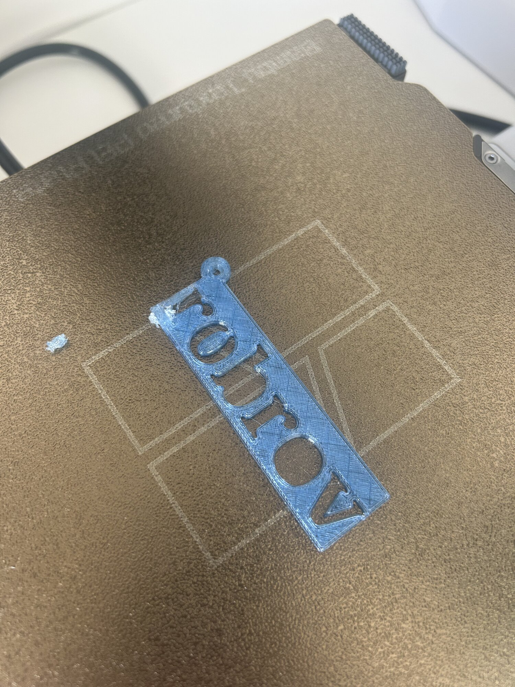
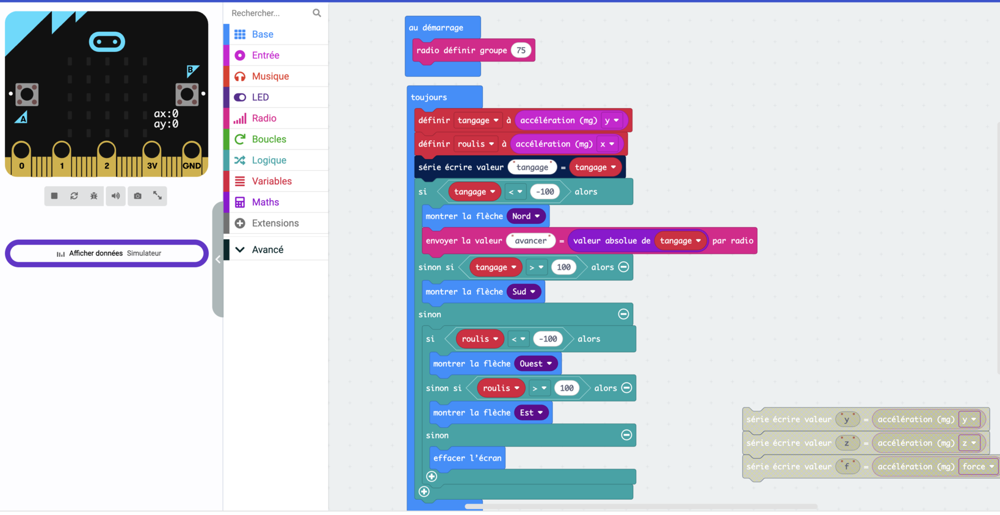
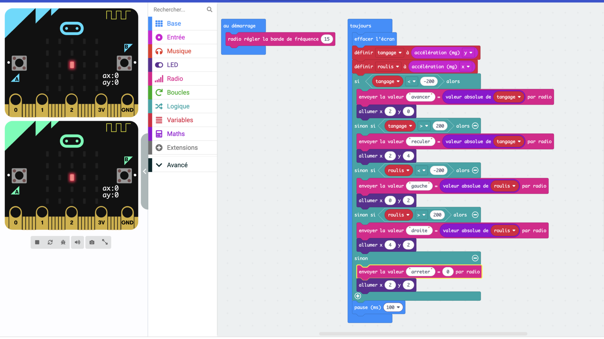
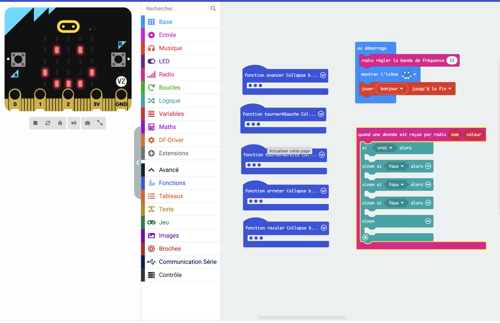
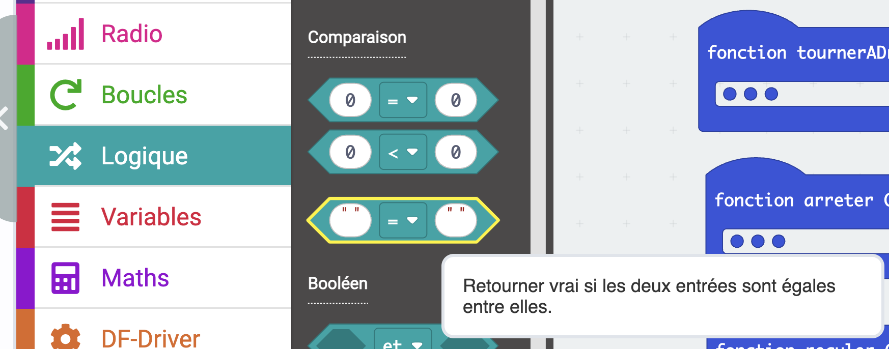
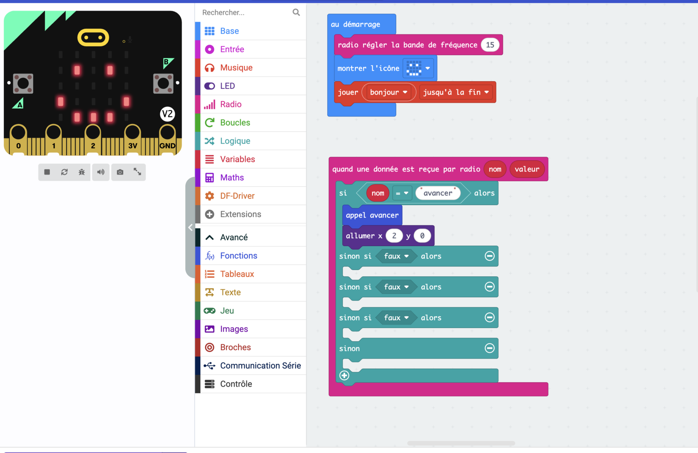
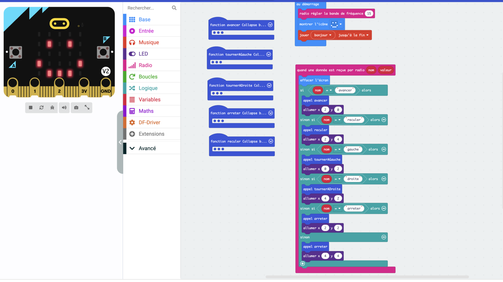

# Séance 4 — Pilote ton rover à distance

Tu poses ta plaque imprimée, tu construis le protocole qui relie tes deux cartes, et tu pilotes ton rover sans fil.

## 1. Récupère ta plaque

<figure markdown>

</figure>

<figure markdown>

</figure>

<figure markdown>

</figure>

Regarde-la de près avant de la monter : les couches, les lettres, ce qui a bavé. Puis glisse-la sous les élastiques déjà en place sur ton rover.

## 2. Deux machines qui ne se sont jamais parlé

Ta télécommande va envoyer des messages, ton rover va les écouter. Pour qu'ils se comprennent, il leur faut deux accords :

- **la même fréquence** — sinon ils ne s'entendent pas
- **le même vocabulaire** — sinon ils s'entendent sans se comprendre

Ces deux accords, c'est un **protocole**. Celui-ci t'est donné, et c'est volontaire : plus tard, ton rover devra obéir à la télécommande d'un coéquipier, et se faire comprendre d'un rover qui n'est pas le tien. Un protocole ne vaut que si tout le monde emploie le même.

## 3. La même fréquence

Dans la salle, une douzaine de télécommandes émettent en même temps. Pour ne pas piloter le rover du voisin — ni lui le tien — chacun prend **sa bande de fréquence**. La tienne, c'est **le numéro de ton ordinateur**.

Dans `au démarrage`, sur **tes deux cartes** :

<figure class="screenshot" markdown>

<figcaption>Ici, le poste 15. Toi, mets ton numéro.</figcaption>
</figure>

> [!CAUTION] La même des deux côtés
> Une carte sur la bande 3 n'entend pas une carte sur la bande 4.

> [!NOTE] Pourquoi la fréquence et pas le groupe
> `radio définir groupe` existe aussi, mais les cartes restent alors sur la même fréquence : elles s'entendent toutes et trient à l'arrivée. À douze qui émettent sans arrêt, les messages se gênent. Changer de bande, c'est parler ailleurs dans le spectre.

## 4. Le même vocabulaire

Reste dans `telecommande`. Ton programme allume déjà le bon point quand tu penches. Il va maintenant envoyer l'ordre qui va avec.

Dans la branche du haut, ajoute `envoyer la valeur … par radio` :

<figure class="screenshot" markdown>

</figure>

Un message porte **une clé** et **une valeur**. La clé est le mot d'ordre. La valeur est un nombre qui l'accompagne — ici, de combien tu penches.

**Le protocole, à respecter au caractère près :**

| Quand tu penches | Clé | Valeur envoyée |
|---|---|---|
| Vers l'avant | `avancer` | valeur absolue de `tangage` |
| Vers l'arrière | `reculer` | valeur absolue de `tangage` |
| À gauche | `gauche` | valeur absolue de `roulis` |
| À droite | `droite` | valeur absolue de `roulis` |
| À plat | `arreter` | `0` |

> [!CAUTION] Huit caractères, pas un de plus
> Au-delà, la carte coupe la clé sans prévenir. `tournerAGauche` et `tournerADroite` arrivent toutes les deux comme `tournerA`. C'est la raison de ces cinq mots-là.

## 5. Tes cinq ordres

**À toi.** Complète les quatre autres branches en suivant le tableau. Puis ajoute une `pause (ms)` de `100` tout en bas du `toujours`.

> [!NOTE] Pourquoi une pause
> Sans elle, ta carte envoie des centaines de messages par seconde et le rover prend du retard à les traiter. Dix par seconde suffisent à conduire.

La solution

<figure class="screenshot" markdown>

</figure>

## 6. Ton rover écoute

Ouvre `rover`, celui de la séance 2 et de ses cinq fonctions.

Dans **Radio**, prends `quand une donnée est reçue par radio`. Il t'apporte deux choses : `nom` et `valeur`.

<figure class="screenshot" markdown>

</figure>

`nom` est un **texte**. Pour le comparer, prends dans **Logique** le bloc d'égalité à **cases blanches** — pas celui qui compare des nombres.

<figure class="screenshot" markdown>

</figure>

## 7. La première branche

<figure class="screenshot" markdown>

</figure>

`si nom = "avancer"` → `appel avancer`. Ta fonction de la séance 2 n'a pas bougé d'un bloc.

### À toi : les quatre autres

Ajoute `reculer`, `gauche`, `droite` et `arreter`. Allume dans chaque branche **le même point que ta télécommande** : c'est lui qui te dira que le message est arrivé.

Mets aussi `effacer l'écran` en tête, comme dans la télécommande.

Termine par un `sinon` qui **arrête les moteurs** et allume un point que tu n'utilises pour rien d'autre : un ordre incompris ne doit pas faire rouler ton rover, et tu dois pouvoir le reconnaître d'un coup d'œil.

La solution

<figure class="screenshot" markdown>

</figure>

Les points sont les mêmes que sur la télécommande, aux mêmes endroits. C'est ce qui rend le contrôle possible d'un coup d'œil.

## 8. Pilote

Téléverse les deux programmes, débranche l'USB, passe sur accus.

> [!TIP] Le contrôle en un coup d'œil
> Penche ta télécommande et regarde **les deux écrans**.
>
> Même point des deux côtés : le message passe. Point allumé seulement sur la télécommande : le rover n'entend pas — vérifie ta bande de fréquence. Le point reste au centre des deux côtés : ce sont tes seuils.

## 9. Va plus loin

- **Trop sensible, ou pas assez ?** Deux nombres décident de ça dans ta télécommande. Trouve lesquels, et dans quel sens les faire varier.
- **Deux vitesses.** Lente ou rapide, selon un seuil d'inclinaison de plus.
- **La valeur arrive au rover, et personne ne s'en sert.** `valeur` dit de combien tu penches. Fais-en une vitesse — mais `speed` s'arrête à `255`, et ton inclinaison monte bien plus haut.
- **Une manœuvre au bouton.** `lorsque le bouton A est pressé` envoie une clé de plus. Côté rover, une branche de plus — et une manœuvre entière qui se déroule toute seule.
- **Invente ta figure** : demi-tour, créneau, huit. Puis donne-lui un nom de huit caractères.

---

## Ce que tu dois avoir à la fin

- [ ] Ta plaque sur ton rover
- [ ] La même bande de fréquence sur tes deux cartes
- [ ] Les cinq clés du protocole, écrites au caractère près
- [ ] Les deux écrans qui allument le même point
- [ ] Ton rover qui avance, recule, tourne et s'arrête, sans fil
- [ ] Ton [carnet de bord](../../../carnet-de-bord/rover-s04.md) rempli

→ [Prendre en main MakeCode](../../../fiches/makecode-prise-en-main.md) · [Déboguer](../../../fiches/deboguer.md)

## Avant de partir

Tes **deux** cartes dans ton bac. Accus en charge.
