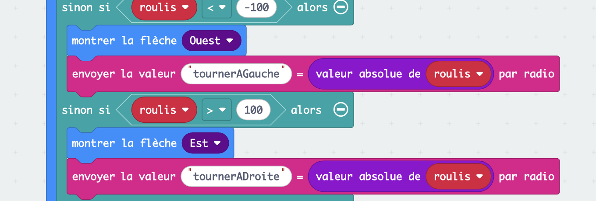
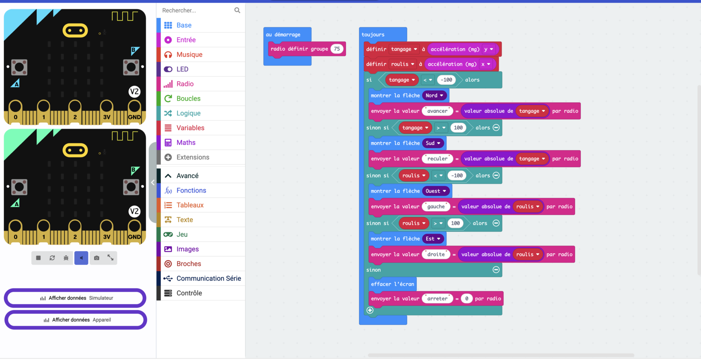
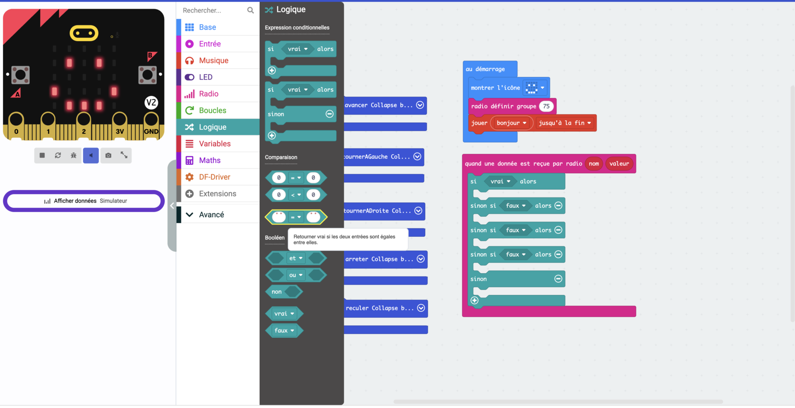

# Séance 4 — Pilote ton rover à distance

Tu poses ta plaque imprimée, puis tu construis le protocole qui fait obéir ton rover sans fil.

## 1. Récupère ta plaque

<figure markdown>

</figure>

<figure markdown>

</figure>

<figure markdown>

</figure>

Regarde-la de près avant de la monter : les couches, les lettres, ce qui a bavé. Puis deux élastiques, et elle tient.

> [!NOTE] Le petit morceau à côté
> C'est l'intérieur d'une lettre que plus rien ne retenait. L'imprimante l'a posé quand même, à plat sur le plateau.

## 2. Deux machines qui ne se sont jamais parlé

Ta télécommande va envoyer des messages, ton rover va les écouter. Pour qu'ils se comprennent, il leur faut deux accords :

- **le même groupe** — sinon ils ne s'entendent pas
- **le même vocabulaire** — sinon ils s'entendent sans se comprendre

Ces deux accords, c'est un **protocole**. Personne ne te le donne : tu l'écris.

## 3. Le même groupe

Dans la salle, une douzaine de télécommandes émettent en même temps. Ton groupe, c'est **le numéro de ton ordinateur**.

Dans `au démarrage`, sur **tes deux cartes** :

<figure class="screenshot" markdown>

<figcaption>Ici, le poste 75. Toi, mets ton numéro.</figcaption>
</figure>

> [!CAUTION] Le même des deux côtés
> Une carte sur le groupe 3 n'entend pas une carte sur le groupe 4. Et rien ne te le dira : juste le silence.

## 4. Le même vocabulaire

Ouvre `telecommande`. Ton programme sait déjà dans quel sens tu penches — il va maintenant le dire.

Dans la branche qui affiche la flèche Nord, ajoute `envoyer la valeur … par radio` :

<figure class="screenshot" markdown>

</figure>

Un message porte **une clé** et **une valeur**. La clé est le mot d'ordre : `avancer`. La valeur est un nombre qui voyage avec — ici, de combien tu penches.

> [!CAUTION] Huit caractères, pas un de plus
> Au-delà, la carte coupe la clé sans prévenir.

<figure class="screenshot" markdown>

<figcaption>Ces deux-là arrivent toutes les deux comme <code>tournerA</code>. Le rover tournerait toujours du même côté.</figcaption>
</figure>

Prends des clés courtes : `avancer`, `reculer`, `gauche`, `droite`, `arreter`.

## 5. Tes cinq ordres, à plat

Complète les quatre autres branches. Profites-en pour **mettre tes tests à plat** : les `si` imbriqués de la séance 3 deviennent une seule suite de `sinon si`.

<figure class="screenshot" markdown>

</figure>

> [!NOTE] Pourquoi c'est la même chose
> Les conditions sont lues **dans l'ordre**, et la première qui est vraie gagne — les suivantes ne sont même pas regardées. Imbriqué ou à plat, le rover reçoit les mêmes ordres. À plat se relit.

**Note tes cinq clés dans le carnet.** Ton rover devra utiliser exactement les mêmes.

## 6. Ton rover écoute

Ouvre `rover`, celui de la séance 2 et de ses cinq fonctions.

Dans **Radio**, prends `quand une donnée est reçue par radio`. Il t'apporte deux choses : `nom` et `valeur`.

Pour comparer deux textes, il te faut le bloc de comparaison à **cases blanches**, dans **Logique** — pas celui qui compare des nombres.

<figure class="screenshot" markdown>

</figure>

## 7. La première branche

<figure class="screenshot" markdown>

</figure>

`si nom = "avancer"` → `appel avancer`. Ta fonction de la séance 2 n'a pas bougé d'un bloc.

### À toi : les quatre autres

Ajoute `reculer`, `gauche`, `droite` et `arreter`. Fais afficher **une flèche** dans chaque branche : c'est elle qui te dira que le message est arrivé.

La solution

<figure class="screenshot" markdown>

<figcaption>Deux flèches du milieu sont à corriger : ici <code>gauche</code> affiche Est et <code>droite</code> affiche Ouest. Mets les mêmes que sur ta télécommande.</figcaption>
</figure>

Le dernier `sinon` attrape les clés que le rover ne connaît pas. Il affiche une croix : tu sauras qu'un message est arrivé et qu'il n'a pas été compris.

## 8. Pilote

Téléverse les deux programmes, débranche l'USB, passe sur accus.

> [!TIP] Le contrôle en un coup d'œil
> Penche ta télécommande et regarde **les deux écrans**.
>
> Même flèche des deux côtés : le message passe. Flèche seulement sur la télécommande : le rover n'entend pas — vérifie ton groupe. Aucune flèche nulle part : ce sont tes seuils.

## 9. Va plus loin

- **Trop sensible, ou pas assez ?** Une seule sorte de nombre décide de ça, dans ta télécommande. Trouve-la, et change-la.
- **La valeur voyage, et personne ne s'en sert.** Côté rover, `valeur` dit de combien tu penches. Fais-en une vitesse — mais `speed` s'arrête à `255`, et ton inclinaison monte bien plus haut.
- **Deux vitesses.** Plus simple que la précédente : lente ou rapide, selon un seuil.
- **Une manœuvre au bouton.** `lorsque le bouton A est pressé` envoie une clé de plus. Côté rover, une branche de plus — et une manœuvre entière qui se déroule toute seule.
- **Invente ta figure** : demi-tour, créneau, huit. Puis donne-lui un nom de huit caractères.

---

## Ce que tu dois avoir à la fin

- [ ] Ta plaque sur ton rover
- [ ] Le même groupe radio sur tes deux cartes
- [ ] Cinq clés de huit caractères maximum, notées au carnet
- [ ] Les deux écrans qui affichent la même flèche
- [ ] Ton rover qui avance, recule, tourne et s'arrête, sans fil
- [ ] Ton [carnet de bord](../../../carnet-de-bord/rover-s04.md) rempli

→ [Prendre en main MakeCode](../../../fiches/makecode-prise-en-main.md) · [Quand ça ne marche pas](../../../fiches/depannage.md)

## Avant de partir

Tes **deux** cartes dans ton bac. Accus en charge.
