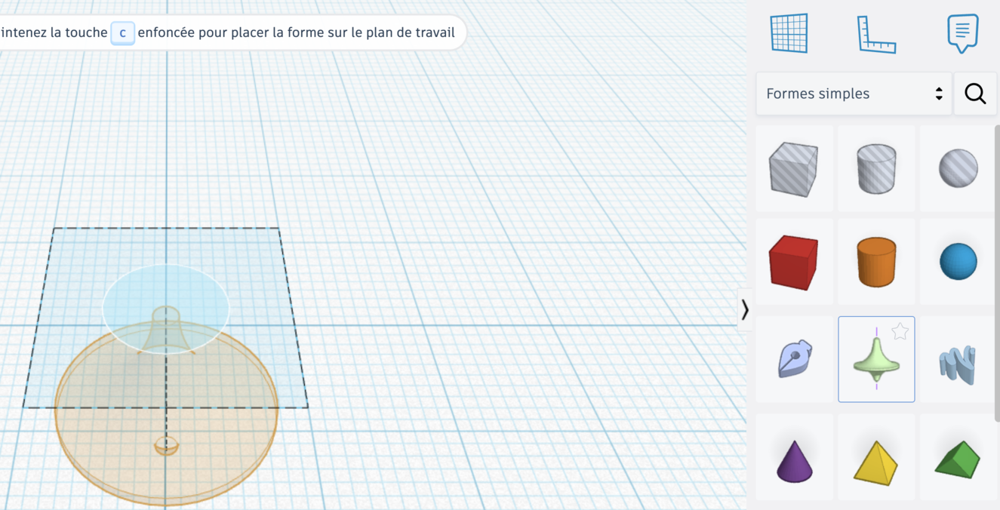
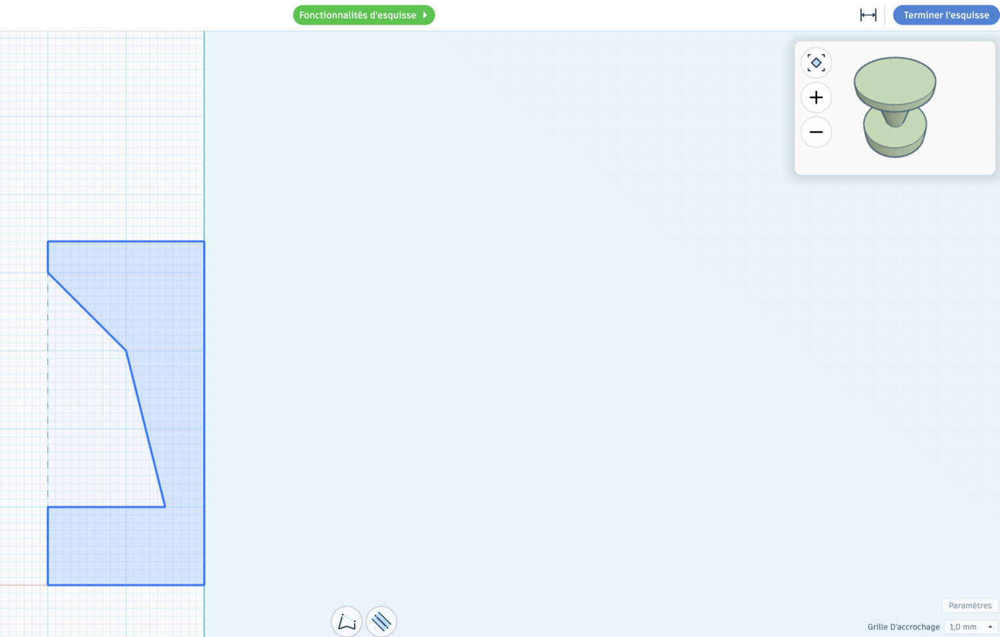
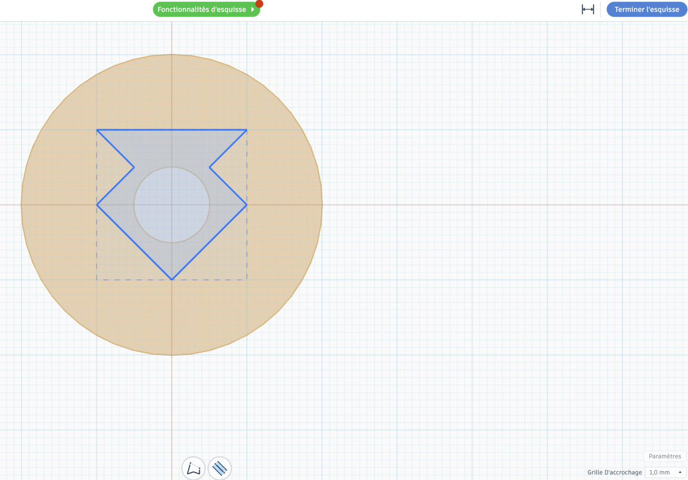
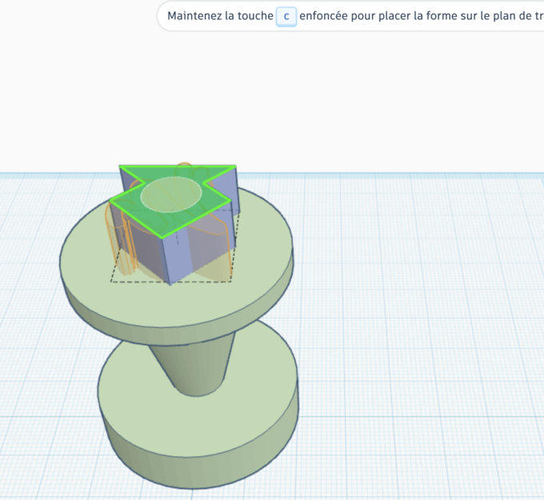
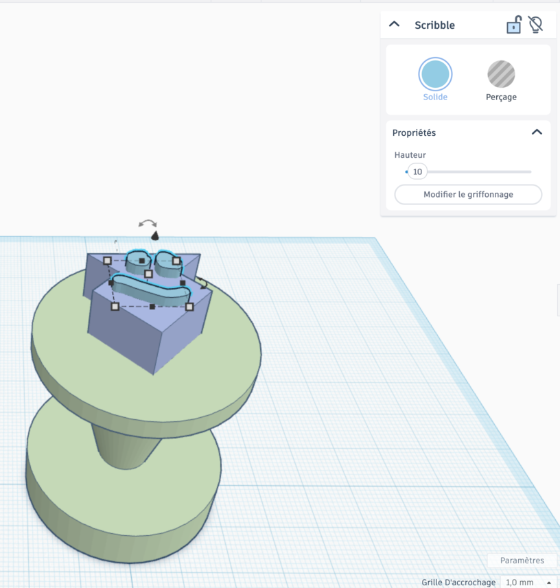
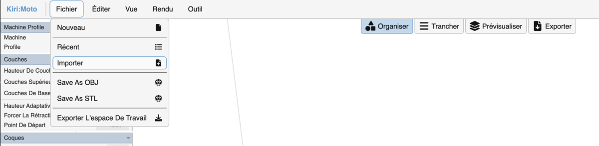
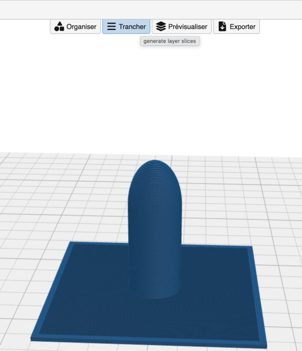
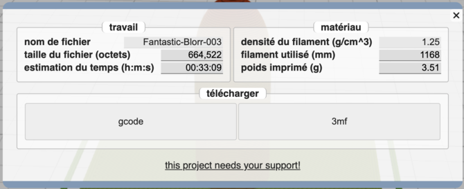

# Séance 6 — Dessinez les pièces de votre rover

Vous dessinez en 3D les pièces que le carton fait mal, ou vous les trouvez toutes faites.

## 1. Quelle pièce le carton fait mal ?

Reprenez votre prototype. Notez les pièces qui plient, qui cassent, ou qu'on ne sait pas découper.

## 2. Partez d'une esquisse

En séance 3, tu as assemblé des formes. Cette fois, tu dessines un contour à plat, et Tinkercad lui donne du volume. Trois outils, dans **Formes simples**.

### La révolution

**Faire pivoter l'esquisse**. Pose-la sur le plan de travail : l'éditeur d'esquisse s'ouvre.

<figure class="screenshot" markdown>

</figure>

Dessine la moitié du profil, contre l'axe. Tinkercad le fait tourner autour. Pour une roue, un moyeu, un bouchon.

<figure class="screenshot" markdown>

<figcaption>Le profil à gauche de l'axe, la pièce en haut à droite.</figcaption>
</figure>

**Terminer l'esquisse** pour revenir au plan de travail.

### L'extrusion

**Extruder l'esquisse**. Dessine le contour vu de dessus : il monte tout droit. Pour une plaque, un pare-chocs, une fourche.

<figure class="screenshot" markdown>

</figure>

<figure class="screenshot" markdown>

</figure>

### L'esquisse libre

**Scribble**. Tu dessines à main levée, puis tu règles sa **Hauteur**. Pour un logo, une forme sans cote précise.

<figure class="screenshot" markdown>

</figure>

> [!TIP] Les cotes
> Relève-les sur le rover, à la règle. Pas de mémoire.

## 3. Ou trouvez une pièce qui existe

Des milliers de pièces sont partagées en ligne. Cherche par exemple `servo arm`, `TT motor mount`, `gripper`.

[capture : une recherche dans la galerie de pièces partagées]

Tu peux la copier et la modifier. Note le nom de son auteur dans ton carnet.

## 4. Vérifiez la durée d'impression

Votre équipe a 3 h d'impression pour tout le projet. Une pièce ratée compte, sauf si c'est la machine qui a raté.

Sélectionne toutes les formes de ta pièce et regroupe-les, puis exporte-la en `.STL`. Ouvre ensuite [Kiri:Moto](https://grid.space/kiri/).

> [!NOTE] Tout regrouper avant d'exporter
> Une forme non regroupée part seule dans le fichier : on n'imprime qu'une partie de la pièce.

**Fichier** → **Importer** → ton `.STL`.

<figure class="screenshot" markdown>

</figure>

**Trancher**.

<figure class="screenshot" markdown>

</figure>

**Exporter** : lis **estimation du temps**. Pas besoin de télécharger.

<figure class="screenshot" markdown>

<figcaption>00:33:09 : 33 minutes.</figcaption>
</figure>

Trop long ? Allège la pièce, ou fais-la en carton.

> [!NOTE] Carton et récupération
> Ils ne coûtent rien sur le budget. Une pièce qui n'a pas besoin d'être imprimée ne l'est pas.

## 5. Fabriquez

Fabriquez les pièces de votre croquis que le carton fait mal.

> [!IMPORTANT] Avant d'imprimer
> Notez la pièce et sa durée dans le suivi d'impression du [cahier des charges](../cahier-des-charges.md), avec le nouveau total. Puis montrez-le à l'animateur : c'est lui qui lance l'impression.

→ [Modéliser et imprimer en 3D](../../../fiches/modeliser-imprimer-3d.md)

---

## Ce que vous devez avoir à la fin

- [ ] Au moins une pièce : fichier envoyé à l'impression, ou fabriquée en carton ou en récupération
- [ ] La durée notée dans votre suivi d'impression
- [ ] L'auteur des pièces réemployées noté
- [ ] Ton [carnet de bord](../../../carnet-de-bord/rover-s06.md) rempli

## Avant de partir

Projet Tinkercad enregistré. Pièces et prototype dans le bac de l'équipe.
