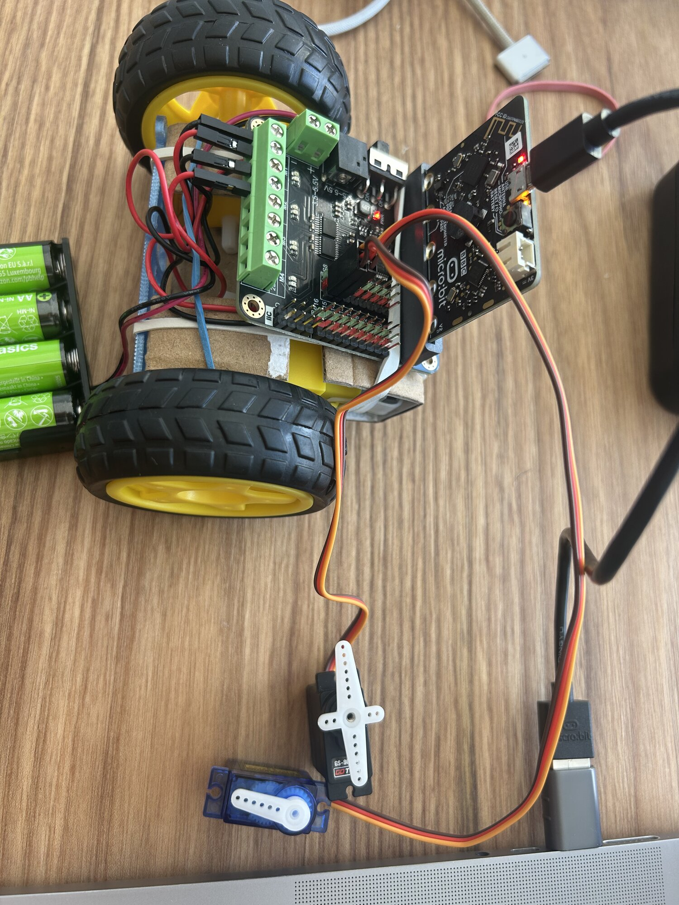
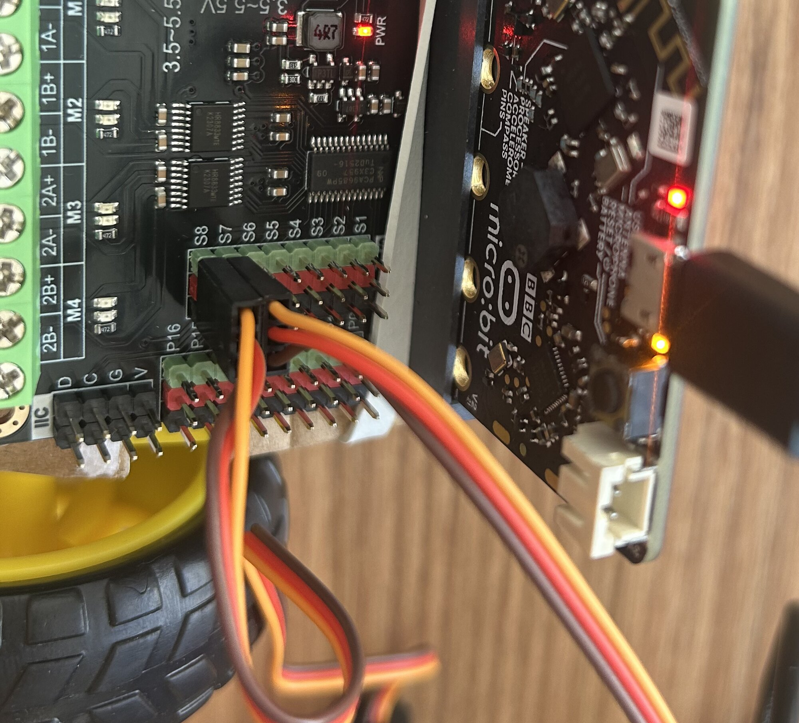
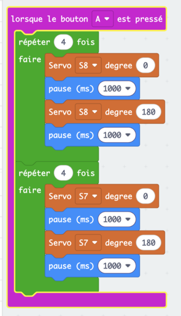

# Séance 7 — Faites bouger une pièce avec un servomoteur

Vous branchez deux servomoteurs, vous les commandez à l'angle près, et vous décidez s'il sert votre rover.

## 1. Récupérez vos pièces imprimées

Regardez-les : sont-elles conformes à votre dessin ? Notez au carnet la durée qu'elles ont consommée.

## 2. Un moteur qui va à une position

Le moteur des roues tourne sans s'arrêter. Le **servomoteur**, lui, va à l'angle que tu lui donnes, entre 0 et 180°, et il s'y tient.

<figure markdown>

</figure>

## 3. Branchez-le

> [!CAUTION] Accus débranchés
> - Branche et débranche toujours accus coupés.
> - Ne force pas le bras d'un servomoteur alimenté : ses engrenages cassent.

Un servomoteur sur `S8`, l'autre sur `S7`. Le connecteur a un sens : fil orange côté vert, fil marron côté noir.

<figure markdown>

</figure>

→ [La carte DFR0548 et ses blocs](../../../fiches/carte-dfr0548.md)

## 4. Commandez-le

Nouveau projet `test-moteur`. Dans **DF-Driver**, prends `Servo S1 degree 0`. Choisis la broche, `S8` ; le nombre est l'angle.

<figure class="screenshot" markdown>

</figure>

### À toi : le balayage

Bouton `A` : le bras de `S8` va de 0° à 180° et revient, quatre fois, une seconde à chaque position. Puis celui de `S7`, pareil.

La solution

<figure class="screenshot" markdown>

</figure>

Essaie d'autres angles. Où ton bras s'arrête-t-il vraiment ?

## 5. Votre rover en a-t-il besoin ?

Relisez votre croquis de la séance 5. Pousser l'échantillon est permis ; le saisir ou le soulever demande un servomoteur. Le cahier des charges en autorise deux.

Écrivez votre décision au carnet, avec la raison.

## 6. Commandez-le depuis la télécommande

Si vous l'utilisez : ajoutez une clé au protocole, par exemple `pince`.

> [!CAUTION] Huit caractères au plus
> Et une branche pour elle dans le rover, avant le `sinon`. Sinon, le rover s'arrête à chaque appui.

La table n'envoie pas cette clé : elle ne sert qu'avec la télécommande.

---

## Ce que vous devez avoir à la fin

- [ ] Deux servomoteurs qui balaient de 0° à 180°
- [ ] Votre décision notée : servomoteur ou pas, et pourquoi
- [ ] Si oui : le servomoteur monté et commandé depuis la télécommande
- [ ] Ton [carnet de bord](../../../carnet-de-bord/rover-s07.md) rempli

## Avant de partir

Servomoteurs et vis dans le bac de l'équipe. Accus en charge.
