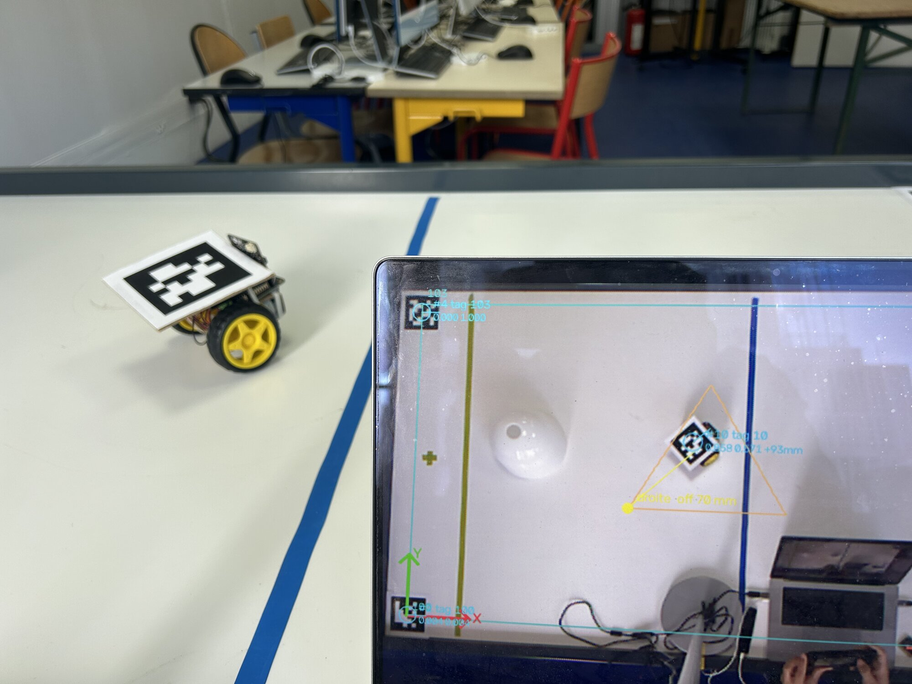
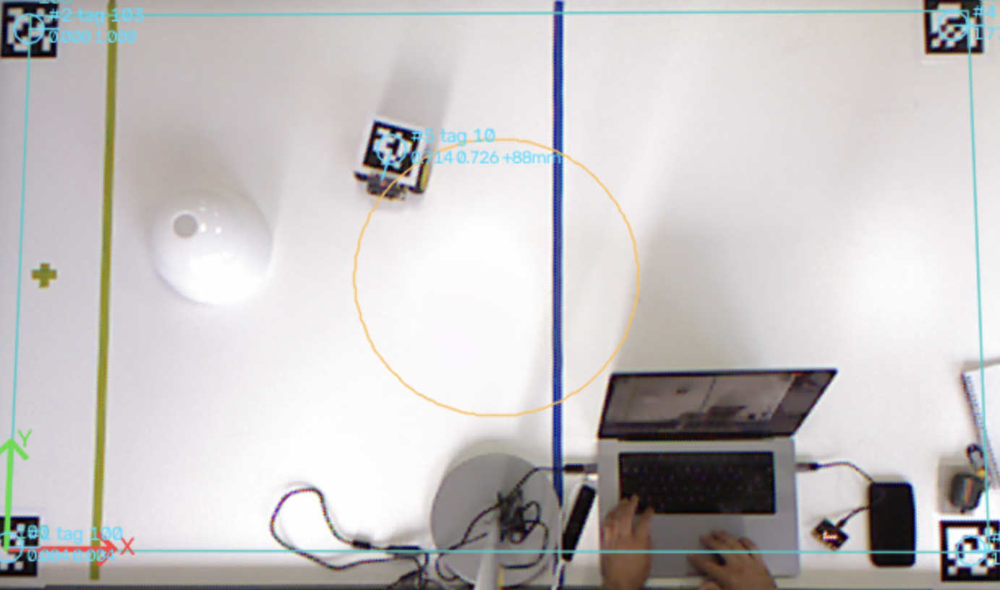
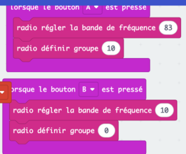
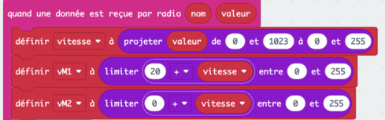
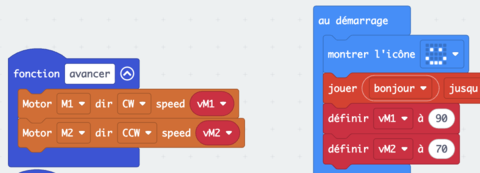

# Séance 8 — Faites piloter votre rover par la table

La table va piloter votre rover. Elle envoie les mêmes messages que votre télécommande : quatre changements dans votre programme suffisent.

## 1. Regardez la table piloter

<figure markdown>

</figure>

<video controls playsinline preload="metadata" src="../../../../assets/rover-s08/video-table-pilote.mp4"></video>

La table voit le tag du rover, le mesure, puis le fait suivre une figure.

<figure class="screenshot" markdown>

<figcaption>Ce que voit la caméra : les repères des coins, le tag 10 et le cercle à suivre.</figcaption>
</figure> Elle envoie `avancer`, `reculer`, `gauche`, `droite`, `arreter`, les clés de ta télécommande.

## 2. La bande et le groupe

En séance 4, chaque télécommande avait sa bande : douze émetteurs en même temps se seraient gênés.

Ici, un seul émetteur parle à tous les rovers : la table. Tout le monde est sur la bande `83`, et le groupe dit à qui le message s'adresse. Votre groupe, c'est votre numéro.

Un bouton par source : `A` met le rover sur la table, `B` le remet sur ta télécommande.

<figure class="screenshot" markdown>

<figcaption>Ici, l'équipe numéro 10.</figcaption>
</figure>

## 3. La valeur devient la vitesse

La table envoie une valeur de `0` à `1023`. Ton moteur accepte de `0` à `255`. Et dans tes cinq fonctions, les vitesses sont écrites en chiffres depuis la séance 2.

> [!NOTE] Une variable pour tout le programme
> Créée une fois, une variable se lit partout : dans le gestionnaire radio, dans `toujours`, dans tes fonctions.

### À toi : la vitesse variable

Dans le gestionnaire radio, range la valeur reçue dans `vitesse` avec `projeter`, dans **Maths** : de `0`–`1023` vers `0`–`255`.

Puis calcule une vitesse par moteur, `vM1` et `vM2`. Ta compensation de la séance 2 devient un écart, par exemple `20 + vitesse` pour le moteur le plus lent. Dans tes cinq fonctions, remplace les chiffres par `vM1` et `vM2`.

> [!TIP] `limiter` et les valeurs de départ
> `limiter` garde la vitesse entre `0` et `255` : sans lui, `20 + 255` dépasse. Et donne une valeur de départ à `vM1` et `vM2` dans `au démarrage`.

La solution

<figure class="screenshot" markdown>

<figcaption>Ici, le moteur M1 est le plus lent : il reçoit 20 de plus.</figcaption>
</figure>

<figure class="screenshot" markdown>

</figure>

Diviser par 4 donne presque le même résultat que `projeter`.

## 4. Le gestionnaire range, la boucle agit

Jusqu'ici, `quand une donnée est reçue par radio` appelait tes fonctions. Désormais, il ne fait que ranger.

**À toi.** La méthode :

1. Crée une variable `ordre`. Dans le gestionnaire, range `nom` dedans, à côté du calcul des vitesses.
2. Déplace tes `si … sinon si` dans `toujours`. Ils testent maintenant `ordre`.
3. Relis le gestionnaire : plus aucun appel de fonction, plus aucune pause.

> [!NOTE] Pas de pause dans le gestionnaire
> La carte ne garde que quatre messages en attente. Si le gestionnaire attend, les suivants sont perdus.

## 5. Le silence arrête le rover

**À toi.** La méthode :

1. Crée une variable `dernier message`.
2. Dans le gestionnaire, range-y `temps écoulé (ms)` : c'est l'heure du message.
3. Dans `toujours`, compare l'heure actuelle à `dernier message`. Plus de 1000 ms d'écart : arrête les moteurs.

> [!TIP] Pour vérifier
> Rover sur la table, éteins ta télécommande : il doit s'arrêter en une seconde.

## 6. Changez de mode

Votre rover doit obéir à la télécommande, sur la bande de l'équipe, et à la table, sur la bande `83`. Ce sont deux modes.

Une variable `mode`, créée une fois, que tout le programme lit : `0` télécommande, `1` table.

Un geste pour en changer : les boutons `A` et `B` de la section 2. Chacun règle la radio et change `mode`.

Un témoin : un point dans un coin libre de l'écran, un par mode, rallumé à chaque tour de `toujours`.

> [!NOTE] Pourquoi un témoin
> En mode table, le rover n'obéit plus à sa télécommande. Sans témoin, on croit à une panne.

### À toi : les deux modes

La méthode :

1. Crée la variable `mode`.
2. Dans tes deux boutons, ajoute une ligne qui la change : `1` avec `A`, `0` avec `B`.
3. Dans `toujours`, juste après `effacer l'écran`, allume le point `0,0` en mode `0` et le point `4,0` en mode `1`.

Appuie sur `A`, puis sur `B` : le point doit changer de coin.

Vous préférez deux programmes, un par mode ? C'est permis. Notez votre choix au carnet.

→ [Changer de mode](../../../fiches/makecode-prise-en-main.md#changer-de-mode)

> [!TIP] Tester sans la table
> Mets ta télécommande sur la bande `83` et votre groupe. Si le rover lui obéit, il obéira à la table.

## 7. Passez sur la table

Une équipe à la fois, dans l'ordre du tableau. La table vérifie :

- `avancer` : 5 cm au moins en 1,5 s
- `gauche` et `droite` : deux sens opposés
- la table se tait : le rover s'arrête en 1 s

---

## Ce que vous devez avoir à la fin

- [ ] Bande `83` et votre groupe
- [ ] La vitesse variable dans tes cinq fonctions, compensation gardée
- [ ] Aucune pause dans le gestionnaire
- [ ] L'arrêt après 1 s de silence
- [ ] Deux modes, et le témoin qui dit lequel est actif
- [ ] Votre rover qui suit la figure de la table
- [ ] Ton [carnet de bord](../../../carnet-de-bord/rover-s08.md) rempli

→ [Prendre en main MakeCode](../../../fiches/makecode-prise-en-main.md) · [Déboguer](../../../fiches/deboguer.md)

## Avant de partir

Programme enregistré. Accus en charge.
