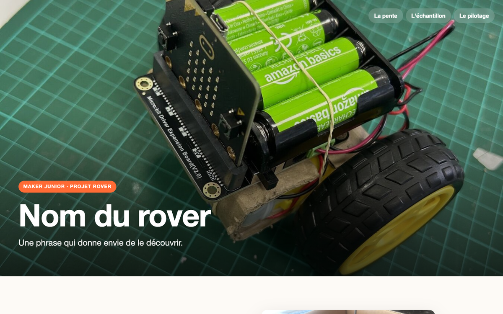

# Séance 11 — Présentez votre rover sur une page web

Vous remplissez la page web de votre rover, qui sera publiée : ce que vous avez construit, et pourquoi vous l'avez construit comme ça.

## 1. Ouvrez le gabarit

→ [Télécharger le gabarit](../../../assets/gabarit-page-rover.zip) · [Le voir en ligne](../../../assets/gabarit-page-rover/index.html)

Décompresse-le. Tu trouves `index.html`, `style.css` et un dossier `images`.

<figure class="screenshot" markdown>

</figure>

Ouvre `index.html` deux fois : dans l'éditeur, et dans le navigateur.

## 2. Lisez une balise

Le texte se place entre une balise ouvrante et une balise fermante.

```html
<h1>Nom du rover</h1>
<p class="sous-titre">Une phrase qui donne envie de le découvrir.</p>
```

`<h1>` est le titre, `<p>` un paragraphe. La balise fermante a une barre : `</p>`.

Remplace le titre par le nom de votre rover. Enregistre, recharge le navigateur.

## 3. Changez les photos

Mets vos photos dans le dossier `images`. Puis écris leur nom dans `src` :

```html

```

`alt` décrit l'image pour qui ne la voit pas.

> [!TIP] L'image ne s'affiche pas ?
> Vérifie le nom du fichier, lettre par lettre, extension comprise.

## 4. Racontez trois choix

Chaque section présente une chose que fait votre rover : un sous-titre, un titre, une description, une photo. Remplacez les textes d'exemple.

> [!NOTE] Un choix, une raison
> Pas « on a mis une fourche ». Plutôt : « on a mis une fourche parce que l'échantillon doit rester debout. »

Votre carnet de la séance 10, « Ce dont on est le plus fiers », vous sert de brouillon.

## 5. Choisissez vos couleurs

Ouvre `style.css`. Tout en haut, **TES RÉGLAGES** :

```css
--couleur-principale: #ff6b35;
```

Change le code couleur, enregistre, recharge : l'étiquette, les sous-titres et le menu changent ensemble.

<details markdown>
<summary>Pour aller plus loin — ajouter une section</summary>

1. Copie une section entière, du commentaire jusqu'à `</section>` compris :

```html
  <!-- Fonctionnalité 3 -->
  <section class="fonction" id="pilotage">
    ...
  </section>
```

2. Colle-la juste avant `<!-- Le bas de la page -->`.

3. Change son `id` : un mot à toi, sans espace ni accent. Deux sections ne peuvent pas avoir le même.

```html
  <!-- Fonctionnalité 4 -->
  <section class="fonction" id="tag">
```

4. Ajoute son lien dans le menu, en haut de la page. Le `#` suivi de l'`id` :

```html
    <nav class="menu">
      <a href="#pente">La pente</a>
      <a href="#echantillon">L'échantillon</a>
      <a href="#pilotage">Le pilotage</a>
      <a href="#tag">Le tag</a>
    </nav>
```

5. Remplace les textes et la photo : `images/fonction-4.jpg`, par exemple.

La photo se place toute seule du bon côté.

</details>

## 6. Terminez vos corrections

Une partie de l'équipe écrit la page, l'autre corrige le rover. Échangez à mi-temps.

> [!CAUTION] Avant de mettre une photo
> Pas de visage ni de nom de famille.

---

## Ce que vous devez avoir à la fin

- [ ] Le nom du rover et de l'équipe
- [ ] Vos photos à la place des photos d'exemple
- [ ] Trois sections, chacune avec son choix et sa raison
- [ ] Vos couleurs
- [ ] La page qui s'ouvre dans le navigateur
- [ ] Ton [carnet de bord](../../../carnet-de-bord/rover-s11.md) rempli

## Avant de partir

Le dossier de la page enregistré, copié là où l'animateur l'indique. Rover chargé pour les épreuves.
